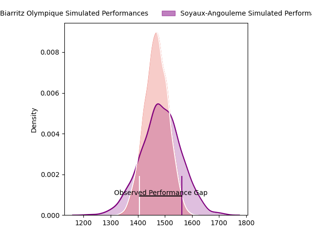
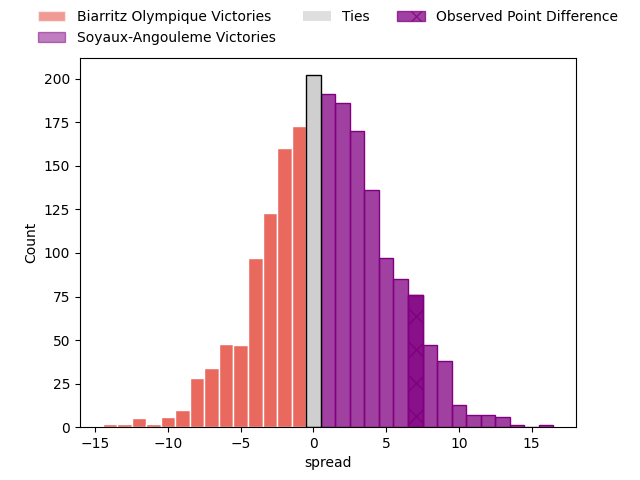

---  
layout: page  
title: Biarritz Olympique at Soyaux-Angouleme; 11-18  
date: 2023-04-14 19:00:00 18:00:00 -0500  
categories: match review  
---
# Biarritz Olympique at Soyaux-Angouleme; 11-18

# Club Level Predictions

The first set of predictions treats a club as the smallest object, as the club develops its members, organizes a gameplan, and deploys its players as needed for each match. This club model has a prediction of 0.527, which translates to predicting Soyaux-Angouleme to win by 1.0.

Each club has a rating and a rating deviation (simiar to a Glicko system), and expected performances can be generated. This allows for simulated matches and spreads like the ones below.
## Projected Performances

## Projected Spreads

## Projected Results

# Player Level Predictions

Treating teams instead as an entity made up of the currently active players, I have ratings for each player in an altogether different system. These can be combined to form team ratings once teamsheets are announced, weighting starters a bit higher than the reserves. After the match is played, players can be weighted by their minutes on the field, allowing for an accurate measure of the team's composition. With these compiled team ratings, we can make predictions, measure inaccuracy, and update the individual player ratings.
## Prediction with Player Minutes: Soyaux-Angouleme by 15.3

Soyaux-Angouleme by 11.3 on a neutral field

There were 6 large changes in win probability in this match
## Prediction without Player Minutes: Soyaux-Angouleme by 11.6

Soyaux-Angouleme by 7.6 on a neutral pitch

|   Away Minutes | Away Player        |   Away elo |   Away Percentile |   Number |   Home Percentile |   Home elo | Home Player                      |   Home Minutes |
|---------------:|:-------------------|-----------:|------------------:|---------:|------------------:|-----------:|:---------------------------------|---------------:|
|             40 | Guy Millar         |      85.09 |                16 |        1 |                57 |      96.08 | Khatchik Vartan                  |             52 |
|             59 | Clément Renaud     |      92.54 |                41 |        2 |                41 |      92.55 | Patxi Bidart                     |             62 |
|             80 | Luka Tchelidze     |     100.1  |                54 |        3 |                83 |     106.36 | Michael Masimba Tingini Kumbirai |             54 |
|             40 | Josh Tyrell        |      87.17 |                22 |        4 |                14 |      81.05 | Matt Beukeboom                   |             25 |
|             80 | John Dyer          |      82.42 |                16 |        5 |                59 |      98.47 | Sikeli Nabou                     |             80 |
|             80 | Ewan Bertheau      |      80.84 |                28 |        6 |                13 |      82.44 | Gautier Gibouin                  |             80 |
|             80 | Simon Augry        |      94.23 |                53 |        7 |                66 |     101.55 | Nicolas Martins                  |             80 |
|             59 | Ekain Imaz Agirre  |      85.51 |                20 |        8 |                50 |      95.54 | Matt Va'ai                       |             59 |
|             72 | Barnabé Couilloud  |      88.68 |                40 |        9 |                 4 |      68.16 | Adrien Bau                       |             80 |
|             72 | Baptiste Germain   |      86.5  |                22 |       10 |                33 |      90.22 | Benjamin Botica                  |             78 |
|             64 | Yohann Artru       |      89.54 |                31 |       11 |                82 |     109.49 | Marvin Lestremau                 |             80 |
|             80 | Auguste Cadot      |      77.28 |                 9 |       12 |                47 |      94.55 | Inaki Ayarza Saporta             |             80 |
|             80 | Francois Vergnaud  |      85.9  |                19 |       13 |                44 |      93.48 | Ledua Mau                        |             80 |
|             80 | Vincent Martin     |      85.11 |                20 |       14 |                74 |     105.13 | Maxime Laforgue                  |             80 |
|             80 | Steeve Barry       |      83.33 |                19 |       15 |                16 |      81.02 | Pierre Lafitte                   |             80 |
|             40 | Baptiste Erdocio   |      83.77 |                15 |       16 |                90 |     117.08 | Germain Burgaud                  |             55 |
|             40 | Adrian Motoc       |      90.89 |                35 |       17 |                64 |      99.23 | Omar Odishvili                   |             28 |
|             21 | Killian Taofifenua |      99.46 |                80 |       18 |                54 |      99.06 | Yassin Boutemani                 |             26 |
|             21 | Johan Aliouat      |      91.61 |                37 |       19 |                76 |     106.77 | Yassine Jarmouni                 |             21 |
|             16 | Gilles Bosch       |      90.48 |               nan |       20 |                32 |      90.39 | Ole Avei                         |             18 |
|              8 | Clément Pérusin    |      96.03 |               nan |       21 |                71 |     103.87 | Jacob Botica                     |              2 |
|              8 | Tomas Cubelli      |      84.1  |                16 |       22 |               nan |     nan    | nan                              |            nan |

