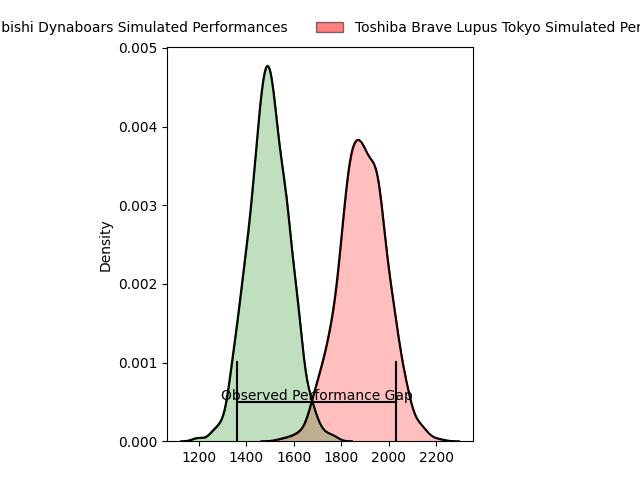
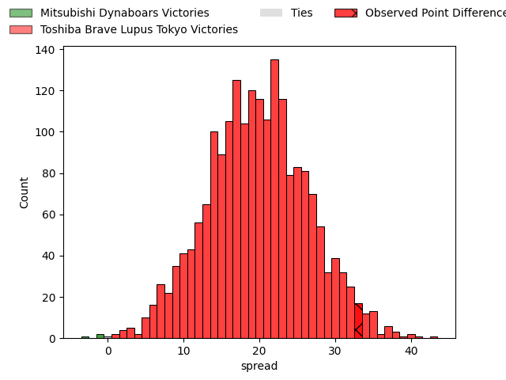
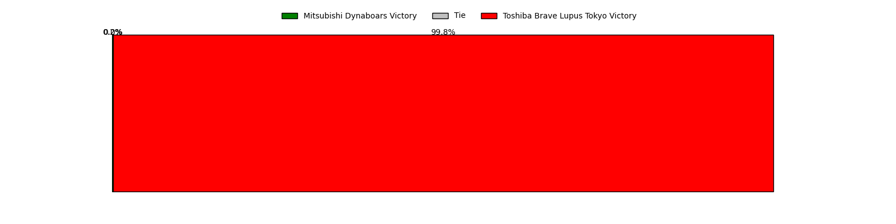

---  
layout: page  
title: Mitsubishi Dynaboars at Toshiba Brave Lupus Tokyo; 19-52  
date: 2023-04-14 12:00:00 18:00:00 -0500  
categories: match review  
---
# Mitsubishi Dynaboars at Toshiba Brave Lupus Tokyo; 19-52

# Club Level Predictions

The first set of predictions treats a club as the smallest object, as the club develops its members, organizes a gameplan, and deploys its players as needed for each match. This club model has a prediction of 0.9, which translates to predicting Toshiba Brave Lupus Tokyo to win by 19.8.

Each club has a rating and a rating deviation (simiar to a Glicko system), and expected performances can be generated. This allows for simulated matches and spreads like the ones below.
## Projected Performances

## Projected Spreads

## Projected Results

# Player Level Predictions

Treating teams instead as an entity made up of the currently active players, I have ratings for each player in an altogether different system. These can be combined to form team ratings once teamsheets are announced, weighting starters a bit higher than the reserves. After the match is played, players can be weighted by their minutes on the field, allowing for an accurate measure of the team's composition. With these compiled team ratings, we can make predictions, measure inaccuracy, and update the individual player ratings.
## Prediction with Player Minutes: Toshiba Brave Lupus Tokyo by 32.0

Toshiba Brave Lupus Tokyo by 28.0 on a neutral field

There were 5 large changes in win probability in this match
## Prediction without Player Minutes: Toshiba Brave Lupus Tokyo by 31.5

Toshiba Brave Lupus Tokyo by 27.5 on a neutral pitch

|   Away Minutes | Away Player            |   Away elo |   Away Percentile |   Number |   Home Percentile |   Home elo | Home Player       |   Home Minutes |
|---------------:|:-----------------------|-----------:|------------------:|---------:|------------------:|-----------:|:------------------|---------------:|
|             62 | Hayato Hosoda          |      73.97 |                 5 |        1 |                77 |     103.58 | Sena Kimura       |             53 |
|             62 | Yuki Miyazato          |      80.65 |                11 |        2 |                71 |     101.57 | Mamoru Harada     |             53 |
|             62 | Tomoaki Ishii          |     134    |                98 |        3 |                96 |     121.33 | Yuta Kokaji       |             53 |
|             80 | Daniel Linde           |      87.16 |                24 |        4 |                70 |     102.18 | Warner Dearns     |             72 |
|             65 | Walt Steenkamp         |      83    |                16 |        5 |                89 |     115.54 | Jacob Pierce      |             80 |
|             80 | Timote Tavalea         |      89.06 |               nan |        6 |                83 |     111.51 | Shin Ito          |             80 |
|             53 | Koki Sato              |      71.04 |                 4 |        7 |                51 |      98.96 | Takeshi Sasaki    |             72 |
|             80 | Epineri Uluviti        |      82.41 |                15 |        8 |                60 |     100.55 | Michael Leitch    |             80 |
|             72 | Kota Iwamura           |      98.91 |                59 |        9 |                47 |      94.55 | Takahiro Ogawa    |             57 |
|             80 | Matt To'omua           |      71.27 |                 4 |       10 |                97 |     130.98 | Hayata Nakao      |             80 |
|             80 | Satoshi Koizumi        |      95    |               nan |       11 |                93 |     123.9  | Masaki Hamada     |             80 |
|             80 | Brackin Karauria-Henry |      83.07 |                15 |       12 |                57 |      98.81 | Nicholas McCurran |             80 |
|             80 | Curtis Rona            |      84.89 |                18 |       13 |                64 |     101.08 | Seta Tamanivalu   |             65 |
|             65 | Jonmoon Han            |      85.57 |                21 |       14 |                40 |      92.08 | Atsuki Kuwayama   |             65 |
|             60 | Roland Alaiasa         |      85.58 |                22 |       15 |                82 |     110.54 | Takuro Matsunaga  |             80 |
|             27 | Yusuke Sakamoto        |      94.86 |                47 |       16 |                63 |      98.8  | Masataka Mikami   |             27 |
|             20 | Nozomi Nara            |      91.74 |                39 |       17 |                 3 |      70.44 | Daigo Hashimoto   |             27 |
|             18 | Shunsuke Sakamoto      |      77.81 |                12 |       18 |                73 |     103.33 | Latu Taufa        |             27 |
|             18 | Yoshimitsu Yasue       |      88.42 |                52 |       19 |                44 |      93.11 | Jack Stratton     |             23 |
|             18 | Jun Morimoto           |      98.47 |                62 |       20 |                64 |      99.4  | Futoshi Mori      |             15 |
|             15 | Sam Chongkit           |      92.82 |                39 |       21 |                69 |     102.96 | Taiki Matsunobu   |             15 |
|             15 | Matt Vaega             |      76.49 |                 9 |       22 |                43 |      90.35 | Kyosuke Kajikawa  |              8 |
|              8 | Ryoto Shibata          |      87.78 |                28 |       23 |               nan |      97.14 | Takahiro Fujita   |              8 |

