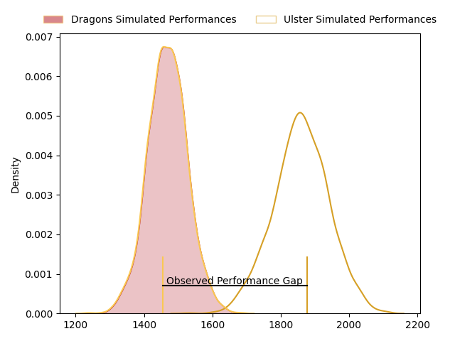
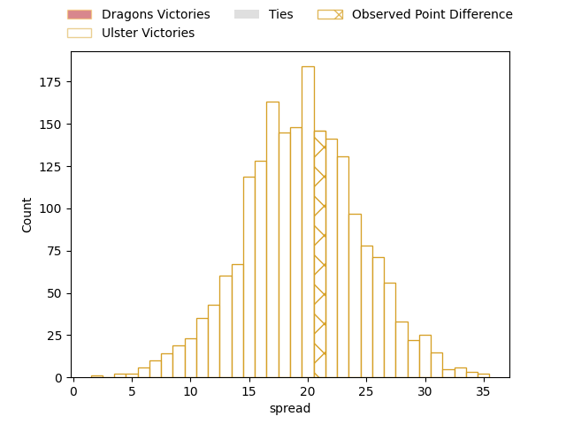

---  
layout: page  
title: Dragons at Ulster; 19-40  
date: 2023-04-14 20:35:00 18:00:00 -0500  
categories: match review  
---
# Dragons at Ulster; 19-40

# Club Level Predictions

The first set of predictions treats a club as the smallest object, as the club develops its members, organizes a gameplan, and deploys its players as needed for each match. This club model has a prediction of 0.903, which translates to predicting Ulster to win by 19.7.

Each club has a rating and a rating deviation (simiar to a Glicko system), and expected performances can be generated. This allows for simulated matches and spreads like the ones below.
## Projected Performances

## Projected Spreads

## Projected Results

# Player Level Predictions

Treating teams instead as an entity made up of the currently active players, I have ratings for each player in an altogether different system. These can be combined to form team ratings once teamsheets are announced, weighting starters a bit higher than the reserves. After the match is played, players can be weighted by their minutes on the field, allowing for an accurate measure of the team's composition. With these compiled team ratings, we can make predictions, measure inaccuracy, and update the individual player ratings.
## Prediction with Player Minutes: Ulster by 31.9

Ulster by 27.9 on a neutral field

There were 5 large changes in win probability in this match
## Prediction without Player Minutes: Ulster by 30.1

Ulster by 26.1 on a neutral pitch

|   Away Minutes | Away Player       |   Away elo |   Away Percentile |   Number |   Home Percentile |   Home elo | Home Player            |   Home Minutes |
|---------------:|:------------------|-----------:|------------------:|---------:|------------------:|-----------:|:-----------------------|---------------:|
|             68 | Rhodri Jones      |      89.22 |                36 |        1 |                63 |      96.73 | Eric O'Sullivan        |             23 |
|             61 | Elliott Dee       |      91.32 |                47 |        2 |                56 |      97.98 | Tom Stewart            |             66 |
|             27 | Leon Brown        |      95.35 |                59 |        3 |                65 |      99.45 | Tom O'Toole            |              5 |
|             80 | Ben Carter        |      81.59 |                15 |        4 |                89 |     114.7  | Alan O'Connor          |             80 |
|             80 | Matthew Screech   |      92.33 |                40 |        5 |                72 |     103.13 | Sam Carter             |             58 |
|             55 | George Nott       |      78.87 |                11 |        6 |                60 |      99.42 | David McCann           |             80 |
|             80 | Taine Basham      |      79.07 |                10 |        7 |                65 |     100.13 | Marcus Rea             |             80 |
|             75 | Aaron Wainwright  |     101.37 |                63 |        8 |                82 |     110.13 | Duane Vermeulen        |             53 |
|             80 | Rhodri Williams   |      82.3  |                14 |        9 |                73 |     105.22 | John Cooney            |             80 |
|             53 | Angus O'Brien     |      92.77 |                42 |       10 |                69 |     103.21 | Billy Burns            |             77 |
|             80 | Ashton Hewitt     |      80.72 |                14 |       11 |                54 |      97.26 | Jacob Stockdale        |             80 |
|             53 | Max Clark         |      93.08 |                43 |       12 |                96 |     128.42 | Stuart McCloskey       |             64 |
|             80 | Jared Lee Rosser  |      93.72 |                44 |       13 |                71 |     104.19 | James Hume             |             80 |
|             64 | Rio Dyer          |      80.61 |                13 |       14 |                51 |      96.25 | Craig Gilroy           |             77 |
|             80 | Jordan Williams   |      72.08 |                 7 |       15 |                90 |     117.02 | Michael Lowry          |             80 |
|             53 | Lloyd Fairbrother |      84.34 |                15 |       16 |                78 |     106.44 | Jeffery To'omaga-Allen |             75 |
|             27 | Will Reed         |      81.52 |                14 |       17 |                53 |      95.83 | Andrew Warwick         |             57 |
|             27 | Aneurin Owen      |      95    |               nan |       18 |                54 |      96.74 | Kieran Treadwell       |             22 |
|             25 | Sean Lonsdale     |      80.15 |                15 |       19 |                86 |     112.86 | Nick Timoney           |             27 |
|             19 | Brodie Coghlan    |      83.7  |                15 |       20 |                70 |     105.32 | Stewart Moore          |             16 |
|             16 | Lewis Jones       |      88.15 |                37 |       21 |                56 |      96.04 | John Andrew            |             14 |
|             12 | Josh Reynolds     |      95    |               nan |       22 |                69 |     101.8  | Nathan Doak            |              3 |
|              5 | George Young      |      95    |               nan |       23 |                40 |      96.03 | Ethan McIlroy          |              3 |

