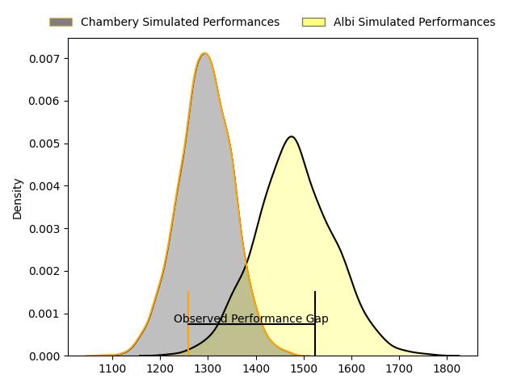
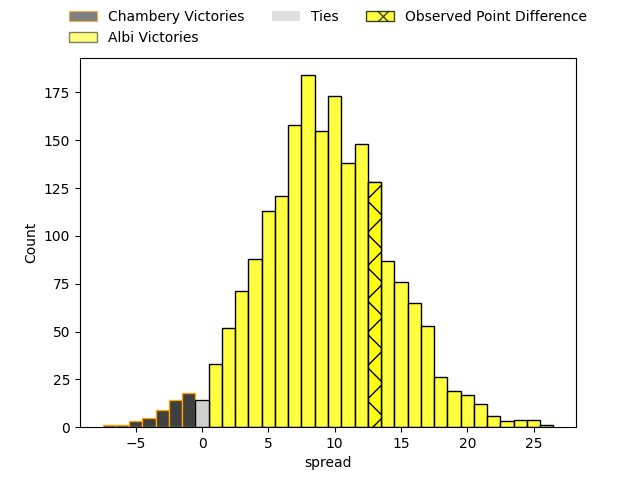
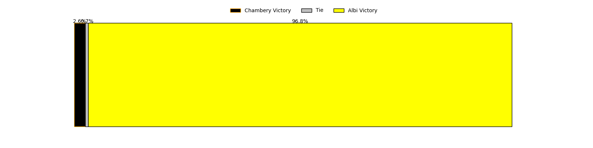

---  
layout: page  
title: Chambery at Albi; 20-33  
date: 2023-04-15 18:30:00 18:00:00 -0500  
categories: match review  
---
# Chambery at Albi; 20-33

# Club Level Predictions

The first set of predictions treats a club as the smallest object, as the club develops its members, organizes a gameplan, and deploys its players as needed for each match. This club model has a prediction of 0.743, which translates to predicting Albi to win by 9.4.

Each club has a rating and a rating deviation (simiar to a Glicko system), and expected performances can be generated. This allows for simulated matches and spreads like the ones below.
## Projected Performances

## Projected Spreads

## Projected Results

# Player Level Predictions

Treating teams instead as an entity made up of the currently active players, I have ratings for each player in an altogether different system. These can be combined to form team ratings once teamsheets are announced, weighting starters a bit higher than the reserves. After the match is played, players can be weighted by their minutes on the field, allowing for an accurate measure of the team's composition. With these compiled team ratings, we can make predictions, measure inaccuracy, and update the individual player ratings.
## Prediction with Player Minutes: Albi by 3.3

Chambery by 0.7 on a neutral field

There were 7 large changes in win probability in this match
## Prediction without Player Minutes: Albi by 3.8

Chambery by 0.2 on a neutral pitch

|   Away Minutes | Away Player                  |   Away elo |   Away Percentile |   Number |   Home Percentile |   Home elo | Home Player                |   Home Minutes |
|---------------:|:-----------------------------|-----------:|------------------:|---------:|------------------:|-----------:|:---------------------------|---------------:|
|             48 | Fabio Gonzalez               |      96.72 |                62 |        1 |                93 |     115.76 | Antoine Soave              |             51 |
|             48 | Julien Primault              |      88.36 |                27 |        2 |                38 |      91.52 | Reinach Venter             |             51 |
|             56 | Giorgi Pertaia               |      97.12 |                57 |        3 |                22 |      86.46 | Kevin Brou                 |             51 |
|             40 | Steevy Cerqueira             |      96.15 |                52 |        4 |                38 |      90.72 | Pierre Roussel             |             80 |
|             80 | Romain Guyot                 |      75.74 |                 8 |        5 |                53 |      96.38 | Pilbarnon Djossou Lokossou |             51 |
|             60 | Matheo Triki                 |     102.12 |                67 |        6 |                64 |      99.96 | Luke Joseph Stringer       |             80 |
|             80 | Colin Lebian                 |      95.61 |                49 |        7 |                14 |      82.7  | Vincent Calas              |             59 |
|             80 | Thomas Coignat               |      99.82 |                58 |        8 |                87 |     113.87 | Sandrick Maciotta          |             80 |
|             60 | Thibault Dufau               |     106.72 |                78 |        9 |                59 |      99.74 | Théo Vidal                 |             60 |
|             80 | Thibault Moreno              |      92.01 |                37 |       10 |                72 |     103.68 | Benjamin Pehau             |             80 |
|             80 | Paul Baptiste Florent Altier |      95.52 |                49 |       11 |                24 |      87.2  | Avenisi Vasuinubu          |             80 |
|             80 | Mickael Blanc                |      87.49 |                26 |       12 |               nan |      78.47 | James Haydn Tedder         |             80 |
|             53 | Victor Pisano                |      87.3  |                26 |       13 |                73 |     106.32 | Paul Clergue               |             65 |
|             80 | Vereniki Goneva              |     106.9  |                78 |       14 |                60 |      99.26 | Charly Vicenzo Trussardi   |             80 |
|             48 | Thomas Hecquet               |     106.73 |                74 |       15 |                64 |      99    | Enzo Marzocca              |             57 |
|             32 | Géraud Clermont              |      90.93 |                33 |       16 |                 5 |      73.64 | Maxime Escur               |             29 |
|             32 | Gauthier Brute de Remur      |     105.14 |                73 |       17 |                50 |      91.04 | Romain Maurice             |             29 |
|             24 | Lautaro Caro Saisi           |     102.67 |                71 |       18 |                23 |      87.9  | Dimitri Tchapnga           |             29 |
|             40 | Revan Gautier                |      96.34 |               nan |       19 |                28 |      88.75 | John Henry Heath Backhouse |             29 |
|             20 | Luka Begic                   |      87.69 |                25 |       20 |                 9 |      78.52 | Hugo Boutin                |             21 |
|             20 | Dylan Nocete                 |      93.06 |                42 |       21 |                15 |      80.84 | Gilen Queheille            |             20 |
|             27 | Jules Dorrival               |      86.09 |                24 |       22 |                60 |      99.54 | Téo Dospital               |             23 |
|             32 | Arthur Nennig                |     105.74 |                75 |       23 |               nan |      95    | Gabriel Aviragnet          |             15 |

