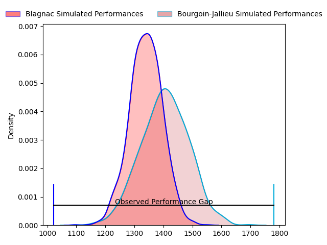
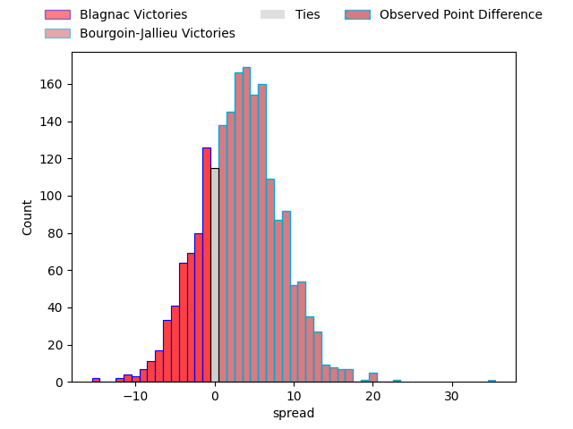
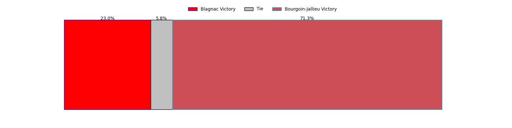

---  
layout: page  
title: Blagnac at Bourgoin-Jallieu; 3-38  
date: 2023-04-15 18:30:00 18:00:00 -0500  
categories: match review  
---
# Blagnac at Bourgoin-Jallieu; 3-38

# Club Level Predictions

The first set of predictions treats a club as the smallest object, as the club develops its members, organizes a gameplan, and deploys its players as needed for each match. This club model has a prediction of 0.592, which translates to predicting Bourgoin-Jallieu to win by 3.3.

Each club has a rating and a rating deviation (simiar to a Glicko system), and expected performances can be generated. This allows for simulated matches and spreads like the ones below.
## Projected Performances

## Projected Spreads

## Projected Results

# Player Level Predictions

Treating teams instead as an entity made up of the currently active players, I have ratings for each player in an altogether different system. These can be combined to form team ratings once teamsheets are announced, weighting starters a bit higher than the reserves. After the match is played, players can be weighted by their minutes on the field, allowing for an accurate measure of the team's composition. With these compiled team ratings, we can make predictions, measure inaccuracy, and update the individual player ratings.
## Prediction with Player Minutes: Bourgoin-Jallieu by 2.3

Blagnac by 1.7 on a neutral field

There were 1 large changes in win probability in this match
## Prediction without Player Minutes: Bourgoin-Jallieu by 1.2

Blagnac by 2.8 on a neutral pitch

|   Away Minutes | Away Player         |   Away elo |   Away Percentile |   Number |   Home Percentile |   Home elo | Home Player         |   Home Minutes |
|---------------:|:--------------------|-----------:|------------------:|---------:|------------------:|-----------:|:--------------------|---------------:|
|             57 | Cesar Biscioni      |     101.96 |                75 |        1 |                68 |     100.54 | Nugzar Somkhishvili |             49 |
|             55 | Leeroy Cloostermans |     116.04 |                94 |        2 |                39 |      91.74 | Maxime Castant      |             55 |
|             53 | Baptiste Collet     |     104.53 |                77 |        3 |                17 |      85.53 | Mickaël Simutoga    |             55 |
|             80 | Lucas Tolofua       |      65.67 |                 3 |        4 |                23 |      86.86 | Robin Gascou        |             49 |
|             54 | Lilian Rousset      |      99.34 |                62 |        5 |                33 |      90.21 | Jonathan Kpoku      |             80 |
|             80 | Benjamin Collet     |      92.83 |                41 |        6 |                29 |      88.09 | Kevin Rivoire       |             49 |
|             71 | Loïc Verdy          |      87.87 |                27 |        7 |                87 |     114.01 | Bynjamin Rabatel    |             80 |
|             54 | Nekolo Tolofua      |      84.09 |                18 |        8 |                 6 |      73.69 | Lakisipone Lee      |             49 |
|             56 | Corentin Penc'hoat  |      99.91 |                65 |        9 |                71 |     103.02 | Tomas Munilla       |             80 |
|             80 | Aurelien Labau      |      92.92 |                42 |       10 |                35 |      91.4  | Nicolas Vuillemin   |             80 |
|             80 | Dorian Terrou       |     102.06 |                67 |       11 |                81 |     108.34 | Quentin Lefort      |             49 |
|             80 | Clément Vareilles   |      96.53 |                51 |       12 |                74 |     105.7  | Christopher Bosch   |             49 |
|             80 | Thibault Moleana    |     102.65 |                68 |       13 |                13 |      81.92 | Pablo Patilla       |             80 |
|             63 | Lucas Martins       |      83.94 |                18 |       14 |                45 |      93.84 | Matthieu Nicolas    |             80 |
|             80 | Francois Tardieu    |      85.82 |                21 |       15 |                 9 |      75.7  | Nicolas Cachet      |             80 |
|             25 | Alexis Decaux       |     103.26 |                76 |       16 |                59 |      98.99 | Romain Favaretto    |             31 |
|             27 | Fabien Lorenzon     |      98.61 |                62 |       17 |                48 |      93.27 | Killian Tripier     |             25 |
|             26 | Vincent Mutel       |     109.54 |                83 |       18 |                65 |     101.19 | Oktay Yilmaz        |             25 |
|             23 | Gabin Villerouge    |     104.96 |                81 |       19 |                40 |      92.58 | Léandre Cotte       |             31 |
|             26 | Mathieu Vachon      |     103.73 |                71 |       20 |                77 |     106.8  | Kevin Chaudouard    |             31 |
|              9 | Florian Bertrand    |      89.22 |                30 |       21 |                57 |     102.76 | Théo Lepage         |             31 |
|             24 | Paul Ravier         |     103.94 |                74 |       22 |                68 |     103.77 | Remi Bouet          |             31 |
|             17 | Simon Villemur      |     102.61 |                68 |       23 |                49 |      91.76 | Romain Sola         |             31 |

