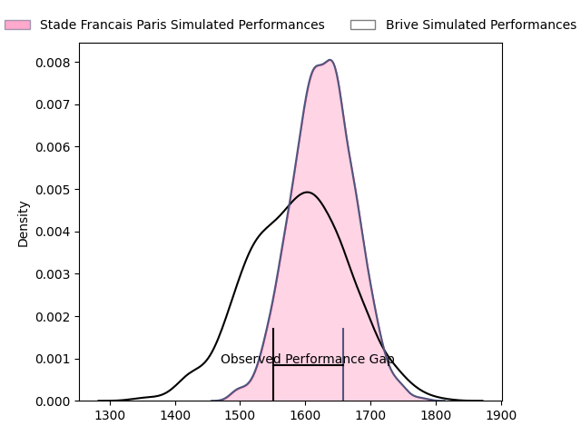
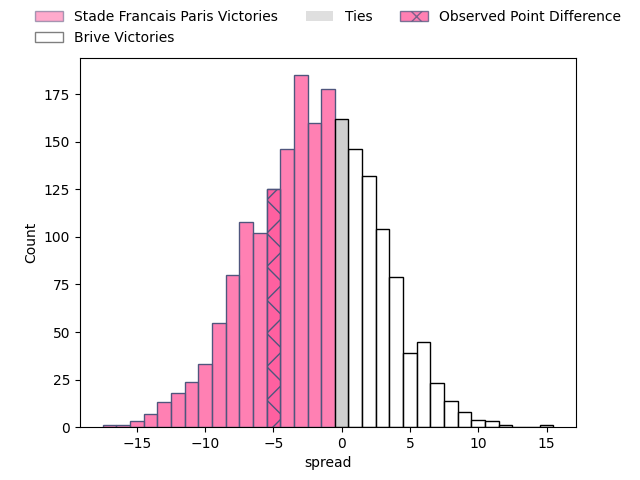
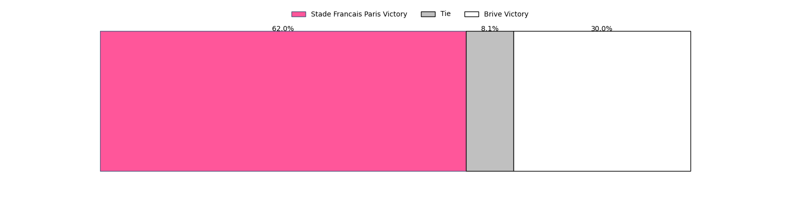

---  
layout: page  
title: Stade Francais Paris at Brive; 27-22  
date: 2023-04-15 17:00:00 18:00:00 -0500  
categories: match review  
---
# Stade Francais Paris at Brive; 27-22

# Club Level Predictions

The first set of predictions treats a club as the smallest object, as the club develops its members, organizes a gameplan, and deploys its players as needed for each match. This club model has a prediction of 0.449, which translates to predicting Stade Francais Paris to win by 1.8.

Each club has a rating and a rating deviation (simiar to a Glicko system), and expected performances can be generated. This allows for simulated matches and spreads like the ones below.
## Projected Performances

## Projected Spreads

## Projected Results

# Player Level Predictions

Treating teams instead as an entity made up of the currently active players, I have ratings for each player in an altogether different system. These can be combined to form team ratings once teamsheets are announced, weighting starters a bit higher than the reserves. After the match is played, players can be weighted by their minutes on the field, allowing for an accurate measure of the team's composition. With these compiled team ratings, we can make predictions, measure inaccuracy, and update the individual player ratings.
## Prediction with Player Minutes: Brive by 10.0

Brive by 6.0 on a neutral field

There were 7 large changes in win probability in this match
## Prediction without Player Minutes: Brive by 9.7

Brive by 5.7 on a neutral pitch

|   Away Minutes | Away Player                   |   Away elo |   Away Percentile |   Number |   Home Percentile |   Home elo | Home Player               |   Home Minutes |
|---------------:|:------------------------------|-----------:|------------------:|---------:|------------------:|-----------:|:--------------------------|---------------:|
|             62 | Moses Eneliko Alo-Emile       |      94.7  |                49 |        1 |                64 |      99.24 | Daniel Brennan            |             40 |
|             49 | Mickaël Ivaldi                |      90.53 |                42 |        2 |                25 |      91.48 | Motu Farao Matu'u         |             48 |
|             59 | Paul Alo-Emile                |      96.41 |                63 |        3 |               nan |      95    | Luka Japaridze            |             61 |
|             80 | Paul Gabrillagues             |      85.42 |                24 |        4 |                69 |     101.92 | Lucas Martin Paulos Adler |             48 |
|             63 | Baptiste Pesenti              |      89.07 |                30 |        5 |                26 |      87.9  | Julien Delannoy           |             28 |
|             80 | Romain Briatte                |      90.58 |                33 |        6 |                 4 |      71.14 | Esteban Abadie            |             48 |
|             80 | Marcos Kremer                 |      86.23 |                22 |        7 |                41 |      92.81 | Saïd Hireche              |             80 |
|             64 | Sekou Macalou                 |      84.16 |                16 |        8 |                66 |     101.5  | Rodrigo Bruni             |             80 |
|             61 | Arthur Coville                |      93.35 |                43 |        9 |                89 |     113.45 | Vasil Lobzhanidze         |             57 |
|             49 | Léo Barré                     |      92.42 |                42 |       10 |                45 |      95.14 | Nicolas Sanchez           |             80 |
|             80 | Lester Etien                  |      85.67 |                21 |       11 |                27 |      87.79 | Setareki Bituniyata       |             40 |
|             80 | Julien Delbouis               |      88.45 |                28 |       12 |                44 |      93.37 | Thomas Laranjeira         |             80 |
|             66 | Jeremy Charles Ward           |      86.23 |                23 |       13 |                 8 |      80.3  | Setariki Tuicuvu          |             80 |
|             80 | Peniasi Dakuwaqa              |      79.04 |                12 |       14 |                19 |      84.49 | Arthur Bonneval           |             80 |
|             80 | Kylan Hamdaoui                |      89.59 |                34 |       15 |                55 |      98.45 | Stuart Olding             |             80 |
|             31 | Laurent Panis                 |      86.39 |                21 |       16 |               nan |      92.31 | Abraham Papali'i          |             52 |
|             31 | Joris Segonds                 |      77.44 |                 8 |       17 |                13 |      86.54 | Wesley Tapueluelu         |             40 |
|             21 | Giorgi Melikidze              |      87.8  |                31 |       18 |                18 |      84.27 | Axel Muller               |             40 |
|             19 | James Hall                    |      82.13 |                39 |       19 |               nan |      91.94 | Andres Zafra Tarazona     |             32 |
|             18 | Vasil Kakovin                 |      88.68 |                25 |       20 |                24 |      87.74 | Ross Moriarty             |             32 |
|             17 | Juan John (JJ) van der Mescht |      94.35 |                54 |       21 |               nan |      95    | Vano Karkadze             |             32 |
|             16 | Mathieu Hirigoyen             |      88.46 |                27 |       22 |                 7 |      72.34 | Mathis Ferté              |             23 |
|             14 | Paolo Odogwu                  |      86.45 |                23 |       23 |                33 |      90.88 | Francisco Coria Marchetti |             19 |

