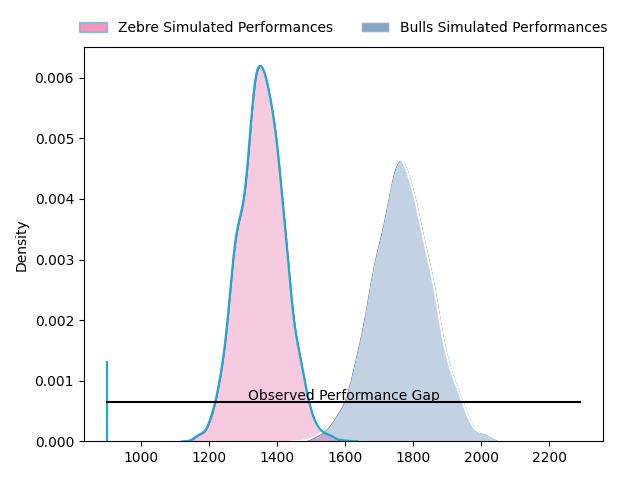
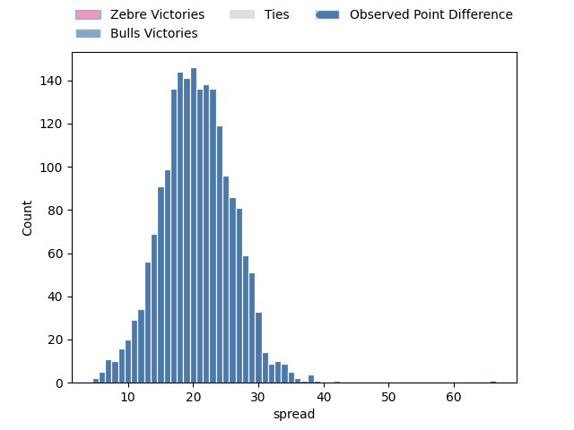

---  
layout: page  
title: Zebre at Bulls; 12-78  
date: 2023-04-15 13:00:00 18:00:00 -0500  
categories: match review  
---
# Zebre at Bulls; 12-78

# Club Level Predictions

The first set of predictions treats a club as the smallest object, as the club develops its members, organizes a gameplan, and deploys its players as needed for each match. This club model has a prediction of 0.912, which translates to predicting Bulls to win by 20.7.

Each club has a rating and a rating deviation (simiar to a Glicko system), and expected performances can be generated. This allows for simulated matches and spreads like the ones below.
## Projected Performances

## Projected Spreads

## Projected Results

# Player Level Predictions

Treating teams instead as an entity made up of the currently active players, I have ratings for each player in an altogether different system. These can be combined to form team ratings once teamsheets are announced, weighting starters a bit higher than the reserves. After the match is played, players can be weighted by their minutes on the field, allowing for an accurate measure of the team's composition. With these compiled team ratings, we can make predictions, measure inaccuracy, and update the individual player ratings.
## Prediction with Player Minutes: Bulls by 27.2

Bulls by 23.2 on a neutral field

There were 2 large changes in win probability in this match
## Prediction without Player Minutes: Bulls by 28.2

Bulls by 24.2 on a neutral pitch

|   Away Minutes | Away Player            |   Away elo |   Away Percentile |   Number |   Home Percentile |   Home elo | Home Player                  |   Home Minutes |
|---------------:|:-----------------------|-----------:|------------------:|---------:|------------------:|-----------:|:-----------------------------|---------------:|
|             49 | Paolo Buonfiglio       |      82.26 |                12 |        1 |                74 |     102.1  | Gerhardus Cornelis Steenkamp |             58 |
|             13 | Jacques du Toit        |      90.41 |                33 |        2 |                74 |     102.66 | Cornelis Johannes Grobbelaar |             58 |
|             54 | Matteo Nocera          |      86.97 |                21 |        3 |                66 |      99.74 | Mornay Jan Jakobus Smith     |             58 |
|             80 | David Sisi             |      93.77 |               nan |        4 |                66 |     100.73 | Ruan Stefan Vermaak          |             80 |
|             45 | Leonard Krumov         |      74.28 |                 8 |        5 |                71 |     103.08 | Ruan Nortje                  |             65 |
|             80 | Guido Volpi            |      85.91 |                21 |        6 |                71 |     103.73 | Marco Gerhardt van Staden    |             80 |
|             49 | Jacopo Bianchi         |      90.9  |                34 |        7 |                68 |     102.38 | Cyle Justin Brink            |             80 |
|             80 | Davide Ruggeri         |      86.9  |                22 |        8 |                70 |     104.21 | Elrigh Louw                  |             62 |
|             40 | Alessandro Fusco       |      82.2  |                14 |        9 |                57 |      98.17 | Embrose Cheldon Papier       |             62 |
|             54 | Geronimo Prisciantelli |      88.48 |                27 |       10 |                37 |      93.88 | Johannes Lodewikus Goosen    |             80 |
|             80 | Simone Gesi            |      78.45 |                11 |       11 |                57 |      98.45 | David Kriel                  |             80 |
|             80 | Enrico Lucchin         |      81.39 |                13 |       12 |                80 |     108.71 | Harold William Vorster       |             70 |
|             80 | Erich Cronje           |      88.59 |                28 |       13 |                75 |     106.03 | Stedman-Gee Rivett Gans      |             80 |
|             80 | Jacobus van Wyk        |      82.27 |                15 |       14 |                77 |     106.57 | Canan Moodie                 |             80 |
|             43 | Richard Kriel          |      83.96 |                19 |       15 |                71 |     105.12 | Kurt-Lee Arendse             |             66 |
|             67 | Luca Bigi              |      95    |               nan |       16 |                18 |      91.51 | Francois Klopper             |             22 |
|             40 | Chris Cook             |      79.42 |                11 |       17 |                35 |      93.06 | Dylan Thomas Smith           |             22 |
|             37 | Jacopo Trulla          |      81.85 |                17 |       18 |               nan |      98.07 | Bismarck du Plessis          |             22 |
|             35 | Andrea Zambonin        |      88.82 |                29 |       19 |                55 |     102.57 | WJ Steenkamp                 |             18 |
|             31 | Giacomo Ferrari        |      97.11 |                58 |       20 |                25 |      90.36 | Keagan Johannes              |             18 |
|             31 | Alessio Sanavia        |     105.9  |               nan |       21 |                77 |     105.4  | Janko Swanepoel              |             15 |
|             26 | Muhamed Hasa           |      94.11 |                46 |       22 |                79 |     108.83 | Chris Smith                  |             14 |
|             26 | Tiff Eden              |      78.31 |                 9 |       23 |                35 |      95.66 | Cornal Hendricks             |             10 |

