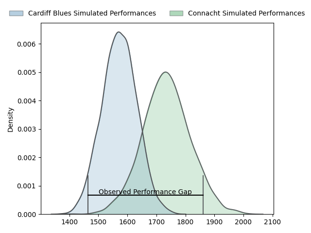

---  
layout: page  
title: Cardiff Blues at Connacht; 19-38  
date: 2023-04-15 20:35:00 18:00:00 -0500  
categories: match review  
---
# Cardiff Blues at Connacht; 19-38

# Club Level Predictions

The first set of predictions treats a club as the smallest object, as the club develops its members, organizes a gameplan, and deploys its players as needed for each match. This club model has a prediction of 0.713, which translates to predicting Connacht to win by 8.1.

Each club has a rating and a rating deviation (simiar to a Glicko system), and expected performances can be generated. This allows for simulated matches and spreads like the ones below.
## Projected Performances

## Projected Spreads

## Projected Results

# Player Level Predictions

Treating teams instead as an entity made up of the currently active players, I have ratings for each player in an altogether different system. These can be combined to form team ratings once teamsheets are announced, weighting starters a bit higher than the reserves. After the match is played, players can be weighted by their minutes on the field, allowing for an accurate measure of the team's composition. With these compiled team ratings, we can make predictions, measure inaccuracy, and update the individual player ratings.
## Prediction with Player Minutes: Connacht by 0.9

Cardiff Blues by 3.1 on a neutral field

There were 5 large changes in win probability in this match
## Prediction without Player Minutes: Connacht by 2.0

Cardiff Blues by 2.0 on a neutral pitch

|   Away Minutes | Away Player       |   Away elo |   Away Percentile |   Number |   Home Percentile |   Home elo | Home Player             |   Home Minutes |
|---------------:|:------------------|-----------:|------------------:|---------:|------------------:|-----------:|:------------------------|---------------:|
|             59 | Corey Domachowski |     104.93 |                80 |        1 |                27 |      89.4  | Dennis Buckley          |             59 |
|             51 | Liam Belcher      |     100.79 |                69 |        2 |                64 |      95.13 | Dylan Tierney-Martin    |             66 |
|             59 | Kieran Assirati   |      96.13 |                54 |        3 |                41 |      92.96 | Finlay Bealham          |             54 |
|             32 | Lopeti Timani     |      84.98 |                18 |        4 |                42 |      92.99 | Joshua Daniel Murphy    |             59 |
|             70 | Seb Davies        |      92.19 |                32 |        5 |                56 |      97.54 | Niall Murray            |             80 |
|             64 | James Botham      |      92.18 |                39 |        6 |                39 |      92.01 | Cian Prendergast        |             80 |
|             80 | Thomas Young      |     103.41 |                70 |        7 |                42 |      93.1  | Conor Oliver            |             80 |
|             80 | Taulupe Faletau   |     113.65 |                86 |        8 |                69 |     103.8  | Jarrad Butler           |             15 |
|             73 | Tomos Williams    |     127.31 |                97 |        9 |                50 |      95.51 | Caolin Blade            |             63 |
|             80 | Rhys Priestland   |      97.11 |                51 |       10 |                79 |     108.72 | Jack Carty              |             69 |
|             80 | Jason Harries     |      86.74 |                23 |       11 |                 8 |      76.57 | Mack Hansen             |             80 |
|             80 | Max Llewellyn     |     105.71 |                74 |       12 |                96 |     127.35 | Bundee Aki              |             80 |
|             80 | Mason Grady       |      91.8  |                38 |       13 |                49 |      95.69 | Thomas Farrell          |             80 |
|             59 | Owen Lane         |     101.53 |                65 |       14 |                83 |     110.61 | Diarmuid Kilgallen      |             80 |
|             80 | Ben Thomas        |      90.62 |                38 |       15 |                45 |      93.57 | Tiernan O'Halloran      |             66 |
|             48 | Joshua Turnbull   |      98.96 |                60 |       16 |                32 |      90.97 | Shamus Hurley-Langton   |             65 |
|             29 | Kristian Dacey    |      97.03 |                46 |       17 |               nan |      98.85 | Dominic Robertson-McCoy |             26 |
|             21 | Harri Millard     |      95    |               nan |       18 |                61 |      98.33 | Peter Dooley            |             21 |
|             21 | Dillon Lewis      |     109.67 |                81 |       19 |                60 |      96.61 | Oisin Dowling           |             21 |
|             21 | Rhys Carre        |      87.03 |                15 |       20 |               nan |      97.44 | Kieran Marmion          |             17 |
|             16 | James Ratti       |      89.72 |                27 |       21 |               nan |      94.66 | Shane Jennings          |             14 |
|             10 | Rory Thornton     |      93.1  |               nan |       22 |               nan |      96.52 | Eoin  de Buitlear       |             14 |
|              7 | Lloyd Williams    |      98.17 |                56 |       23 |               nan |      97.97 | Tom Daly                |             11 |

