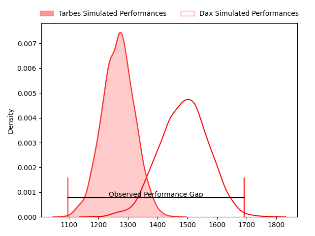
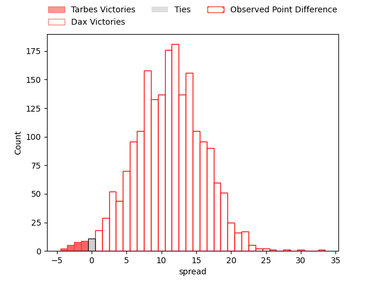
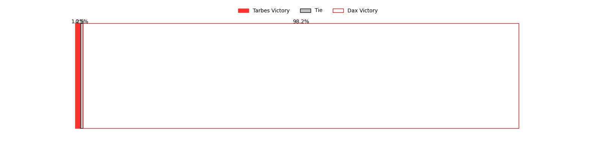

---  
layout: page  
title: Tarbes at Dax; 24-52  
date: 2023-04-15 19:00:00 18:00:00 -0500  
categories: match review  
---
# Tarbes at Dax; 24-52

# Club Level Predictions

The first set of predictions treats a club as the smallest object, as the club develops its members, organizes a gameplan, and deploys its players as needed for each match. This club model has a prediction of 0.78, which translates to predicting Dax to win by 11.2.

Each club has a rating and a rating deviation (simiar to a Glicko system), and expected performances can be generated. This allows for simulated matches and spreads like the ones below.
## Projected Performances

## Projected Spreads

## Projected Results

# Player Level Predictions

Treating teams instead as an entity made up of the currently active players, I have ratings for each player in an altogether different system. These can be combined to form team ratings once teamsheets are announced, weighting starters a bit higher than the reserves. After the match is played, players can be weighted by their minutes on the field, allowing for an accurate measure of the team's composition. With these compiled team ratings, we can make predictions, measure inaccuracy, and update the individual player ratings.
## Prediction with Player Minutes: Dax by 16.2

Dax by 12.2 on a neutral field

There were 8 large changes in win probability in this match
## Prediction without Player Minutes: Dax by 16.1

Dax by 12.1 on a neutral pitch

|   Away Minutes | Away Player               |   Away elo |   Away Percentile |   Number |   Home Percentile |   Home elo | Home Player          |   Home Minutes |
|---------------:|:--------------------------|-----------:|------------------:|---------:|------------------:|-----------:|:---------------------|---------------:|
|             60 | Antoine Palisse           |      83.76 |                14 |        1 |                87 |     111.06 | Louis Mary           |             53 |
|             65 | Enzo Mondon               |     103.99 |                82 |        2 |                69 |     100.66 | Louis Barrere        |             53 |
|             60 | Aleksi Tchitchiashvili    |      76.92 |                 8 |        3 |                11 |      81.91 | Thibaud Dréan        |             53 |
|             80 | Antoine Bousquet          |      80.5  |                13 |        4 |                25 |      88.75 | Étienne Loiret       |             62 |
|             58 | Jason Nel                 |      94.31 |               nan |        5 |                23 |      88.35 | Matt Luamanu         |             58 |
|             80 | Mattéo Coustalat          |      95.27 |                48 |        6 |                75 |     105.75 | Arnaud Aletti        |             80 |
|             29 | Léo Estaque               |      95.19 |               nan |        7 |                43 |      94.7  | Jean Despiau         |             80 |
|             80 | Gigi Leshkasheli          |      94.78 |               nan |        8 |                13 |      81.26 | Brice Ferrer         |             80 |
|             53 | Alexis Levron             |      88.81 |                32 |        9 |                52 |      96.12 | Simon Garrouteigt    |             53 |
|             53 | Anthony  Fuertes          |      98.83 |                56 |       10 |                74 |     105.08 | Hugo Cerisier        |             53 |
|             80 | Jonathan Duffau           |     104.53 |                73 |       11 |                94 |     124.96 | Théo Gatelier        |             80 |
|             80 | Josaia Vakacegu           |      90.21 |                32 |       12 |                40 |      92.33 | Ilikena Bolakoro     |             80 |
|             40 | Julien Cantan             |      89.89 |                30 |       13 |                81 |     108.91 | Rodrigo Marta        |             80 |
|             80 | Johan Paulet              |      81.81 |                15 |       14 |                11 |      80.84 | Julien Dechavanne    |             80 |
|             80 | Thibaut Trotta            |      74.45 |                11 |       15 |                86 |     114.62 | Théo Duprat          |             41 |
|             20 | Alexandre Combier         |      81.19 |                10 |       16 |                21 |      90.54 | Joaquin Rodon        |             27 |
|             15 | Johan Mees Erasmus        |      98.02 |                61 |       17 |                98 |     129.68 | Elvis Levi           |             27 |
|             20 | Mariano Ezequiel Filomeno |      93.17 |                30 |       18 |                17 |      85.88 | Diogo Hasse Ferreira |             27 |
|             22 | Paul Sajous               |      68.22 |                 4 |       19 |                42 |      93.22 | Diaby Doucouré       |             18 |
|             51 | Aurelien Ricart           |      91.43 |                36 |       20 |                72 |     103.37 | Mattieu Bidau        |             22 |
|             27 | Thomas Lhusero            |     134.47 |                98 |       21 |                83 |     112.02 | Sylvère Reteau       |             27 |
|             27 | Mathieu Berbizier         |      93.1  |                49 |       22 |                18 |      83.95 | Gaëtan Robert        |             27 |
|             40 | Alofa Alofa               |      90.26 |                33 |       23 |                84 |     112.48 | Hugo Fourquet        |             39 |

