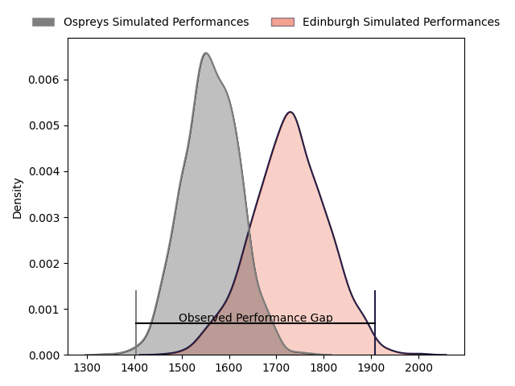
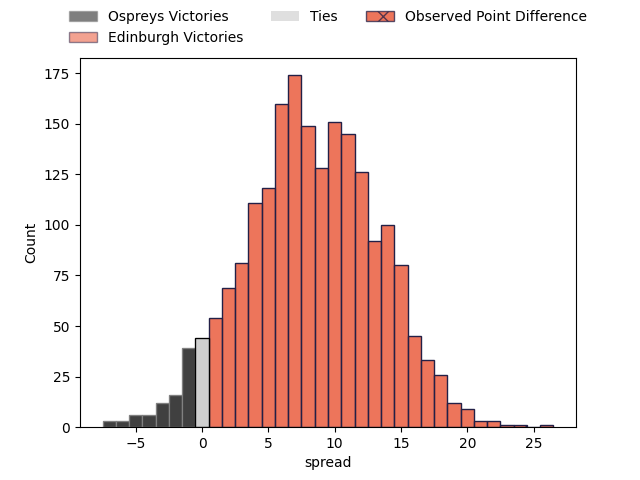
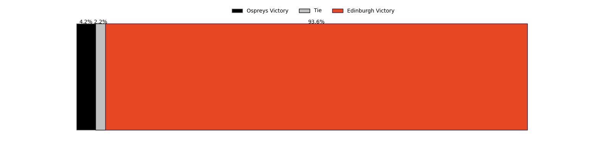

---  
layout: page  
title: Ospreys at Edinburgh; 21-45  
date: 2023-04-15 20:35:00 18:00:00 -0500  
categories: match review  
---
# Ospreys at Edinburgh; 21-45

# Club Level Predictions

The first set of predictions treats a club as the smallest object, as the club develops its members, organizes a gameplan, and deploys its players as needed for each match. This club model has a prediction of 0.715, which translates to predicting Edinburgh to win by 8.1.

Each club has a rating and a rating deviation (simiar to a Glicko system), and expected performances can be generated. This allows for simulated matches and spreads like the ones below.
## Projected Performances

## Projected Spreads

## Projected Results

# Player Level Predictions

Treating teams instead as an entity made up of the currently active players, I have ratings for each player in an altogether different system. These can be combined to form team ratings once teamsheets are announced, weighting starters a bit higher than the reserves. After the match is played, players can be weighted by their minutes on the field, allowing for an accurate measure of the team's composition. With these compiled team ratings, we can make predictions, measure inaccuracy, and update the individual player ratings.
## Prediction with Player Minutes: Ospreys by 3.2

Ospreys by 7.2 on a neutral field

There were 3 large changes in win probability in this match
## Prediction without Player Minutes: Ospreys by 3.3

Ospreys by 7.3 on a neutral pitch

|   Away Minutes | Away Player            |   Away elo |   Away Percentile |   Number |   Home Percentile |   Home elo | Home Player              |   Home Minutes |
|---------------:|:-----------------------|-----------:|------------------:|---------:|------------------:|-----------:|:-------------------------|---------------:|
|             50 | Gareth Thomas          |      84.45 |                 7 |        1 |                18 |      86.15 | Pierre Schoeman          |             59 |
|             50 | Dewi Lake              |      99.65 |               nan |        2 |                31 |      89.71 | David Cherry             |             55 |
|             50 | Tom Botha              |      95.51 |                42 |        3 |                98 |     135.91 | WP Nel                   |             55 |
|             80 | Adam Beard             |     114.54 |                89 |        4 |                36 |      90.19 | Marshall Sykes           |             21 |
|             53 | Alun Wyn Jones         |     110.61 |                85 |        5 |                95 |     124.87 | Sam Skinner              |             80 |
|             80 | Rhys Davies            |      89.86 |                24 |        6 |                96 |     129.82 | Jamie Ritchie            |             80 |
|             69 | Daniel Lydiate         |      99.01 |                48 |        7 |                60 |      99.36 | Hamish Watson            |             80 |
|             80 | Morgan Morris          |     103.2  |                68 |        8 |                12 |      80.06 | Viliame Mata             |             64 |
|             60 | Rhys Webb              |     122.87 |                95 |        9 |                21 |      85.87 | Ben Vellacott            |             60 |
|             60 | Owen Williams          |     120.34 |                90 |       10 |                99 |     151.19 | Blair Kinghorn           |             80 |
|             80 | Luke Morgan            |      98.37 |                57 |       11 |                10 |      77.13 | Damien Hoyland           |             80 |
|             71 | Kieran Williams        |     100.35 |                62 |       12 |                11 |      80.11 | James Lang               |             80 |
|             80 | Michael Collins        |     104.41 |                70 |       13 |                13 |      81.65 | Mark Bennett             |             66 |
|             80 | George North           |     122.9  |                92 |       14 |                46 |      94.45 | Darcy Graham             |             76 |
|             80 | Iestyn Hopkins         |      92.37 |                32 |       15 |                32 |      88.94 | Emiliano Boffelli        |             80 |
|             30 | Nicky Smith            |      96.57 |                56 |       16 |                29 |      87.44 | Jamie Hodgson            |             59 |
|             30 | Tomas Francis          |     138.04 |                99 |       17 |               nan |      95.25 | Luan de Bruin            |             25 |
|             30 | Sam Parry              |      96.06 |                54 |       18 |                32 |      90.25 | Stuart McInally          |             25 |
|             27 | Ethan Roots            |      92.88 |                41 |       19 |                11 |      83.08 | Abram Adrian Boan Venter |             21 |
|             20 | Reuben Morgan-Williams |      92.35 |                39 |       20 |                43 |      93.24 | Henry Pyrgos             |             20 |
|             20 | Gareth Anscombe        |      96.71 |               nan |       21 |                24 |      87.42 | Conor Boyle              |             16 |
|             11 | Huw Sutton             |      96.67 |                54 |       22 |               nan |      88.38 | Chris Dean               |             14 |
|              9 | Max Nagy               |      92.66 |                43 |       23 |                61 |      99.75 | Duhan van der Merwe      |              4 |

