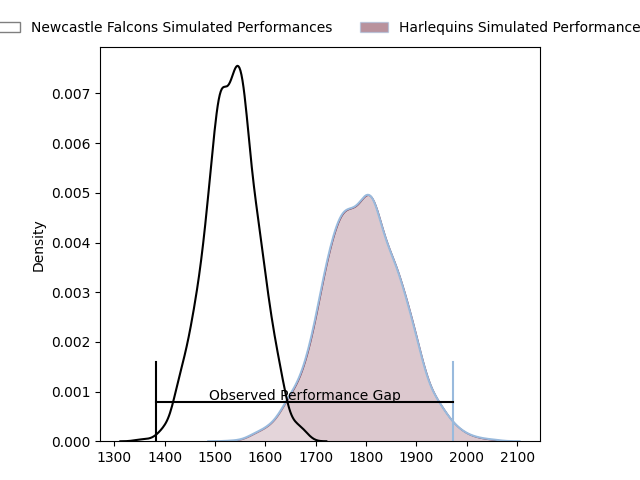
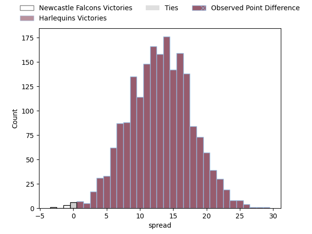

---  
layout: page  
title: Newcastle Falcons at Harlequins; 20.0-48.0  
date: 2023-04-15 10:00:00 18:00:00 -0500  
categories: match review  
---
# Newcastle Falcons at Harlequins; 20.0-48.0

# Club Level Predictions

The first set of predictions treats a club as the smallest object, as the club develops its members, organizes a gameplan, and deploys its players as needed for each match. This club model has a prediction of 0.814, which translates to predicting Harlequins to win by 13.0.

Each club has a rating and a rating deviation (simiar to a Glicko system), and expected performances can be generated. This allows for simulated matches and spreads like the ones below.
## Projected Performances

## Projected Spreads

## Projected Results

# Player Level Predictions

Treating teams instead as an entity made up of the currently active players, I have ratings for each player in an altogether different system. These can be combined to form team ratings once teamsheets are announced, weighting starters a bit higher than the reserves. After the match is played, players can be weighted by their minutes on the field, allowing for an accurate measure of the team's composition. With these compiled team ratings, we can make predictions, measure inaccuracy, and update the individual player ratings.
## Prediction with Player Minutes: Harlequins by 12.5

Harlequins by 8.5 on a neutral field

There were 9 large changes in win probability in this match
## Prediction without Player Minutes: Harlequins by 12.2

Harlequins by 8.2 on a neutral pitch

|   Away Minutes | Away Player         |   Away elo |   Away Percentile |   Number |   Home Percentile |   Home elo | Home Player       |   Home Minutes |
|---------------:|:--------------------|-----------:|------------------:|---------:|------------------:|-----------:|:------------------|---------------:|
|             66 | Adam Brocklebank    |      95.65 |                52 |        1 |                62 |      98.56 | Joe Marler        |             68 |
|             54 | Jamie Blamire       |      88.06 |                26 |        2 |                11 |      80.03 | Jack Walker       |             68 |
|             66 | Mark Tampin         |      93.68 |                33 |        3 |                93 |     115.53 | Wilco Louw        |             25 |
|             73 | Greg Peterson       |      81    |                14 |        4 |                83 |     109.39 | Dino Lamb         |             80 |
|             80 | Sebastian de Chaves |      62.7  |                 3 |        5 |                86 |     111.12 | Irne Herbst       |             70 |
|             80 | Pedro Rubiolo       |      95.35 |                49 |        6 |                 6 |      76.86 | Luke Wallace      |             55 |
|             80 | Callum Chick        |     101.33 |                66 |        7 |                15 |      83.34 | Will Evans        |             80 |
|             51 | Carl Fearns         |     117.49 |                89 |        8 |                98 |     136.96 | Alex Dombrandt    |             80 |
|             61 | Michael Young       |     116.63 |                92 |        9 |                81 |     108.19 | Danny Care        |             72 |
|             73 | Brett Connon        |      84.03 |                18 |       10 |                90 |     121.19 | Marcus Smith      |             80 |
|             80 | Mateo Carreras      |      90.83 |                36 |       11 |                50 |      96.1  | Cadan Murley      |             80 |
|             80 | Matias Moroni       |     120.06 |                92 |       12 |                87 |     114.6  | Andre Esterhuizen |             80 |
|             43 | Ben Stevenson       |     103.77 |                63 |       13 |                47 |      94.86 | Joe Marchant      |             80 |
|             80 | Adam Radwan         |     132.18 |                97 |       14 |                85 |     112.9  | Louis Lynagh      |             55 |
|             80 | Elliott Obatoyinbo  |     101.46 |                64 |       15 |                60 |      99.46 | Josh Bassett      |             61 |
|             26 | Conrad Cade         |      97.39 |               nan |       16 |                51 |      95.25 | Sam Riley         |             12 |
|             14 | Logovi'i Mulipola   |     104.3  |                79 |       17 |                44 |      93.9  | Fin Baxter        |             12 |
|             14 | Conor Kenny         |      88.5  |               nan |       18 |                75 |     105.57 | Simon Kerrod      |             55 |
|             29 | Freddie Lockwood    |     104.33 |                70 |       19 |                17 |      85.83 | George Hammond    |             10 |
|              7 | Tom Marshall        |      71.2  |                 5 |       20 |                25 |      88.14 | Jack Kenningham   |             25 |
|             19 | Sam Stuart          |      57.27 |                 0 |       21 |                59 |      97.79 | Lewis Gjaltema    |              8 |
|              7 | Josh Thomas         |      67.46 |                 3 |       22 |                77 |     105.93 | Oscar Beard       |             25 |
|             37 | Pete Lucock         |      96.52 |                49 |       23 |                23 |      86.35 | Tommaso Allan     |             19 |

