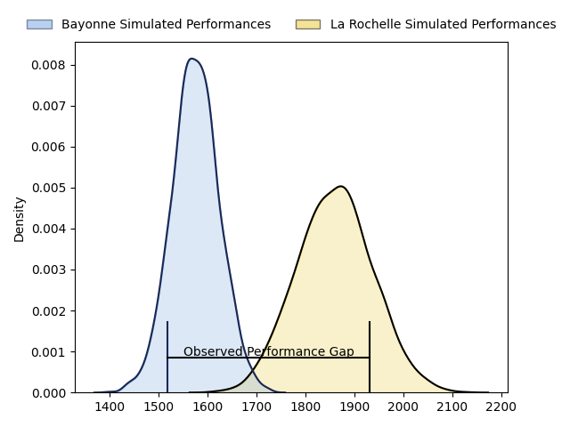
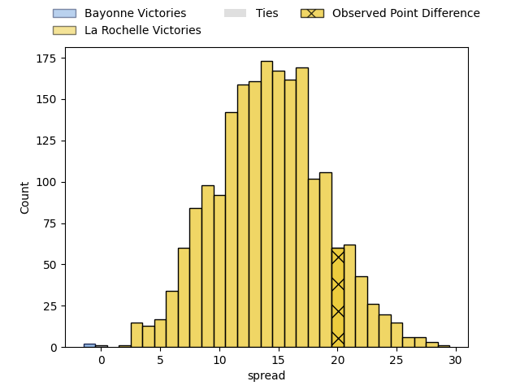
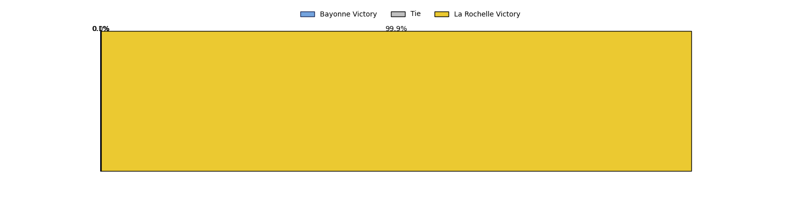

---  
layout: page  
title: Bayonne at La Rochelle; 6-26  
date: 2023-04-15 21:00:00 18:00:00 -0500  
categories: match review  
---
# Bayonne at La Rochelle; 6-26

# Club Level Predictions

The first set of predictions treats a club as the smallest object, as the club develops its members, organizes a gameplan, and deploys its players as needed for each match. This club model has a prediction of 0.833, which translates to predicting La Rochelle to win by 14.1.

Each club has a rating and a rating deviation (simiar to a Glicko system), and expected performances can be generated. This allows for simulated matches and spreads like the ones below.
## Projected Performances

## Projected Spreads

## Projected Results

# Player Level Predictions

Treating teams instead as an entity made up of the currently active players, I have ratings for each player in an altogether different system. These can be combined to form team ratings once teamsheets are announced, weighting starters a bit higher than the reserves. After the match is played, players can be weighted by their minutes on the field, allowing for an accurate measure of the team's composition. With these compiled team ratings, we can make predictions, measure inaccuracy, and update the individual player ratings.
## Prediction with Player Minutes: La Rochelle by 14.4

La Rochelle by 10.4 on a neutral field

There were 2 large changes in win probability in this match
## Prediction without Player Minutes: La Rochelle by 13.3

La Rochelle by 9.3 on a neutral pitch

|   Away Minutes | Away Player           |   Away elo |   Away Percentile |   Number |   Home Percentile |   Home elo | Home Player               |   Home Minutes |
|---------------:|:----------------------|-----------:|------------------:|---------:|------------------:|-----------:|:--------------------------|---------------:|
|             59 | Quentin Béthune       |      95.94 |               nan |        1 |                69 |     100.77 | Reda Wardi                |             63 |
|             59 | Facundo Bosch         |      96.24 |                55 |        2 |                58 |     104.95 | Quentin Lespiaucq-Brettes |             67 |
|             51 | Tevita Tatafu         |      88.78 |                25 |        3 |                56 |      98.91 | Joel Sclavi               |             63 |
|             13 | Geoffrey Cridge       |      95    |               nan |        4 |                56 |      99.58 | Romain Sazy               |             59 |
|             51 | Konstantin Mikautadze |     116.54 |                90 |        5 |                56 |      98.02 | Rémi Picquette            |             80 |
|             80 | Pierre Huguet         |      84.86 |                17 |        6 |                58 |     100.31 | Rémi Bourdeau             |             80 |
|             80 | Baptiste Heguy        |      95.34 |                48 |        7 |               nan |      97.28 | Matthias Haddad           |             28 |
|             80 | Uzair Cassiem         |      94.53 |                43 |        8 |                49 |      96.57 | Yoan Tanga Mangene        |             80 |
|             68 | Maxime Machenaud      |      92.94 |                46 |        9 |                44 |      96.54 | Thomas Berjon             |             65 |
|             67 | Camille Lopez         |      96.19 |                49 |       10 |               nan |      96.92 | Hugo Reus                 |             80 |
|             80 | Rémy Baget            |      93.05 |                43 |       11 |               nan |      95    | Martin Alonso Munoz       |             51 |
|             59 | Guillaume Martocq     |      86.67 |                23 |       12 |                76 |     107.17 | Jonathan Danty            |             65 |
|             80 | Peyo Muscarditz       |      83.85 |                24 |       13 |                77 |     107.86 | UJ Seuteni                |             80 |
|             80 | Bastien Pourailly     |      96.3  |                51 |       14 |                48 |      96.52 | Teddy Thomas              |             80 |
|             80 | Tom Spring            |      80    |                15 |       15 |                62 |     100.54 | Dillyn Leyds              |             80 |
|             67 | Manuel Leindekar      |      88.66 |                26 |       16 |               nan |      96.33 | Kyle Hatherell            |             52 |
|             29 | Pieter Ernst Scholtz  |      90.28 |                27 |       17 |                77 |     106.83 | Jules Favre               |             29 |
|             29 | Thomas Ceyte          |     128.42 |                97 |       18 |                76 |     105.21 | Thomas Lavault            |             21 |
|             21 | Matis Perchaud        |      91.33 |                57 |       19 |                97 |     126.19 | Uini Atonio               |             17 |
|             21 | Thomas Acquier        |      92.28 |               nan |       20 |               nan |      94.94 | Leo Aouf                  |             17 |
|             21 | Eneriko Buliruarua    |      92.86 |                42 |       21 |                56 |      98.93 | Antoine Hastoy            |             15 |
|             13 | Thomas Dolhagaray     |     123.61 |                92 |       22 |               nan |      95.2  | Jules Le Bail             |             15 |
|             12 | Guillaume Rouet       |      91.45 |                37 |       23 |                62 |      96.9  | Samuel Lagrange           |             13 |

