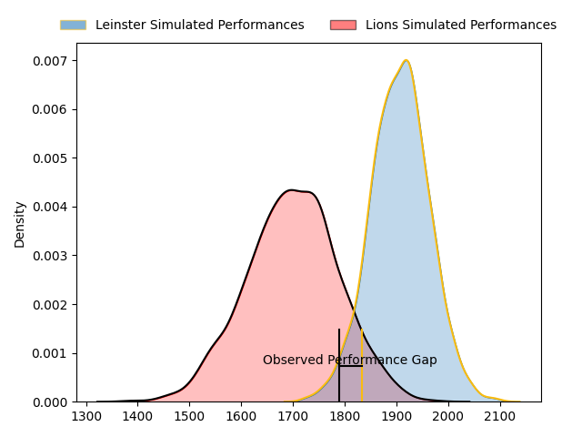
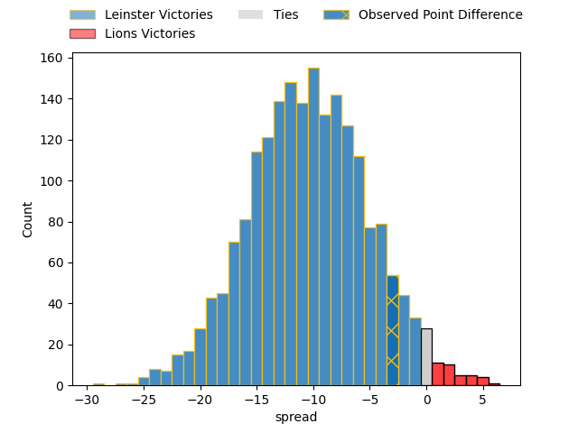

---  
layout: page  
title: Leinster at Lions; 39-36  
date: 2023-04-15 16:00:00 18:00:00 -0500  
categories: match review  
---
# Leinster at Lions; 39-36

# Club Level Predictions

The first set of predictions treats a club as the smallest object, as the club develops its members, organizes a gameplan, and deploys its players as needed for each match. This club model has a prediction of 0.233, which translates to predicting Leinster to win by 10.5.

Each club has a rating and a rating deviation (simiar to a Glicko system), and expected performances can be generated. This allows for simulated matches and spreads like the ones below.
## Projected Performances

## Projected Spreads

## Projected Results

# Player Level Predictions

Treating teams instead as an entity made up of the currently active players, I have ratings for each player in an altogether different system. These can be combined to form team ratings once teamsheets are announced, weighting starters a bit higher than the reserves. After the match is played, players can be weighted by their minutes on the field, allowing for an accurate measure of the team's composition. With these compiled team ratings, we can make predictions, measure inaccuracy, and update the individual player ratings.
## Prediction with Player Minutes: Lions by 1.7

Leinster by 2.3 on a neutral field

There were 6 large changes in win probability in this match
## Prediction without Player Minutes: Lions by 1.3

Leinster by 2.7 on a neutral pitch

|   Away Minutes | Away Player          |   Away elo |   Away Percentile |   Number |   Home Percentile |   Home elo | Home Player                 |   Home Minutes |
|---------------:|:---------------------|-----------:|------------------:|---------:|------------------:|-----------:|:----------------------------|---------------:|
|             49 | Michael Milne        |     100.64 |                69 |        1 |               nan |      97.08 | Rhynardt Rinjsburger        |             51 |
|             34 | Lee Barron           |      96.5  |               nan |        2 |                56 |      96.69 | PJ Botha                    |             70 |
|             26 | Vakh Abdaladze       |      97.98 |               nan |        3 |                 8 |      78.71 | Asenathi Ntlabakanye        |             51 |
|             62 | Brian Deeny          |     105.39 |                75 |        4 |                24 |      87.11 | Willem Alberts              |             80 |
|             80 | Jason Howell Jenkins |      95.13 |                45 |        5 |                81 |     108.39 | Ruben (Hobo) Schoeman       |             73 |
|             58 | Rhys Ruddock         |     102.91 |                69 |        6 |                35 |      91.29 | Jacobus Albertus Kriel      |             80 |
|             80 | Will Connors         |      97.82 |               nan |        7 |                73 |     107.35 | Ruan Delport                |             64 |
|             80 | Max Deegan           |     103.1  |                67 |        8 |                80 |     108.36 | Francke Horn                |             80 |
|             64 | Nick McCarthy        |      99.64 |               nan |        9 |                75 |     104.51 | Sanele Nohamba              |             70 |
|             80 | Sam Prendergast      |      95    |               nan |       10 |                56 |      98.96 | Gianni Dean Lombard         |             80 |
|             80 | Dave Kearney         |     103.1  |                70 |       11 |                60 |      99.52 | Edwill Charl van der Merwe  |             80 |
|             76 | Ben Brownlee         |     102.15 |                66 |       12 |                55 |      98.23 | Marius Louw                 |             80 |
|             80 | Liam Turner          |     103.1  |                69 |       13 |                47 |      94.99 | Manuel Johern (Mannie) Rass |             76 |
|             62 | Jimmy O'Brien        |     104.54 |                73 |       14 |                72 |     104.75 | Stean Pienaar               |             73 |
|             80 | Chris Cosgrave       |      99.68 |                60 |       15 |                55 |      98.24 | Quan Horn                   |             80 |
|             54 | Tom Clarkson         |      99.64 |               nan |       16 |               nan |      95.64 | Ruan Martin Dreyer          |             29 |
|             46 | Tadgh McElroy        |      93.6  |               nan |       17 |                56 |      96.83 | Jean-Pierre Smith           |             29 |
|             31 | Edward Byrne         |      93.15 |               nan |       18 |                17 |      83.53 | Travis Gordon               |             16 |
|             22 | James Culhane        |      95    |               nan |       19 |                13 |      83.95 | Morné Brandon               |             10 |
|             18 | Ben Murphy           |      95    |               nan |       20 |                 8 |      76.08 | Morne Van den Berg          |             10 |
|             18 | Alex Soroka          |      95    |               nan |       21 |                81 |     108.65 | Andries Coetzee             |              7 |
|             16 | Rob Russell          |      90.11 |                34 |       22 |                83 |     109.18 | Darrien-Lane Landsberg      |              7 |
|              4 | Charlie Tector       |      96.99 |               nan |       23 |                85 |     112.75 | Rynardt Jonker              |              4 |

