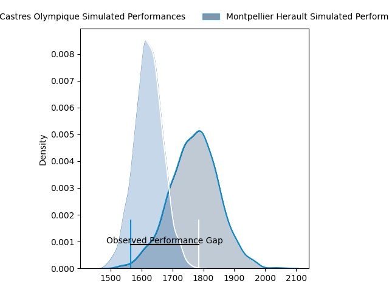
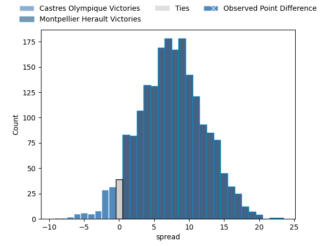

---  
layout: page  
title: Castres Olympique at Montpellier Herault; 28-19  
date: 2023-04-15 17:00:00 18:00:00 -0500  
categories: match review  
---
# Castres Olympique at Montpellier Herault; 28-19

# Club Level Predictions

The first set of predictions treats a club as the smallest object, as the club develops its members, organizes a gameplan, and deploys its players as needed for each match. This club model has a prediction of 0.697, which translates to predicting Montpellier Herault to win by 7.3.

Each club has a rating and a rating deviation (simiar to a Glicko system), and expected performances can be generated. This allows for simulated matches and spreads like the ones below.
## Projected Performances

## Projected Spreads

## Projected Results

# Player Level Predictions

Treating teams instead as an entity made up of the currently active players, I have ratings for each player in an altogether different system. These can be combined to form team ratings once teamsheets are announced, weighting starters a bit higher than the reserves. After the match is played, players can be weighted by their minutes on the field, allowing for an accurate measure of the team's composition. With these compiled team ratings, we can make predictions, measure inaccuracy, and update the individual player ratings.
## Prediction with Player Minutes: Montpellier Herault by 21.7

Montpellier Herault by 17.7 on a neutral field

There were 12 large changes in win probability in this match
## Prediction without Player Minutes: Montpellier Herault by 24.7

Montpellier Herault by 20.7 on a neutral pitch

|   Away Minutes | Away Player             |   Away elo |   Away Percentile |   Number |   Home Percentile |   Home elo | Home Player                         |   Home Minutes |
|---------------:|:------------------------|-----------:|------------------:|---------:|------------------:|-----------:|:------------------------------------|---------------:|
|             41 | Matt Tierney            |      93.67 |               nan |        1 |                85 |     107.4  | Enzo Forletta                       |             46 |
|             65 | Gaëtan Barlot           |     107.83 |                84 |        2 |                35 |      90.76 | Vincent Giudicelli                  |             46 |
|             41 | Levan Chilachava        |      90.68 |                41 |        3 |                72 |     101.58 | Henry Thomas                        |             46 |
|             63 | Leone Nakarawa          |      90.94 |                28 |        4 |                85 |     110.96 | Elliott Stooke                      |             71 |
|             53 | Florent Vanverberghe    |      83.78 |                18 |        5 |                75 |     104.5  | Tyler Evan Duguid                   |             46 |
|             80 | Baptiste Delaporte      |      87.95 |                34 |        6 |                76 |     106.26 | Nicolaas Jacobus Janse van Rensburg |             80 |
|             80 | Baptiste Cope           |      94.89 |               nan |        7 |                65 |     100.91 | Alexandre Bécognée                  |             59 |
|             63 | Teariki Ben-Nicholas    |      94.28 |               nan |        8 |                75 |     105.82 | Zach Mercer                         |             80 |
|             80 | Jeremy Fernandez        |      96.33 |               nan |        9 |                71 |     105.11 | Léo Coly                            |             59 |
|             80 | Louis Le Brun           |      90.99 |                31 |       10 |                36 |      98.03 | Louis Carbonel                      |             80 |
|             80 | Josaia Raisuqe          |      92.86 |               nan |       11 |                77 |     106.73 | Vincent Rattez                      |             80 |
|             80 | Vilimoni Botitu         |      79.37 |                 7 |       12 |                78 |     108.04 | Paolo Garbisi                       |             80 |
|             80 | Adrien Seguret          |     102.99 |                68 |       13 |                75 |     105.93 | Thomas Darmon                       |             80 |
|             80 | Antoine Zeghdar         |      95    |               nan |       14 |                33 |      89.4  | Gabriel Ngandebe                    |             80 |
|             80 | Geoffrey Palis          |      93.14 |                43 |       15 |                76 |     107.57 | Anthony Bouthier                    |             65 |
|             39 | Antoine Tichit          |      89.24 |                15 |       16 |               nan |     107.96 | Curtis Langdon                      |             34 |
|             39 | Aurélien Azar           |      74.11 |                 6 |       17 |                37 |      91.84 | Simon-Pierre Chauvac                |             34 |
|             27 | Kevin Kornath           |     101.82 |                63 |       18 |                65 |     100.49 | Mohamed Haouas                      |             34 |
|             17 | Asier Latierro Usarraga |      89.84 |                31 |       19 |                99 |     144.87 | Paul Willemse                       |             34 |
|             17 | Théo Hannoyer           |      95    |               nan |       20 |                81 |     107.87 | Jacobus Meyer Reinach               |             21 |
|             15 | Pierre Colonna          |      84.68 |                21 |       21 |                53 |     103.89 | Lenni Nouchi                        |             21 |
|            nan | nan                     |     nan    |               nan |       22 |               nan |      92.81 | Pierre Lucas                        |             15 |
|            nan | nan                     |     nan    |               nan |       23 |                31 |      94.32 | Marco Tauleigne                     |              9 |

