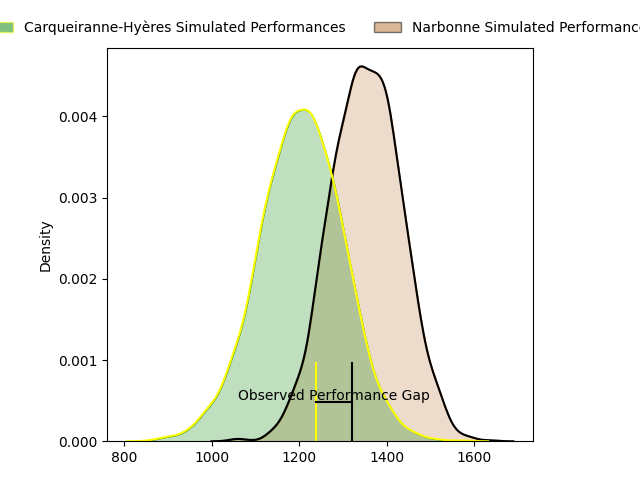
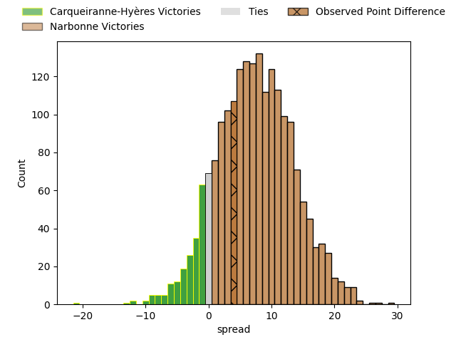
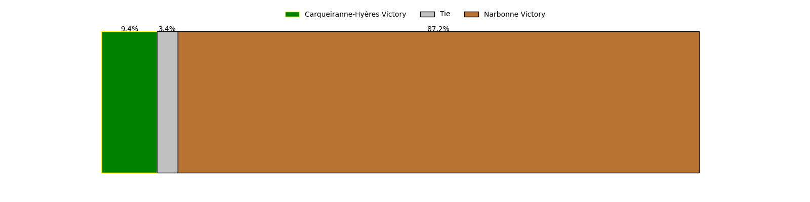

---  
layout: page  
title: Carqueiranne-Hyères at Narbonne; 10-14  
date: 2023-04-15 18:30:00 18:00:00 -0500  
categories: match review  
---
# Carqueiranne-Hyères at Narbonne; 10-14

# Club Level Predictions

The first set of predictions treats a club as the smallest object, as the club develops its members, organizes a gameplan, and deploys its players as needed for each match. This club model has a prediction of 0.693, which translates to predicting Narbonne to win by 7.4.

Each club has a rating and a rating deviation (simiar to a Glicko system), and expected performances can be generated. This allows for simulated matches and spreads like the ones below.
## Projected Performances

## Projected Spreads

## Projected Results

# Player Level Predictions

Treating teams instead as an entity made up of the currently active players, I have ratings for each player in an altogether different system. These can be combined to form team ratings once teamsheets are announced, weighting starters a bit higher than the reserves. After the match is played, players can be weighted by their minutes on the field, allowing for an accurate measure of the team's composition. With these compiled team ratings, we can make predictions, measure inaccuracy, and update the individual player ratings.
## Prediction with Player Minutes: Narbonne by 10.2

Narbonne by 6.2 on a neutral field

There were 11 large changes in win probability in this match
## Prediction without Player Minutes: Narbonne by 9.7

Narbonne by 5.7 on a neutral pitch

|   Away Minutes | Away Player              |   Away elo |   Away Percentile |   Number |   Home Percentile |   Home elo | Home Player           |   Home Minutes |
|---------------:|:-------------------------|-----------:|------------------:|---------:|------------------:|-----------:|:----------------------|---------------:|
|             46 | Eli Serra-Miglietti      |      95.62 |                52 |        1 |                27 |      89.21 | Sylvain Abadie        |             25 |
|             46 | Pierre Traiter           |      93.83 |                52 |        2 |                63 |      98.6  | Christophe David      |             50 |
|             46 | Lasha Mchelidze          |      91.21 |                34 |        3 |                28 |      87.77 | Matthieu Loudet       |             25 |
|             58 | Lucas Cazac              |      63.36 |                 3 |        4 |                34 |      90.58 | Valentin Sese         |             80 |
|             80 | César Damiani            |      91.43 |                40 |        5 |                91 |     117.49 | Mauro Rebussone       |             38 |
|             70 | Florian Munoz Rivero     |      96.64 |                51 |        6 |                46 |      96.86 | Thibault Clauzade     |             80 |
|             80 | Joachim Beaumont         |     105.28 |                74 |        7 |                65 |     101    | Paul Belzons          |             80 |
|             62 | Christian Marian Chirica |      94.7  |                43 |        8 |                70 |     104.39 | Luke Nakobukobua      |             49 |
|             62 | Thomas Sonetti           |     116.28 |                91 |        9 |                 7 |      74.99 | Pierrick Nova         |             50 |
|             80 | Théo Defrance            |      79.05 |                10 |       10 |                24 |      87.19 | Tom Chauvet           |             80 |
|             70 | David Raikuna            |      83.16 |                26 |       11 |                50 |      95.8  | Pierre-Hugo Ducom     |             80 |
|             80 | Romain Leveque           |     123.76 |                94 |       12 |                83 |     111.57 | José Lima             |             80 |
|             80 | Charles Brousse          |     102.5  |                67 |       13 |                70 |     103.83 | Pierre Nueno          |             58 |
|             80 | Dylan Michael Sage       |      85.8  |                21 |       14 |                14 |      82.61 | Étienne Ducom         |             80 |
|             80 | Vincent Alessi           |      71.03 |                 5 |       15 |                55 |      98.09 | Paul Auradou          |             62 |
|             34 | Liam Chad Hendricks      |      90.9  |                36 |       16 |                72 |     102.51 | Geoffrey Moise        |             55 |
|             34 | Michael Tyumenev         |      80.62 |                11 |       17 |               nan |      96.06 | Gabriel Atlan         |             30 |
|             34 | Miguel Mathieu           |      90.25 |                25 |       18 |                94 |     118.11 | Théo Castinel         |             55 |
|             22 | Nathan Gendre            |      93.77 |                44 |       19 |                43 |      95.33 | Bill Caffo            |             31 |
|             10 | Nicolas Baquer           |      83.08 |                15 |       20 |                31 |      91.6  | Christopher Kaiser    |             30 |
|             18 | Jordan Lavocat           |      96.31 |                48 |       21 |                 8 |      75.74 | Flavien Nouhaillaguet |             42 |
|             18 | Rémi Dubié               |      79.1  |                10 |       22 |                70 |     106.53 | James Kane            |             18 |
|             10 | Enzo Miot                |      92.15 |               nan |       23 |               nan |      89.2  | Louis Balfet          |             22 |

