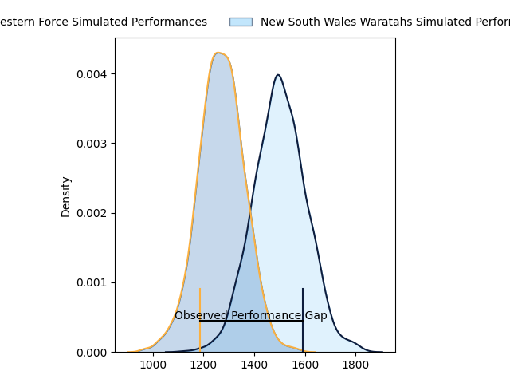
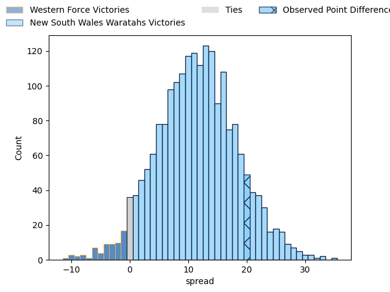

---  
layout: page  
title: Western Force at New South Wales Waratahs; 16.0-36.0  
date: 2023-04-15 05:35:00 18:00:00 -0500  
categories: match review  
---
# Western Force at New South Wales Waratahs; 16.0-36.0

# Club Level Predictions

The first set of predictions treats a club as the smallest object, as the club develops its members, organizes a gameplan, and deploys its players as needed for each match. This club model has a prediction of 0.785, which translates to predicting New South Wales Waratahs to win by 11.7.

Each club has a rating and a rating deviation (simiar to a Glicko system), and expected performances can be generated. This allows for simulated matches and spreads like the ones below.
## Projected Performances

## Projected Spreads

## Projected Results

# Player Level Predictions

Treating teams instead as an entity made up of the currently active players, I have ratings for each player in an altogether different system. These can be combined to form team ratings once teamsheets are announced, weighting starters a bit higher than the reserves. After the match is played, players can be weighted by their minutes on the field, allowing for an accurate measure of the team's composition. With these compiled team ratings, we can make predictions, measure inaccuracy, and update the individual player ratings.
## Prediction with Player Minutes: New South Wales Waratahs by 8.3

New South Wales Waratahs by 4.3 on a neutral field

There were 7 large changes in win probability in this match
## Prediction without Player Minutes: New South Wales Waratahs by 10.5

New South Wales Waratahs by 6.5 on a neutral pitch

|   Away Minutes | Away Player           |   Away elo |   Away Percentile |   Number |   Home Percentile |   Home elo | Home Player          |   Home Minutes |
|---------------:|:----------------------|-----------:|------------------:|---------:|------------------:|-----------:|:---------------------|---------------:|
|             68 | Tom Robertson         |     116.34 |                93 |        1 |                72 |     102.02 | Tom Lambert          |             72 |
|             68 | Tom Horton            |     108.94 |                85 |        2 |                90 |     114.62 | Dave Porecki         |             29 |
|             68 | Santiago Medrano      |     120.93 |                96 |        3 |                 8 |      78.34 | Harry Johnson-Holmes |             61 |
|             81 | Jackson Pugh          |      88.11 |                32 |        4 |                22 |      86.32 | Jed Holloway         |             81 |
|             81 | Jeremy Williams       |      94.4  |                46 |        5 |                87 |     112.58 | Ned Hanigan          |             55 |
|             81 | Tim Anstee            |      73.03 |                 5 |        6 |                66 |     101.57 | Lachlan Swinton      |             72 |
|             51 | Ollie Callan          |      89.83 |                31 |        7 |                97 |     134.47 | Michael Hooper       |             81 |
|             81 | Jacob Norris          |      95    |               nan |        8 |                85 |     112.28 | Taleni Seu           |             81 |
|             61 | Issak Fines-Leleiwasa |      97.29 |                52 |        9 |                96 |     126.21 | Jake Gordon          |             68 |
|             36 | Jake Strachan         |      83.63 |                16 |       10 |                79 |     108.36 | Ben Donaldson        |             81 |
|             81 | Zach Kibirige         |      90.39 |                35 |       11 |                87 |     114.2  | Dylan Pietsch        |             68 |
|             81 | Hamish Stewart        |     133.17 |                96 |       12 |                66 |     101.99 | Lalakai Foketi       |             81 |
|             81 | Sam Spink             |     111.07 |                82 |       13 |                19 |      85.15 | Izaia Perese         |             81 |
|             81 | Manasa Mataele        |     120.34 |                91 |       14 |                55 |      97.61 | Mark Nawaqanitawase  |             81 |
|             81 | Chase Tiatia          |     105.22 |                71 |       15 |                81 |     109.84 | Max Jorgensen        |             77 |
|             13 | Feleti Kaitu'u        |      84.95 |                14 |       16 |                 5 |      71.97 | Mahe Vailanu         |             52 |
|             13 | Angus Wagner          |      95.67 |                52 |       17 |                56 |      96.71 | Tetera Faulkner      |             20 |
|             13 | Siosifa Amone         |      97.88 |               nan |       18 |               nan |      95.86 | Daniel Botha         |              9 |
|              0 | Ryan McCauley         |      81.33 |                10 |       19 |               nan |      94.76 | Zac Von Appen        |              9 |
|             30 | Felix Kalapu          |      55.14 |                 1 |       20 |                75 |     105.6  | Will Harris          |             26 |
|             20 | Ian Prior             |     102.98 |                70 |       21 |               nan |      96.03 | Teddy Wilson         |             13 |
|             38 | Bayley Kuenzle        |      89.17 |                29 |       22 |                79 |     109.1  | Joey Walton          |             13 |
|              7 | George Poolman        |      96.98 |               nan |       23 |               nan |      93.87 | Harry Wilson         |              4 |

