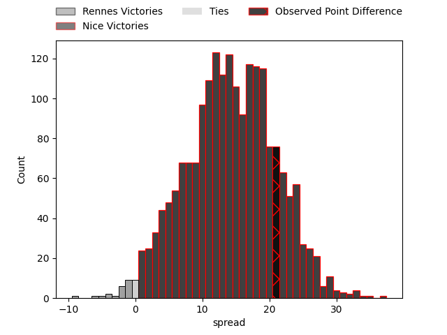
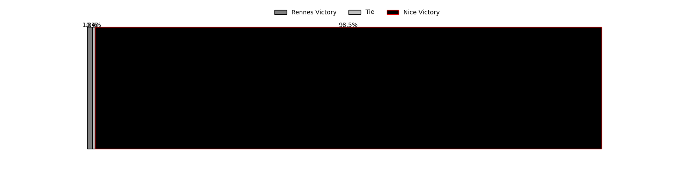

---  
layout: page  
title: Rennes at Nice; 15-36  
date: 2023-04-15 19:00:00 18:00:00 -0500  
categories: match review  
---
# Rennes at Nice; 15-36

# Club Level Predictions

The first set of predictions treats a club as the smallest object, as the club develops its members, organizes a gameplan, and deploys its players as needed for each match. This club model has a prediction of 0.828, which translates to predicting Nice to win by 14.3.

Each club has a rating and a rating deviation (simiar to a Glicko system), and expected performances can be generated. This allows for simulated matches and spreads like the ones below.
## Projected Performances

## Projected Spreads

## Projected Results

# Player Level Predictions

Treating teams instead as an entity made up of the currently active players, I have ratings for each player in an altogether different system. These can be combined to form team ratings once teamsheets are announced, weighting starters a bit higher than the reserves. After the match is played, players can be weighted by their minutes on the field, allowing for an accurate measure of the team's composition. With these compiled team ratings, we can make predictions, measure inaccuracy, and update the individual player ratings.
## Prediction with Player Minutes: Nice by 26.3

Nice by 22.3 on a neutral field

There were 6 large changes in win probability in this match
## Prediction without Player Minutes: Nice by 19.3

Nice by 15.3 on a neutral pitch

|   Away Minutes | Away Player            |   Away elo |   Away Percentile |   Number |   Home Percentile |   Home elo | Home Player          |   Home Minutes |
|---------------:|:-----------------------|-----------:|------------------:|---------:|------------------:|-----------:|:---------------------|---------------:|
|             48 | Baptiste Le Jallé      |      84.56 |                20 |        1 |               nan |      92.6  | Nicolas Lemaire      |             46 |
|             53 | Alexandre Fau          |      74.82 |                 7 |        2 |                47 |      93.92 | Kurt Stanley Haupt   |             46 |
|             63 | Luvuyo Pupuma          |      86.69 |                20 |        3 |                43 |      93.3  | Jeronimo Negrotto    |             46 |
|             80 | Gabriel Quesmel        |      81.11 |                14 |        4 |                25 |      87.47 | Jérôme Mondoulet     |             58 |
|             17 | Clément Fontaine       |      90.94 |                40 |        5 |                 3 |      63.6  | Martin Freytes       |             80 |
|             41 | Vincent Wenger         |      86.87 |                26 |        6 |                64 |     102.1  | Steffon Armitage     |             56 |
|             80 | Pedro Ortega           |      75.51 |                 8 |        7 |                72 |     104.79 | Louis Suaud          |             80 |
|             48 | Gaétan Béraud          |      62.13 |                 2 |        8 |                91 |     120.47 | Laijiasa Bolenaivalu |             52 |
|             80 | Lucas Ollion           |      83.76 |                15 |        9 |                23 |      83.22 | Louis Peutin         |             50 |
|             61 | Joaquin Diaz Luzzi     |     111.05 |                83 |       10 |                16 |      84.19 | Mathieu Lorée        |             80 |
|             80 | Romuald François       |      72.62 |                 6 |       11 |                19 |      84.8  | Augustin Slowik      |             80 |
|             80 | Gonzalo Lopez Bontempo |      74.04 |                 7 |       12 |                74 |     106.2  | Luca Cutayar         |             80 |
|             39 | Hypolite Cornu         |     100.62 |                63 |       13 |                42 |      92.93 | Baptiste Delage      |             48 |
|             53 | Mathieu Brignonen      |      80.28 |                13 |       14 |                50 |      95.76 | David Odiete         |             80 |
|             80 | Pedro Soto             |      71.61 |                 6 |       15 |                49 |      95.28 | Loic Le Gal          |             80 |
|             32 | Atonio Ulutuipalelei   |      87.47 |                22 |       16 |                15 |      84.07 | Nika Neparidze       |             34 |
|             27 | Pierre Strippoli       |      91.11 |                36 |       17 |                79 |     106.41 | Louis Martin         |             34 |
|             39 | Alexandre Gueroult     |      86.06 |                21 |       18 |               nan |      92.75 | James Johnston       |             34 |
|             17 | Clément Fontaine       |      95    |               nan |       19 |                33 |      88.87 | Louis Vincent        |             22 |
|             32 | Luca Di Salvatore      |      90.11 |                32 |       20 |                46 |      94.63 | Arthur Vignolles     |             24 |
|             41 | Théo Platon            |      90.12 |                36 |       21 |                71 |     103.48 | Mathis Viard         |             30 |
|             19 | Gwenaël Beillot        |      95    |               nan |       22 |                64 |     101.03 | Julien Fritz         |             32 |
|             27 | Mateo Carrere          |      91.16 |                37 |       23 |               nan |      95    | Andy Joseph          |             28 |

