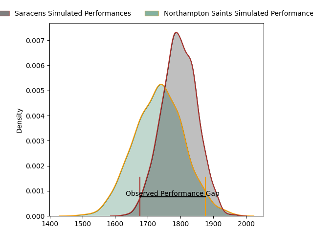
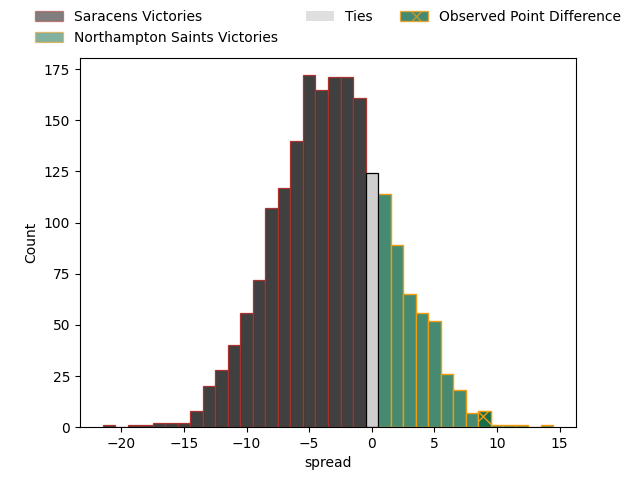

---  
layout: page  
title: Saracens at Northampton Saints; 29.0-38.0  
date: 2023-04-15 10:00:00 18:00:00 -0500  
categories: match review  
---
# Saracens at Northampton Saints; 29.0-38.0

# Club Level Predictions

The first set of predictions treats a club as the smallest object, as the club develops its members, organizes a gameplan, and deploys its players as needed for each match. This club model has a prediction of 0.417, which translates to predicting Saracens to win by 3.0.

Each club has a rating and a rating deviation (simiar to a Glicko system), and expected performances can be generated. This allows for simulated matches and spreads like the ones below.
## Projected Performances

## Projected Spreads

## Projected Results

# Player Level Predictions

Treating teams instead as an entity made up of the currently active players, I have ratings for each player in an altogether different system. These can be combined to form team ratings once teamsheets are announced, weighting starters a bit higher than the reserves. After the match is played, players can be weighted by their minutes on the field, allowing for an accurate measure of the team's composition. With these compiled team ratings, we can make predictions, measure inaccuracy, and update the individual player ratings.
## Prediction with Player Minutes: Northampton Saints by 6.5

Northampton Saints by 2.5 on a neutral field

There were 9 large changes in win probability in this match
## Prediction without Player Minutes: Northampton Saints by 8.4

Northampton Saints by 4.4 on a neutral pitch

|   Away Minutes | Away Player        |   Away elo |   Away Percentile |   Number |   Home Percentile |   Home elo | Home Player          |   Home Minutes |
|---------------:|:-------------------|-----------:|------------------:|---------:|------------------:|-----------:|:---------------------|---------------:|
|             54 | Eroni Mawi         |      84.59 |                17 |        1 |                98 |     134.8  | Alex Waller          |             62 |
|             54 | Tom Woolstencroft  |      92.74 |               nan |        2 |                 5 |      73.62 | Sam Matavesi         |             67 |
|             54 | Christian Judge    |      90.99 |                40 |        3 |                 2 |      65.69 | Trevor Davison       |             51 |
|             80 | Callum Hunter-Hill |      98.39 |                63 |        4 |                69 |     102.08 | David Ribbans        |             64 |
|             51 | Hugh Tizard        |      85.39 |                21 |        5 |                92 |     118.99 | Alex Moon            |             80 |
|             80 | Nick Isiekwe       |      90.19 |                32 |        6 |                55 |      97.14 | Courtney Lawes       |             51 |
|             53 | Toby Knight        |      96.66 |               nan |        7 |                43 |      93.35 | Lewis Ludlam         |             80 |
|             80 | Jackson Wray       |     134.33 |                99 |        8 |                43 |      94.53 | Juarno Augustus      |             56 |
|             51 | Ruben de Haas      |      92.01 |                38 |        9 |                78 |     106.44 | Alex Mitchell        |             67 |
|             80 | Manu Vunipola      |      89.69 |                30 |       10 |                15 |      82.32 | Fin Smith            |             80 |
|             51 | Alex Lewington     |      95.82 |                59 |       11 |                83 |     110.11 | Tommy Freeman        |             80 |
|             71 | Olly Hartley       |      90.25 |                45 |       12 |                30 |      89.38 | Rory Hutchinson      |             80 |
|             80 | Duncan Taylor      |     107.65 |                79 |       13 |                 7 |      74.09 | Fraser Dingwall      |             80 |
|             80 | Rotimi Segun       |      97.33 |                52 |       14 |                97 |     134.82 | James Ramm           |             44 |
|             80 | Alex Goode         |     101.19 |                63 |       15 |                96 |     128.87 | George Furbank       |             80 |
|             26 | Theo Dan           |      94.75 |                52 |       16 |                65 |      87.24 | Tom Cruse            |             13 |
|             26 | Robin Hislop       |     109.17 |                85 |       17 |                69 |     100.91 | Ethan Waller         |             18 |
|             26 | Marco Riccioni     |      96.76 |                56 |       18 |                81 |     104.85 | Paul Hill            |             29 |
|              9 | Nathan Michelow    |      95    |               nan |       19 |                 3 |      69.38 | Alex Coles           |             16 |
|             29 | Ben Earl           |     119.31 |                91 |       20 |                13 |      81.67 | Lukhan Salakaia-Loto |             29 |
|             29 | Ivan van Zyl       |     113.1  |                88 |       21 |                93 |     121.25 | Sam Graham           |             24 |
|             27 | Josh Hallett       |      90.56 |               nan |       22 |                64 |      99.8  | Tom James            |             13 |
|             29 | Ben Harris         |      99.07 |                59 |       23 |                91 |     119.06 | Tom Collins          |             36 |

