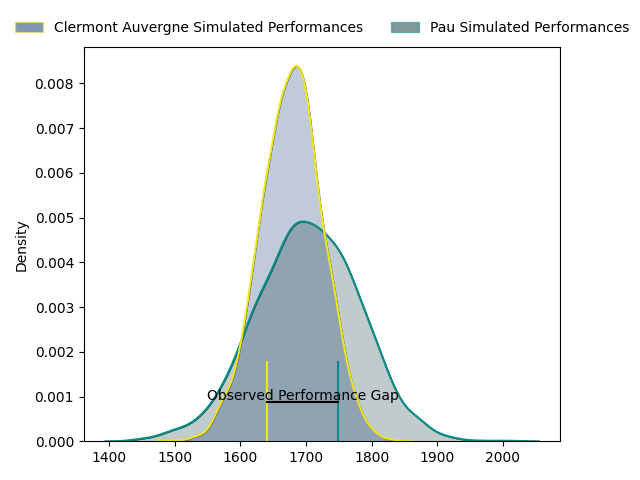
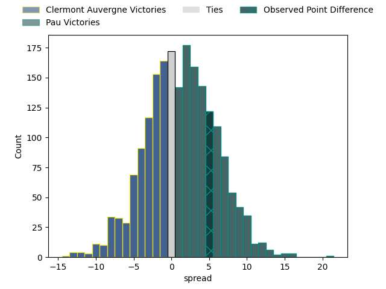

---  
layout: page  
title: Clermont Auvergne at Pau; 18-23  
date: 2023-04-15 17:00:00 18:00:00 -0500  
categories: match review  
---
# Clermont Auvergne at Pau; 18-23

# Club Level Predictions

The first set of predictions treats a club as the smallest object, as the club develops its members, organizes a gameplan, and deploys its players as needed for each match. This club model has a prediction of 0.538, which translates to predicting Pau to win by 1.3.

Each club has a rating and a rating deviation (simiar to a Glicko system), and expected performances can be generated. This allows for simulated matches and spreads like the ones below.
## Projected Performances

## Projected Spreads

## Projected Results

# Player Level Predictions

Treating teams instead as an entity made up of the currently active players, I have ratings for each player in an altogether different system. These can be combined to form team ratings once teamsheets are announced, weighting starters a bit higher than the reserves. After the match is played, players can be weighted by their minutes on the field, allowing for an accurate measure of the team's composition. With these compiled team ratings, we can make predictions, measure inaccuracy, and update the individual player ratings.
## Prediction with Player Minutes: Pau by 8.4

Pau by 4.4 on a neutral field

There were 5 large changes in win probability in this match
## Prediction without Player Minutes: Pau by 5.0

Pau by 1.0 on a neutral pitch

|   Away Minutes | Away Player                |   Away elo |   Away Percentile |   Number |   Home Percentile |   Home elo | Home Player              |   Home Minutes |
|---------------:|:---------------------------|-----------:|------------------:|---------:|------------------:|-----------:|:-------------------------|---------------:|
|             80 | Giorgi Beria               |      88.46 |                23 |        1 |                52 |      95.77 | Ignacio David Calles     |             80 |
|             57 | Étienne Fourcade           |      97.2  |                57 |        2 |                61 |      98.26 | Lucas Rey                |             59 |
|             28 | Cristian Ojovan            |     101.67 |                72 |        3 |                59 |     102.24 | Guram Papidze            |             54 |
|             71 | Thibault Lanen             |      98.51 |                59 |        4 |                81 |     108.03 | Guillaume Ducat          |             71 |
|             80 | Judicael Cancoriet         |      88.06 |                34 |        5 |                40 |      95.57 | Lekima Vuda Tagitagivalu |             51 |
|             80 | Killian Tixeront           |      96.14 |                50 |        6 |                73 |     104.98 | Luke Whitelock           |             80 |
|             71 | Lucas Dessaigne            |      99.11 |                59 |        7 |                47 |      94.92 | Reece Hewat              |             57 |
|             80 | Fritz Lee                  |     109.26 |                81 |        8 |                76 |     105.94 | Beka Gorgadze            |             80 |
|             41 | Sebastien Bézy             |     106.4  |                80 |        9 |                68 |     101.24 | Thibault Daubagna        |             51 |
|             41 | Anthony Belleau            |     100.39 |                61 |       10 |                68 |     102.22 | Zack Henry               |             80 |
|             80 | Alivereti Raka             |      96.31 |                51 |       11 |                51 |      96.11 | Aminiasi Tuimaba         |             80 |
|             49 | Apisai Naqalevu            |      95    |               nan |       12 |                25 |      87.21 | Tumua Manu               |             71 |
|             80 | George Moala               |     104.31 |                71 |       13 |                92 |     119.95 | Émilien Gailleton        |             80 |
|             80 | Bautista Delguy            |     101.38 |                65 |       14 |                64 |     101.2  | Clément Laporte          |             80 |
|             80 | Alex Newsome               |     100.21 |                61 |       15 |                67 |     103.4  | Jack Maddocks            |             80 |
|             43 | Davit Kubriashvili         |      91.63 |               nan |       16 |               nan |      95.8  | Santiago Grondona        |             29 |
|             39 | Jules Plisson              |      95.77 |                47 |       17 |                34 |      93.17 | Dan Robson               |             29 |
|             39 | Baptiste Jauneau           |      92.82 |                41 |       18 |               nan |      95.72 | Youri Delhommel          |             21 |
|             31 | François Carlo Mey         |      93.88 |               nan |       19 |                73 |     102.08 | Siate Tokolahi           |             26 |
|             23 | Jean-Maxence Jules-Rosette |      95.04 |               nan |       20 |                 8 |      78.05 | Sacha Zegueur            |             23 |
|              9 | Rabah Slimani              |      96.75 |                47 |       21 |                67 |     103.48 | Brent Liufau             |              9 |
|              9 | Loïc Godener               |      97.93 |               nan |       22 |                67 |     105.82 | Nathan Decron            |              9 |
|              9 | Edward Annandale           |      95.41 |               nan |       23 |               nan |     nan    | nan                      |            nan |

