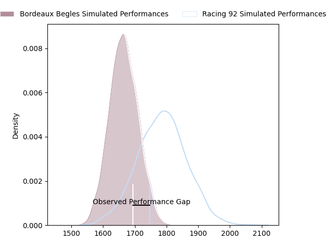
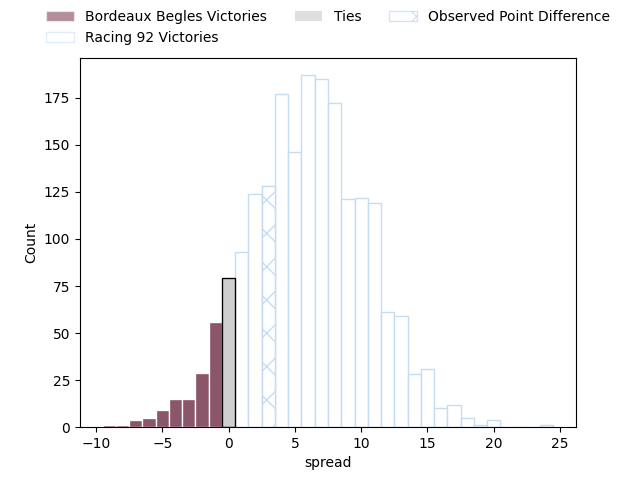
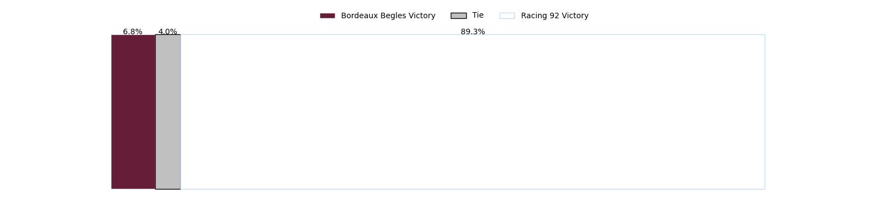

---  
layout: page  
title: Bordeaux Begles at Racing 92; 28-31  
date: 2023-04-15 15:00:00 18:00:00 -0500  
categories: match review  
---
# Bordeaux Begles at Racing 92; 28-31

# Club Level Predictions

The first set of predictions treats a club as the smallest object, as the club develops its members, organizes a gameplan, and deploys its players as needed for each match. This club model has a prediction of 0.671, which translates to predicting Racing 92 to win by 6.3.

Each club has a rating and a rating deviation (simiar to a Glicko system), and expected performances can be generated. This allows for simulated matches and spreads like the ones below.
## Projected Performances

## Projected Spreads

## Projected Results

# Player Level Predictions

Treating teams instead as an entity made up of the currently active players, I have ratings for each player in an altogether different system. These can be combined to form team ratings once teamsheets are announced, weighting starters a bit higher than the reserves. After the match is played, players can be weighted by their minutes on the field, allowing for an accurate measure of the team's composition. With these compiled team ratings, we can make predictions, measure inaccuracy, and update the individual player ratings.
## Prediction with Player Minutes: Racing 92 by 3.7

Bordeaux Begles by 0.3 on a neutral field

There were 5 large changes in win probability in this match
## Prediction without Player Minutes: Racing 92 by 2.9

Bordeaux Begles by 1.1 on a neutral pitch

|   Away Minutes | Away Player          |   Away elo |   Away Percentile |   Number |   Home Percentile |   Home elo | Home Player            |   Home Minutes |
|---------------:|:---------------------|-----------:|------------------:|---------:|------------------:|-----------:|:-----------------------|---------------:|
|             56 | Jefferson Poirot     |     101.68 |                81 |        1 |                51 |      95.47 | Guram Gogichashvili    |             46 |
|             63 | Gabriel Oghre        |      94.34 |               nan |        2 |                20 |      86.07 | Janick Tarrit          |             46 |
|             56 | Ben Tameifuna        |     103.24 |                76 |        3 |                61 |      98.39 | Trevor Ntando Nyakane  |             46 |
|             56 | Kane Douglas         |      95    |               nan |        4 |                34 |      90.49 | Anthime Hemery         |             62 |
|             80 | Cyril Cazeaux        |      84.92 |                20 |        5 |                72 |     103.43 | Fabien Sanconnie       |             80 |
|             80 | Mahamadou Diaby      |      95.16 |                48 |        6 |                40 |      91.39 | Ibrahim Diallo         |             74 |
|             74 | Pierre Bochaton      |      92.98 |               nan |        7 |                27 |      87.06 | Baptiste Chouzenoux    |             80 |
|             80 | Tom Willis           |      91.54 |                35 |        8 |                34 |      91.24 | Cameron Woki           |             80 |
|             80 | Maxime Lucu          |      93.14 |                42 |        9 |                66 |     100.71 | Nolann Le Garrec       |             80 |
|             31 | Zack Holmes          |      95.66 |                47 |       10 |                50 |      96.71 | Antoine Gibert         |             46 |
|             80 | Santiago Cordero     |      96.34 |                51 |       11 |                36 |      90.92 | Vinaya Habosi          |             80 |
|             80 | Yoram Moefana        |     100.87 |                63 |       12 |                77 |     107.38 | Gael Fickou            |             80 |
|             63 | Nicolas Depoortere   |     100.02 |                60 |       13 |                62 |     100.51 | Francis Saili          |             46 |
|             80 | Madosh Tambwe        |      98.53 |                57 |       14 |                60 |      99.26 | Christian Wade         |             46 |
|             73 | Nans Ducuing         |      98.5  |                56 |       15 |                43 |      91.07 | Max Spring             |             80 |
|             49 | Yann Lesgourgues     |      95    |               nan |       16 |                52 |      96.62 | Henry Chavancy         |             34 |
|             24 | Ugo Boniface         |      89.24 |                35 |       17 |                94 |     128.15 | Finn Russell           |             34 |
|             24 | Christopher Vaotoa   |     108.02 |                87 |       18 |                47 |      94.43 | Eddy Ben Arous         |             34 |
|             24 | Jan Andre Marais     |      94.04 |                45 |       19 |                28 |      88.59 | Peniami Nasali Narisia |             34 |
|             17 | Pablo Uberti         |      93.5  |                37 |       20 |                36 |      91.63 | Ali Oz                 |             34 |
|             17 | Clément Maynadier    |      95.44 |               nan |       21 |                27 |      87.8  | Warrick Wayne Gelant   |             34 |
|              7 | Louis Bielle Biarrey |      95.68 |                49 |       22 |                33 |      89.91 | Anton Bresler          |             18 |
|              6 | Caleb Timu           |      90.96 |                32 |       23 |                16 |      84.07 | Maxime Baudonne        |              6 |

