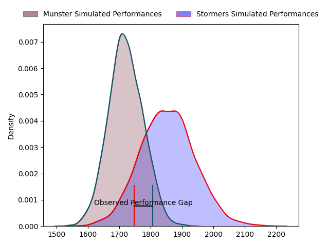
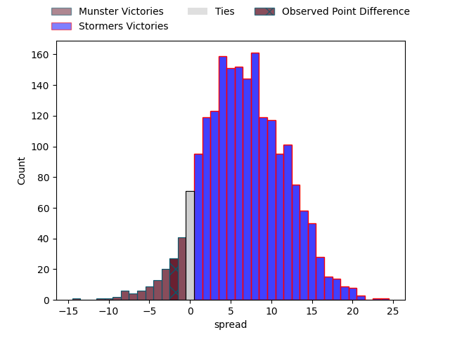

---  
layout: page  
title: Munster at Stormers; 26-24  
date: 2023-04-15 18:15:00 18:00:00 -0500  
categories: match review  
---
# Munster at Stormers; 26-24

# Club Level Predictions

The first set of predictions treats a club as the smallest object, as the club develops its members, organizes a gameplan, and deploys its players as needed for each match. This club model has a prediction of 0.678, which translates to predicting Stormers to win by 6.6.

Each club has a rating and a rating deviation (simiar to a Glicko system), and expected performances can be generated. This allows for simulated matches and spreads like the ones below.
## Projected Performances

## Projected Spreads

## Projected Results

# Player Level Predictions

Treating teams instead as an entity made up of the currently active players, I have ratings for each player in an altogether different system. These can be combined to form team ratings once teamsheets are announced, weighting starters a bit higher than the reserves. After the match is played, players can be weighted by their minutes on the field, allowing for an accurate measure of the team's composition. With these compiled team ratings, we can make predictions, measure inaccuracy, and update the individual player ratings.
## Prediction with Player Minutes: Stormers by 11.6

Stormers by 7.6 on a neutral field

There were 10 large changes in win probability in this match
## Prediction without Player Minutes: Stormers by 11.0

Stormers by 7.0 on a neutral pitch

|   Away Minutes | Away Player              |   Away elo |   Away Percentile |   Number |   Home Percentile |   Home elo | Home Player                  |   Home Minutes |
|---------------:|:-------------------------|-----------:|------------------:|---------:|------------------:|-----------:|:-----------------------------|---------------:|
|             75 | Jeremy Loughman          |      95    |               nan |        1 |                71 |     101.33 | Steven Kitshoff              |             72 |
|             65 | Diarmuid Barron          |      90.64 |                42 |        2 |                80 |     105.43 | Joseph Dweba                 |             63 |
|             78 | Stephen Archer           |      91.35 |               nan |        3 |                60 |      98.24 | Jozua Francois Malherbe      |             67 |
|             80 | Jean Kleyn               |      94.94 |                47 |        4 |                62 |      99.23 | Ruben van Heerden            |             67 |
|             65 | Rudolph Gerhardus Snyman |      88.74 |                28 |        5 |                58 |      98.03 | Marvin Orie                  |             80 |
|             80 | Peter O'Mahony           |      78.82 |                10 |        6 |                26 |      87.89 | Willem Gerhardus Engelbrecht |             63 |
|             51 | Alex Kendellen           |      99.07 |                64 |        7 |                78 |     107.42 | Ben-Jason Dixon              |             47 |
|             80 | Gavin Coombes            |      91.83 |                37 |        8 |                68 |     101.61 | Hacjivah Dayimani            |             80 |
|             71 | Conor Murray             |     146.31 |                99 |        9 |                50 |      95.22 | Albertus Paul de Wet         |             55 |
|             55 | Jack Crowley             |      85.95 |                21 |       10 |                73 |     104.64 | Immanuel Libbok              |             80 |
|             80 | Jack Daly                |      95    |               nan |       11 |                71 |     103.72 | Seabelo Senatla              |             80 |
|             80 | Malakai Fekitoa          |      93.17 |                43 |       12 |                75 |     106.1  | Daniel Michael du Plessis    |             80 |
|             80 | Antoine Frisch           |     101.02 |                64 |       13 |                16 |      85.28 | Adriaan Ruhan Nel            |             80 |
|             80 | Calvin Nash              |      83.74 |                17 |       14 |                86 |     113.83 | Suleiman  Hartzenberg        |             72 |
|             65 | Michael Haley            |      85.51 |                22 |       15 |                69 |     104.16 | Damian Willemse              |             80 |
|             29 | Jack O'Donoghue          |      88.1  |                31 |       16 |                44 |      94.86 | Evan Roos                    |             33 |
|             15 | Scott Buckley            |     106.29 |               nan |       17 |                65 |     100.41 | Herschel Jerome Jantjies     |             25 |
|             25 | Ben Healy                |     104.11 |               nan |       18 |                54 |      93.53 | JJ Kotze                     |             17 |
|             15 | Fineen Wycherley         |      93.57 |                50 |       19 |                20 |      85.6  | Marcel Theunissen            |             17 |
|             15 | Keith Earls              |      95    |               nan |       20 |                71 |     103.11 | Johan Neethling Fouche       |             13 |
|              9 | Craig Casey              |     103.01 |                71 |       21 |                24 |      87.21 | Ernst van Rhyn               |             13 |
|              5 | Josh Wycherley           |      99.84 |                80 |       22 |                49 |      95.22 | Clayton Blommetjies          |              8 |
|              2 | Keynan Knox              |      92.68 |               nan |       23 |                14 |      79.91 | Alistair Fernando Vermaak    |              8 |

