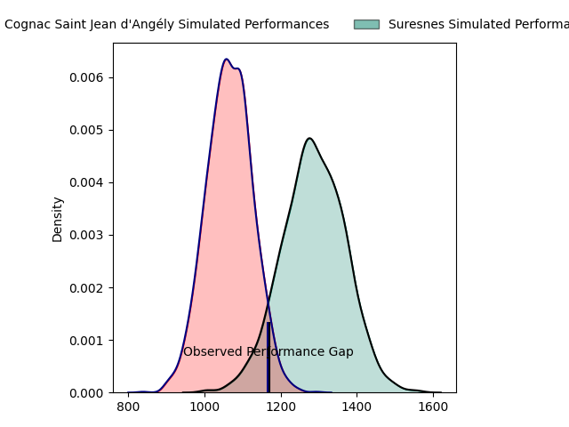
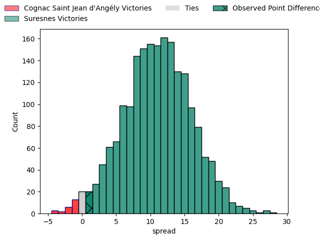
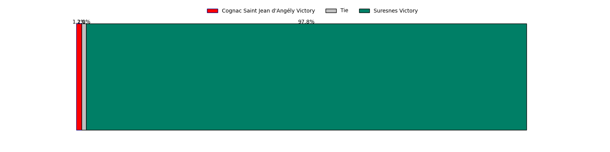

---  
layout: page  
title: Cognac Saint Jean d'Angély at Suresnes; 19-20  
date: 2023-04-15 18:30:00 18:00:00 -0500  
categories: match review  
---
# Cognac Saint Jean d'Angély at Suresnes; 19-20

# Club Level Predictions

The first set of predictions treats a club as the smallest object, as the club develops its members, organizes a gameplan, and deploys its players as needed for each match. This club model has a prediction of 0.777, which translates to predicting Suresnes to win by 11.0.

Each club has a rating and a rating deviation (simiar to a Glicko system), and expected performances can be generated. This allows for simulated matches and spreads like the ones below.
## Projected Performances

## Projected Spreads

## Projected Results

# Player Level Predictions

Treating teams instead as an entity made up of the currently active players, I have ratings for each player in an altogether different system. These can be combined to form team ratings once teamsheets are announced, weighting starters a bit higher than the reserves. After the match is played, players can be weighted by their minutes on the field, allowing for an accurate measure of the team's composition. With these compiled team ratings, we can make predictions, measure inaccuracy, and update the individual player ratings.
## Prediction with Player Minutes: Cognac Saint Jean d'Angély by 20.1

Cognac Saint Jean d'Angély by 24.1 on a neutral field

There were 11 large changes in win probability in this match
## Prediction without Player Minutes: Cognac Saint Jean d'Angély by 20.0

Cognac Saint Jean d'Angély by 24.0 on a neutral pitch

|   Away Minutes | Away Player         |   Away elo |   Away Percentile |   Number |   Home Percentile |   Home elo | Home Player             |   Home Minutes |
|---------------:|:--------------------|-----------:|------------------:|---------:|------------------:|-----------:|:------------------------|---------------:|
|             66 | Kevin Tougne        |     112.08 |                90 |        1 |                 7 |      76.01 | Lucas Dycke             |             62 |
|             69 | Maxime Gau          |     103.07 |                75 |        2 |                24 |      85.66 | Thomas Bordes           |             64 |
|             44 | Manasa Saulo Romumu |     100.46 |                68 |        3 |                47 |      91.99 | Leandro Mario Assi      |             64 |
|             65 | Thomas Toevalu      |      66.22 |                 4 |        4 |                 2 |      56.91 | Sacha Yahi              |             80 |
|             80 | Utu Maninoa         |      59.92 |                 2 |        5 |                23 |      86.91 | Yakine Djebarri         |             64 |
|             80 | Matthieu Thomas     |     101.01 |                65 |        6 |                18 |      83.87 | Wian Vosloo             |             58 |
|             80 | Damien Bonnet       |     115.32 |                88 |        7 |                 6 |      75.83 | Florian Desbordes       |             80 |
|             66 | Filipe Manu         |      96.06 |                47 |        8 |                23 |      87.13 | Antonie Delport Claasen |             80 |
|             66 | Mathieu Billou      |      92.14 |                38 |        9 |                 8 |      73.98 | Quentin Dauvergne       |             55 |
|             80 | Serafin Bordoli     |     109.43 |                80 |       10 |                14 |      79.56 | Goulwen Gueho           |             80 |
|             80 | Paul Boitard        |      89.31 |                31 |       11 |                 0 |      37.74 | Jean-Baptiste Fuster    |             55 |
|             80 | Isimeli Kuruibua    |     101.86 |                65 |       12 |                27 |      87.72 | Lilan Savioz Fouillet   |             80 |
|             80 | Henry Tuilagi       |      99.81 |                60 |       13 |                37 |      91.35 | Arthur Proult           |             80 |
|             69 | Eneri Lotawa        |      96.74 |                52 |       14 |                11 |      78.04 | Alexis Clement          |             80 |
|             70 | Nils Guyon          |     102.04 |                65 |       15 |                23 |      86.44 | Pierre Le Huby          |             64 |
|             14 | Martin Augeix       |     102.51 |                71 |       16 |                54 |      91.87 | Elias Coulibaly         |             18 |
|             11 | Bryan Bruno         |      93.92 |                46 |       17 |                12 |      81.54 | Hayam El Bibouji        |             16 |
|             36 | Giorgi Sharashidze  |      79.76 |                 9 |       18 |                50 |      94.88 | Victor Damian Arias     |             16 |
|             15 | Clément Praud       |      68.3  |                 4 |       19 |                15 |      82.35 | Youssouf Yatera         |             16 |
|             14 | Lucas Gulizzi       |      65.94 |                 2 |       20 |                74 |     104.29 | Bastien Berenguel       |             22 |
|             14 | William Beaudon     |      95.06 |                47 |       21 |                12 |      80.18 | Enzo Barbarit           |             25 |
|             11 | Dany Antunes        |      86.92 |                24 |       22 |                 0 |      25.76 | Ervin Muric             |             25 |
|             10 | Mathis Garnier      |      65.69 |                 2 |       23 |                 4 |      67.87 | Thomas Baudy            |             16 |

