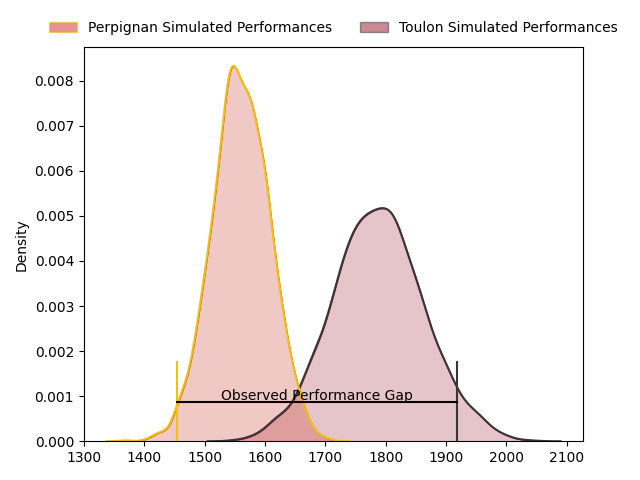
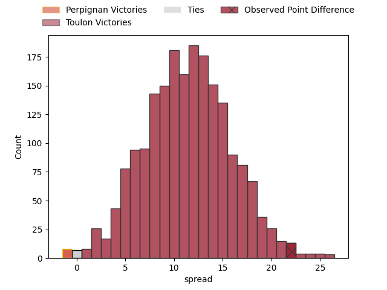
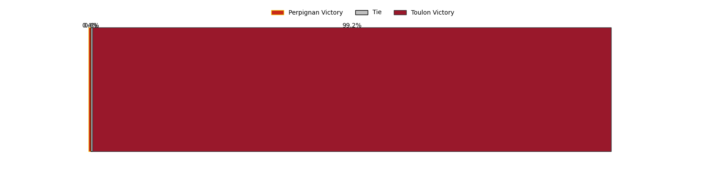

---  
layout: page  
title: Perpignan at Toulon; 15-37  
date: 2023-04-15 17:00:00 18:00:00 -0500  
categories: match review  
---
# Perpignan at Toulon; 15-37

# Club Level Predictions

The first set of predictions treats a club as the smallest object, as the club develops its members, organizes a gameplan, and deploys its players as needed for each match. This club model has a prediction of 0.784, which translates to predicting Toulon to win by 11.3.

Each club has a rating and a rating deviation (simiar to a Glicko system), and expected performances can be generated. This allows for simulated matches and spreads like the ones below.
## Projected Performances

## Projected Spreads

## Projected Results

# Player Level Predictions

Treating teams instead as an entity made up of the currently active players, I have ratings for each player in an altogether different system. These can be combined to form team ratings once teamsheets are announced, weighting starters a bit higher than the reserves. After the match is played, players can be weighted by their minutes on the field, allowing for an accurate measure of the team's composition. With these compiled team ratings, we can make predictions, measure inaccuracy, and update the individual player ratings.
## Prediction with Player Minutes: Toulon by 20.2

Toulon by 16.2 on a neutral field

There were 3 large changes in win probability in this match
## Prediction without Player Minutes: Toulon by 21.2

Toulon by 17.2 on a neutral pitch

|   Away Minutes | Away Player         |   Away elo |   Away Percentile |   Number |   Home Percentile |   Home elo | Home Player         |   Home Minutes |
|---------------:|:--------------------|-----------:|------------------:|---------:|------------------:|-----------:|:--------------------|---------------:|
|             53 | Sacha Lotrian       |      91.76 |                37 |        1 |                79 |     105.65 | Bruce Devaux        |             50 |
|             48 | Mike Tadjer         |      98.21 |                61 |        2 |               nan |      99.96 | Christopher Tolofua |             50 |
|             48 | Arthur Joly         |     101.47 |                71 |        3 |                92 |     114.82 | Beka Gigashvili     |             50 |
|             80 | Piula Fa'asalele    |      96.42 |                53 |        4 |               nan |      95.83 | Mathieu Tanguy      |             80 |
|             48 | Victor Moreaux      |      91.15 |                37 |        5 |                77 |     105.78 | Brian Alainu'uese   |             64 |
|             48 | Lucas Bachelier     |      99.78 |                62 |        6 |                56 |      99.43 | Mattéo Le Corvec    |             48 |
|             80 | Kélian Galletier    |      88.62 |                25 |        7 |                52 |      99.41 | Mathieu Bastareaud  |             80 |
|             80 | Joaquin Oviedo      |      93.22 |                42 |        8 |                64 |     102.77 | Sergio Parisse      |             80 |
|             48 | Matteo Rodor        |      91.97 |                35 |        9 |                38 |      92.92 | Benoit Paillaugue   |             53 |
|             80 | Tristan Tedder      |     101.12 |                63 |       10 |                98 |     143.82 | Dan Biggar          |             64 |
|             80 | Mathieu Acebes      |      95    |               nan |       11 |                76 |     105.95 | Aymeric Luc         |             80 |
|             60 | Dorian Laborde      |      88.21 |                28 |       12 |                11 |      79.62 | Maëlan Rabut        |             38 |
|             80 | Edward Sawailau     |      88.26 |                27 |       13 |                69 |     103.74 | Jérémy Sinzelle     |             80 |
|             80 | Théo Forner         |      85.63 |                17 |       14 |                14 |      81.37 | Gaël Dréan          |             80 |
|             80 | Lucas Dubois        |      92.07 |                40 |       15 |                66 |     102.79 | Marius Domon        |             80 |
|             32 | Victor Montgaillard |      86.55 |                18 |       16 |                83 |     111.42 | Waisea Nayacavelu   |             42 |
|             32 | Siua Halanukonuka   |      95.64 |                52 |       17 |                85 |     112.03 | Facundo Isa         |             32 |
|             32 | Tristan Labouteley  |     102.22 |                70 |       18 |                76 |     103.07 | Dany Priso          |             30 |
|             32 | Tom Ecochard        |      95    |               nan |       19 |                89 |     113.15 | Teddy Baubigny      |             30 |
|             32 | Posolo Tuilagi      |      97.01 |                55 |       20 |                73 |     103.14 | Kieran Brookes      |             30 |
|             27 | Akato Fakatika      |      96.99 |               nan |       21 |                88 |     112.73 | Baptiste Serin      |             27 |
|             20 | Boris Goutard       |      47.41 |                 0 |       22 |                57 |      98.48 | Matthias Halagahu   |             16 |
|            nan | nan                 |     nan    |               nan |       23 |                82 |     110.11 | Ihaia West          |             16 |

