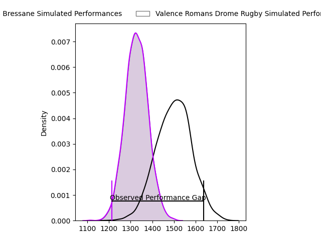
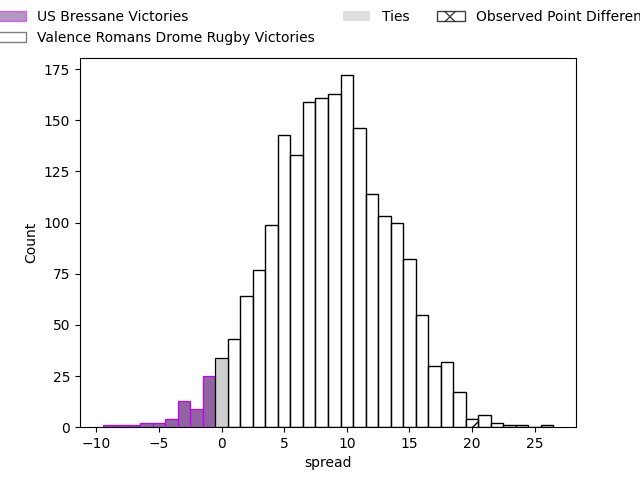
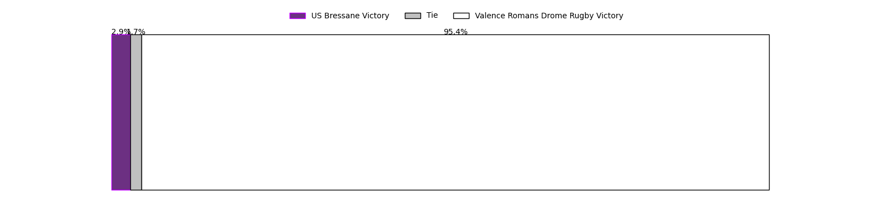

---  
layout: page  
title: US Bressane at Valence Romans Drome Rugby; 7-27  
date: 2023-04-15 15:15:00 18:00:00 -0500  
categories: match review  
---
# US Bressane at Valence Romans Drome Rugby; 7-27

# Club Level Predictions

The first set of predictions treats a club as the smallest object, as the club develops its members, organizes a gameplan, and deploys its players as needed for each match. This club model has a prediction of 0.729, which translates to predicting Valence Romans Drome Rugby to win by 8.7.

Each club has a rating and a rating deviation (simiar to a Glicko system), and expected performances can be generated. This allows for simulated matches and spreads like the ones below.
## Projected Performances

## Projected Spreads

## Projected Results

# Player Level Predictions

Treating teams instead as an entity made up of the currently active players, I have ratings for each player in an altogether different system. These can be combined to form team ratings once teamsheets are announced, weighting starters a bit higher than the reserves. After the match is played, players can be weighted by their minutes on the field, allowing for an accurate measure of the team's composition. With these compiled team ratings, we can make predictions, measure inaccuracy, and update the individual player ratings.
## Prediction with Player Minutes: Valence Romans Drome Rugby by 16.2

Valence Romans Drome Rugby by 12.2 on a neutral field

There were 7 large changes in win probability in this match
## Prediction without Player Minutes: Valence Romans Drome Rugby by 20.1

Valence Romans Drome Rugby by 16.1 on a neutral pitch

|   Away Minutes | Away Player                 |   Away elo |   Away Percentile |   Number |   Home Percentile |   Home elo | Home Player                   |   Home Minutes |
|---------------:|:----------------------------|-----------:|------------------:|---------:|------------------:|-----------:|:------------------------------|---------------:|
|             49 | Quentin Drancourt           |     112.23 |               nan |        1 |                99 |     142.09 | Sami Zouhair                  |             51 |
|             49 | Sione Anga'aelangi          |      98.73 |                55 |        2 |                88 |     112.69 | Dorian Marco Pena             |             51 |
|             49 | Erich de Jager              |      39.05 |                 0 |        3 |                77 |     103.54 | John Henry Fincham            |             62 |
|             60 | Thomas Déliance             |     106.66 |                73 |        4 |                97 |     129.69 | Darrell Dyer                  |             53 |
|             80 | Marius Constantin Antonescu |      95.88 |                51 |        5 |               nan |      95.97 | John Adriaan (Ian) Groenewald |             80 |
|             80 | Lucas Lyons                 |     120.72 |                91 |        6 |                92 |     120.58 | Alexis Armary                 |             80 |
|             62 | Dimitri Jean Etienne        |      77.1  |                 6 |        7 |                86 |     113.07 | Sven Bernat Girlando          |             80 |
|             80 | Wael May                    |     108.95 |                80 |        8 |                40 |      93.57 | Dylan Lam                     |             55 |
|             74 | Jérémy Valençot             |     101.41 |                68 |        9 |                11 |      79.41 | Tim Menzel                    |             65 |
|             74 | Christian Lacombe           |      88.02 |                26 |       10 |                88 |     116.83 | Joris Moura                   |             60 |
|             80 | Kavekini Tabu               |      96.7  |                52 |       11 |                63 |     100.81 | Tim Giresse                   |             80 |
|             80 | Parataiso Silafai-Lea'ana   |     134.43 |                98 |       12 |                95 |     124.95 | Ben Neiceru                   |             80 |
|             72 | Maile Mamao                 |      80.9  |                12 |       13 |                 8 |      75.86 | Anatole Pauvert               |             80 |
|             80 | Élie De Fleurian            |      92.12 |                40 |       14 |                81 |     109.16 | Adam Vargas                   |             80 |
|             80 | Audric Sanlaville           |      95.47 |                48 |       15 |                85 |     112.17 | Quentin Gobet                 |             57 |
|             31 | Willem Johannes Harmse      |      94.66 |                49 |       16 |                31 |      90.47 | Anthony Aléo                  |             29 |
|             31 | Clément Jullien             |      91.25 |                37 |       17 |               nan |      93.4  | Mehdi Boundjema               |             29 |
|             31 | Vazha Kapanadze             |      89.19 |                27 |       18 |               nan |      96.6  | Vincent Pelo                  |             18 |
|             18 | Nicolas Tachat              |      87.35 |                23 |       19 |                43 |      93.16 | François Uys                  |             27 |
|              6 | Gaspard De Ligault          |      95    |               nan |       20 |                 5 |      70.68 | Charles Brayer                |             25 |
|              6 | Noé Brune                   |      95    |               nan |       21 |                26 |      89.18 | Léopold Dupas                 |             15 |
|              8 | Alexandre Badet             |      87.76 |                27 |       22 |                47 |      97.11 | Lucas Méret                   |             20 |
|             20 | Monty Leverstein            |      90.13 |                31 |       23 |                78 |     108.21 | Charles Bouldoire             |             23 |

