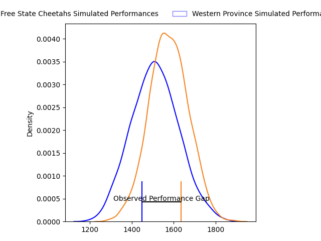
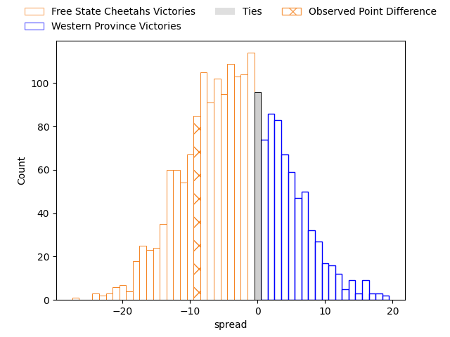
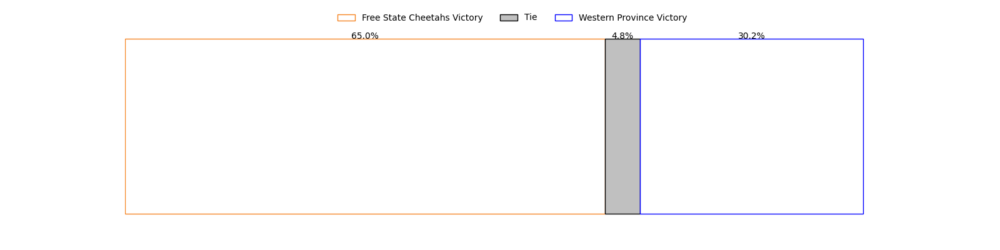

---  
layout: page  
title: Free State Cheetahs at Western Province; 26-17  
date: 2023-04-15 15:00:00 18:00:00 -0500  
categories: match review  
---
# Free State Cheetahs at Western Province; 26-17

# Club Level Predictions

The first set of predictions treats a club as the smallest object, as the club develops its members, organizes a gameplan, and deploys its players as needed for each match. This club model has a prediction of 0.409, which translates to predicting Free State Cheetahs to win by 3.3.

Each club has a rating and a rating deviation (simiar to a Glicko system), and expected performances can be generated. This allows for simulated matches and spreads like the ones below.
## Projected Performances

## Projected Spreads

## Projected Results

# Player Level Predictions

Treating teams instead as an entity made up of the currently active players, I have ratings for each player in an altogether different system. These can be combined to form team ratings once teamsheets are announced, weighting starters a bit higher than the reserves. After the match is played, players can be weighted by their minutes on the field, allowing for an accurate measure of the team's composition. With these compiled team ratings, we can make predictions, measure inaccuracy, and update the individual player ratings.
## Prediction with Player Minutes: Free State Cheetahs by 6.7

Free State Cheetahs by 10.7 on a neutral field

There were 6 large changes in win probability in this match
## Prediction without Player Minutes: Free State Cheetahs by 2.7

Free State Cheetahs by 6.7 on a neutral pitch

|   Away Minutes | Away Player                    |   Away elo |   Away Percentile |   Number |   Home Percentile |   Home elo | Home Player                       |   Home Minutes |
|---------------:|:-------------------------------|-----------:|------------------:|---------:|------------------:|-----------:|:----------------------------------|---------------:|
|             58 | Schalk Ferreira                |     103.82 |                72 |        1 |               nan |      93.76 | Leon Lyons                        |             67 |
|             58 | Marko Louis Janse van Rensburg |      84.62 |                17 |        2 |                68 |     100.29 | Andre-Hugo Venter                 |             67 |
|             40 | Johannes (Aranos) Coetzee      |      92.29 |                39 |        3 |                90 |     112.29 | Lee-Marvin Lofty Siyanda Mazibuko |             67 |
|             58 | Mzwanele Richman Zito          |     108.03 |                74 |        4 |                43 |      93.05 | Connor Evans                      |             72 |
|             80 | Victor Kutlwano Sekekete       |     103.12 |                71 |        5 |                38 |      91.26 | Gary Porter                       |             80 |
|             80 | Gideon van der Merwe           |     120.55 |                92 |        6 |                19 |      85.67 | Junior Sipato Pokomela            |             80 |
|             80 | Sibabalo Qoma                  |     103.67 |                66 |        7 |               nan |      97.73 | Jarrod Taylor                     |             62 |
|             57 | Anidisa Ntsila                 |      94.14 |                42 |        8 |                61 |     100.71 | Keke Morabe                       |             80 |
|             80 | Ruan Pienaar                   |     113.51 |                89 |        9 |                34 |      91.04 | Thomas Bursey                     |             72 |
|             40 | Reinhardt Fortuin              |      95.58 |                47 |       10 |                27 |      88.85 | Kade Wolhuter                     |             64 |
|             80 | Munier Hartzenberg             |     113.67 |                86 |       11 |                93 |     124.26 | Angelo Davids                     |             80 |
|             80 | David Benjamin Brits           |      95.75 |                49 |       12 |                30 |      89.32 | Jean-Luc du Plessis               |             80 |
|             80 | Evardi Boshoff                 |      81.1  |                10 |       13 |                 9 |      78.33 | Juan de Jongh                     |             80 |
|             80 | Daniel Kasende Kalepula        |      99.41 |                60 |       14 |                45 |      94.12 | Duncan Rowan Saal                 |             62 |
|             70 | Cohen Jasper                   |     106.75 |                71 |       15 |                47 |      94.55 | Sacha Mngomezulu                  |             80 |
|             40 | Hencus van Wyk                 |     117.9  |                94 |       16 |                67 |     102.12 | Cornel Smit                       |             16 |
|             40 | Siya Masuku                    |      91.66 |                36 |       17 |                50 |      95.2  | Kwenzokuhle Ndumiso Blose         |             13 |
|             22 | Alulutho Tshakweni             |     103.71 |                77 |       18 |                30 |      89.28 | Siyabonga Ntubeni                 |             13 |
|             22 | Louis van der Westhuizen       |     104.17 |                43 |       19 |               nan |      95.47 | Corne Wellbach                    |             13 |
|             23 | Daniel Johannes Maartens       |     133.16 |                97 |       20 |               nan |      95    | Louw Nel                          |             18 |
|             22 | Rynier Mark Bernardo           |     106.39 |                78 |       21 |               nan |      95    | Luke John Burger                  |             18 |
|             10 | Tapiwa Lloyd Mafura            |      86.17 |                22 |       22 |               nan |      91.97 | Moegamat Kannemeyer               |              8 |
|            nan | nan                            |     nan    |               nan |       23 |               nan |      94.73 | Dylan De Leeuw                    |              8 |

