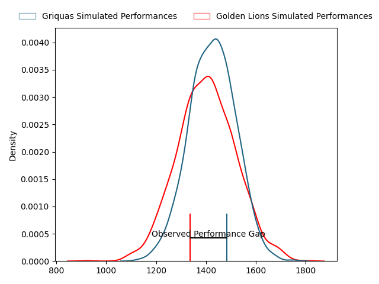
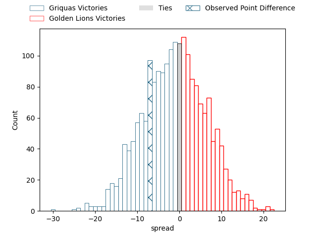
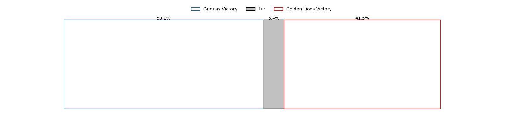

---  
layout: page  
title: Griquas at Golden Lions; 25-18  
date: 2023-04-16 00:00:00 18:00:00 -0500  
categories: match review  
---
# Griquas at Golden Lions; 25-18

# Club Level Predictions

The first set of predictions treats a club as the smallest object, as the club develops its members, organizes a gameplan, and deploys its players as needed for each match. This club model has a prediction of 0.468, which translates to predicting Griquas to win by 1.2.

Each club has a rating and a rating deviation (simiar to a Glicko system), and expected performances can be generated. This allows for simulated matches and spreads like the ones below.
## Projected Performances

## Projected Spreads

## Projected Results

# Player Level Predictions

Treating teams instead as an entity made up of the currently active players, I have ratings for each player in an altogether different system. These can be combined to form team ratings once teamsheets are announced, weighting starters a bit higher than the reserves. After the match is played, players can be weighted by their minutes on the field, allowing for an accurate measure of the team's composition. With these compiled team ratings, we can make predictions, measure inaccuracy, and update the individual player ratings.
## Prediction with Player Minutes: Golden Lions by 10.0

Golden Lions by 6.0 on a neutral field

There were 6 large changes in win probability in this match
## Prediction without Player Minutes: Golden Lions by 10.2

Golden Lions by 6.2 on a neutral pitch

|   Away Minutes | Away Player                |   Away elo |   Away Percentile |   Number |   Home Percentile |   Home elo | Home Player               |   Home Minutes |
|---------------:|:---------------------------|-----------:|------------------:|---------:|------------------:|-----------:|:--------------------------|---------------:|
|             80 | Kudzwai Dube               |      93.44 |                31 |        1 |                67 |     100.15 | Morgan Naude              |             63 |
|             55 | Janco Uys                  |      88.87 |                18 |        2 |                81 |     105.75 | Gerrit Jacobus Visagie    |             77 |
|             63 | Janu Botha                 |      90.65 |                40 |        3 |                76 |     103.38 | Ruan-Henry Smith          |             64 |
|             63 | Derrick Pretorius          |      70.31 |                 5 |        4 |                37 |      89.84 | Pieter Jansen van Vuuren  |             80 |
|             80 | Albert Liebenberg          |      70.06 |                 5 |        5 |                83 |     108.93 | Darrien-Lane Landsberg    |             72 |
|             80 | Stephan Smit               |      84.37 |                16 |        6 |               nan |      92.63 | Renzo du Plessis          |             80 |
|             54 | Michael Amiras             |      85.15 |               nan |        7 |                43 |      94.63 | Jarod Cairns              |             80 |
|             80 | Hanru Sirgel               |     106.41 |                76 |        8 |               nan |      76.03 | Cal Smid                  |             63 |
|             80 | Johan Mulder               |      89.36 |                29 |        9 |                45 |      93.99 | Nico Steyn                |             46 |
|             58 | George Alexander Whitehead |      90.24 |                32 |       10 |                 6 |      73.69 | Jurich Claasens           |             80 |
|             68 | Luther Obi                 |      88.69 |                29 |       11 |                41 |      92.3  | Ilunga Mukendi            |             80 |
|             80 | Eduard (Eddie) Fouche      |     104.92 |                72 |       12 |               nan |      95    | Bronson Mills             |             72 |
|             80 | Jay Cee Nel                |     114.32 |                86 |       13 |                84 |     112.61 | Rynardt Jonker            |             80 |
|             80 | Rosco Shane Specman        |      76.57 |                 8 |       14 |                21 |      86.14 | Boldwin Hansen            |             80 |
|             65 | Lubabalo Dobela            |      84.91 |                21 |       15 |                57 |      98.64 | Tiaan Henk Swanepoel      |             80 |
|             26 | Niel Otto                  |     110.6  |                83 |       16 |                47 |      92.74 | Andre Warner              |             34 |
|             25 | Gustav Du Rand             |      95.04 |                51 |       17 |                61 |      95.52 | Sithembiso Sithole        |             17 |
|             22 | Sango (Saida) Xamlashe     |      95.7  |                52 |       18 |               nan |      95.34 | Johannes JC Pretorius     |             17 |
|             17 | Cebolenkosi Dlamini        |      93.28 |                43 |       19 |               nan |      92.65 | Kabous Bezuidenhout       |             16 |
|             17 | Johan Retief               |      92.82 |               nan |       20 |               nan |      70.04 | Zeilinga Strydom          |              8 |
|             15 | Raegan Oranje              |     104.86 |                78 |       21 |               nan |      89.24 | Conor Van Buuren          |              8 |
|             12 | Sakoyisa Makata            |      91.22 |               nan |       22 |                69 |      92.09 | Michael Thomas van Vuuren |              3 |

