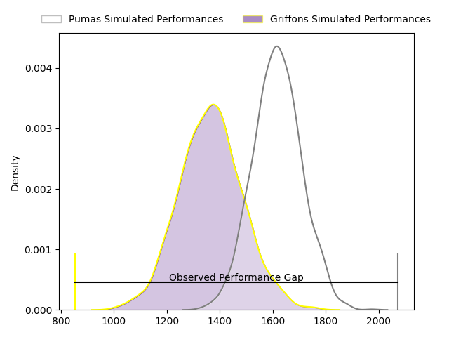
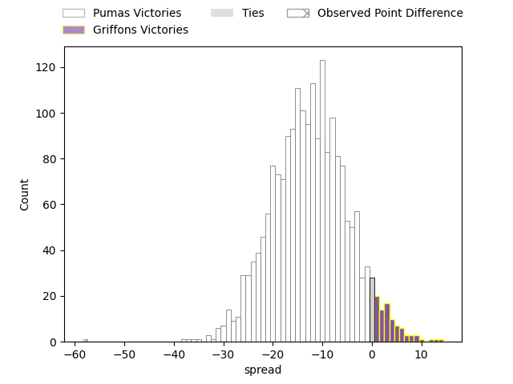
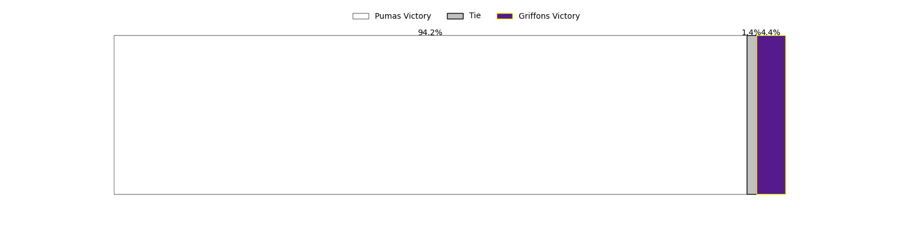

---  
layout: page  
title: Pumas at Griffons; 64-6  
date: 2023-04-16 00:00:00 18:00:00 -0500  
categories: match review  
---
# Pumas at Griffons; 64-6

# Club Level Predictions

The first set of predictions treats a club as the smallest object, as the club develops its members, organizes a gameplan, and deploys its players as needed for each match. This club model has a prediction of 0.201, which translates to predicting Pumas to win by 12.5.

Each club has a rating and a rating deviation (simiar to a Glicko system), and expected performances can be generated. This allows for simulated matches and spreads like the ones below.
## Projected Performances

## Projected Spreads

## Projected Results

# Player Level Predictions

Treating teams instead as an entity made up of the currently active players, I have ratings for each player in an altogether different system. These can be combined to form team ratings once teamsheets are announced, weighting starters a bit higher than the reserves. After the match is played, players can be weighted by their minutes on the field, allowing for an accurate measure of the team's composition. With these compiled team ratings, we can make predictions, measure inaccuracy, and update the individual player ratings.
## Prediction with Player Minutes: Pumas by 14.8

Pumas by 18.8 on a neutral field

There were 2 large changes in win probability in this match
## Prediction without Player Minutes: Pumas by 14.1

Pumas by 18.1 on a neutral pitch

|   Away Minutes | Away Player           |   Away elo |   Away Percentile |   Number |   Home Percentile |   Home elo | Home Player                 |   Home Minutes |
|---------------:|:----------------------|-----------:|------------------:|---------:|------------------:|-----------:|:----------------------------|---------------:|
|             56 | Cameron Dawson        |      93.18 |               nan |        1 |                28 |      89.59 | Stephan de Jager            |             63 |
|             66 | Corne Fourie          |      93.18 |                42 |        2 |               nan |      89.7  | Hendrik Petrus van Schoor   |             63 |
|             56 | Njabula Juice Gumede  |      88.9  |                33 |        3 |               nan |      99.21 | Neo Mohapi                  |             40 |
|             80 | Malembe Mpofu         |      95.72 |               nan |        4 |                48 |      95.22 | Jaco Willemse               |             56 |
|             63 | Shane Monro Kirkwood  |     131.67 |                97 |        5 |               nan |      96.46 | Curtley Thomas              |             80 |
|             80 | Francois Kleinhans    |      93.94 |                44 |        6 |                35 |      91.06 | Jean-Jacques Pretorius      |             80 |
|             63 | Deon Slabbert         |     106.67 |                78 |        7 |               nan |      95    | Thomas Ulengo               |             56 |
|             80 | Kwanda Dimaza         |      95.46 |                45 |        8 |                23 |      87.11 | Ludio Fernando Williams     |             80 |
|             62 | Giovanne Snyman       |      86.02 |                20 |        9 |               nan |      94.76 | Richman Gora                |             56 |
|             70 | Tinus de Beer         |     115.24 |                86 |       10 |               nan |      43.51 | Robbie Petzer               |             80 |
|             70 | Jade Kyle Stighling   |      90.6  |                35 |       11 |                37 |      89.52 | Duren Hoffman               |             80 |
|             80 | Ali Mgijima           |     106.64 |                75 |       12 |                 1 |      59    | Marquit Virgil September    |             56 |
|             80 | Diego Appollis        |      90.01 |                32 |       13 |                24 |      86.21 | Keanu Armandio Vers         |             56 |
|             80 | Stefan Coetzee        |      98.28 |               nan |       14 |                55 |      97.56 | Granwill Matthys            |             80 |
|             80 | Devon Frank Williams  |      93.94 |                46 |       15 |                32 |      89.11 | Domenic Smit                |             80 |
|             24 | Simon Raw             |      74.95 |               nan |       16 |                18 |      86.05 | Doctor Booysen              |             40 |
|             24 | PJ Jacobs             |     120.96 |               nan |       17 |                17 |      83.71 | Sokuphumla (Soso) Xakalashe |             24 |
|             18 | Chriswill September   |     122.73 |                96 |       18 |                17 |      83.6  | Michael Benadie             |             24 |
|             17 | Ruwald Van der Merwe  |      96.04 |               nan |       19 |                 0 |      53.23 | Carel-Jan Coetzee           |             24 |
|             17 | Andre Fouché          |     114.71 |                87 |       20 |                87 |     115.84 | Duan Pretorius              |             24 |
|             14 | Etienne Janeke        |     100.18 |               nan |       21 |                26 |      88.46 | Jaywinn Juries              |             24 |
|             10 | Brandon Terry Thomson |      89.13 |                22 |       22 |               nan |      95.4  | Xolani Jacobs               |             17 |
|             10 | Lundi Msenge          |      88.46 |                28 |       23 |                28 |      88.86 | Dandré Delport              |             17 |

