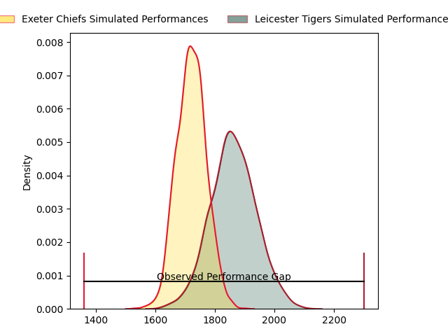
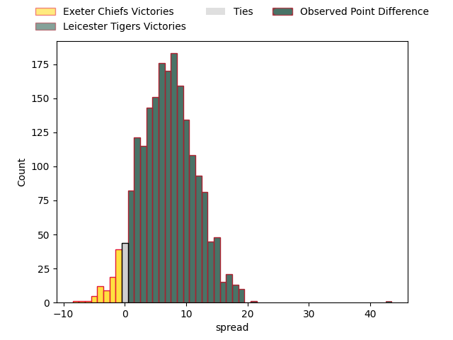

---  
layout: page  
title: Exeter Chiefs at Leicester Tigers; 19.0-62.0  
date: 2023-04-16 10:00:00 18:00:00 -0500  
categories: match review  
---
# Exeter Chiefs at Leicester Tigers; 19.0-62.0

# Club Level Predictions

The first set of predictions treats a club as the smallest object, as the club develops its members, organizes a gameplan, and deploys its players as needed for each match. This club model has a prediction of 0.688, which translates to predicting Leicester Tigers to win by 6.9.

Each club has a rating and a rating deviation (simiar to a Glicko system), and expected performances can be generated. This allows for simulated matches and spreads like the ones below.
## Projected Performances

## Projected Spreads

## Projected Results

# Player Level Predictions

Treating teams instead as an entity made up of the currently active players, I have ratings for each player in an altogether different system. These can be combined to form team ratings once teamsheets are announced, weighting starters a bit higher than the reserves. After the match is played, players can be weighted by their minutes on the field, allowing for an accurate measure of the team's composition. With these compiled team ratings, we can make predictions, measure inaccuracy, and update the individual player ratings.
## Prediction with Player Minutes: Leicester Tigers by 7.7

Leicester Tigers by 3.7 on a neutral field

There were 7 large changes in win probability in this match
## Prediction without Player Minutes: Leicester Tigers by 3.5

Exeter Chiefs by 0.5 on a neutral pitch

|   Away Minutes | Away Player       |   Away elo |   Away Percentile |   Number |   Home Percentile |   Home elo | Home Player         |   Home Minutes |
|---------------:|:------------------|-----------:|------------------:|---------:|------------------:|-----------:|:--------------------|---------------:|
|             46 | Nika Abuladze     |     118.46 |                94 |        1 |                92 |     115.16 | James Cronin        |              4 |
|             46 | Jack Yeandle      |     123.55 |                98 |        2 |                23 |      87.02 | Julian Montoya      |             56 |
|             46 | Josh Iosefa-Scott |      93.63 |                56 |        3 |                20 |      86.32 | Dan Cole            |             49 |
|             80 | Jack Dunne        |      94    |                45 |        4 |                64 |     100.29 | George Martin       |             65 |
|             56 | Jonny Gray        |     100.18 |                64 |        5 |                91 |     117.15 | Cameron Henderson   |             80 |
|             54 | Aidon Davis       |      74.33 |                 7 |        6 |                96 |     130.32 | Hanro Liebenberg    |             80 |
|             80 | Christ Tshiunza   |      96.31 |                51 |        7 |                92 |     120.61 | Tommy Reffell       |             80 |
|             72 | Sam Simmonds      |     121.29 |                92 |        8 |                76 |     105.89 | Jasper Wiese        |             54 |
|             52 | Will Becconsall   |      92.6  |                40 |        9 |                35 |      91.22 | Jack van Poortvliet |             52 |
|             56 | Joe Simmonds      |     127.73 |                94 |       10 |                95 |     128.87 | Handre Pollard      |             65 |
|             80 | Olly Woodburn     |     138.88 |                99 |       11 |                16 |      82.85 | Anthony Watson      |             64 |
|              8 | Solomone Kata     |     121.55 |                93 |       12 |                24 |      86.82 | Dan Kelly           |             80 |
|             80 | Sean O'Brien      |      67.37 |                 4 |       13 |                34 |      90.68 | Matt Scott          |             80 |
|             80 | Tom Wyatt         |      94.82 |                48 |       14 |                80 |     108.29 | Chris Ashton        |             80 |
|             80 | Stuart Hogg       |     107.66 |                76 |       15 |                58 |      98.83 | Freddie Steward     |             80 |
|             34 | Jack Innard       |      92.7  |                41 |       16 |                12 |      81.78 | Charlie Clare       |             24 |
|             34 | Scott Sio         |      98.66 |                62 |       17 |                87 |     105.07 | Tom West            |             76 |
|             34 | Marcus Street     |      74.82 |                 6 |       18 |                79 |     104.44 | Joe Heyes           |             31 |
|             24 | Mike Williams     |      74.18 |                11 |       19 |                39 |      91.85 | Eli Snyman          |             15 |
|             34 | Rusiate Tuima     |      95    |               nan |       20 |                81 |     107.91 | Olly Cracknell      |             26 |
|             28 | Stu Townsend      |     116.13 |                91 |       21 |                34 |      90.99 | Ben Youngs          |             28 |
|             24 | Harvey Skinner    |      85.73 |                18 |       22 |                73 |     104.66 | Jimmy Gopperth      |             15 |
|             72 | Rory O'Loughlin   |      91.29 |                36 |       23 |                68 |     102.84 | Harry Potter        |             16 |

