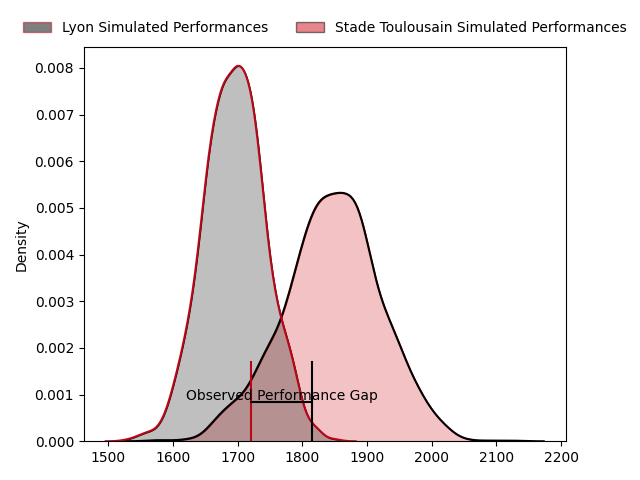
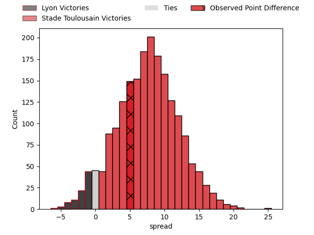

---  
layout: page  
title: Lyon at Stade Toulousain; 31-36  
date: 2023-04-16 21:00:00 18:00:00 -0500  
categories: match review  
---
# Lyon at Stade Toulousain; 31-36

# Club Level Predictions

The first set of predictions treats a club as the smallest object, as the club develops its members, organizes a gameplan, and deploys its players as needed for each match. This club model has a prediction of 0.706, which translates to predicting Stade Toulousain to win by 7.7.

Each club has a rating and a rating deviation (simiar to a Glicko system), and expected performances can be generated. This allows for simulated matches and spreads like the ones below.
## Projected Performances

## Projected Spreads

## Projected Results

# Player Level Predictions

Treating teams instead as an entity made up of the currently active players, I have ratings for each player in an altogether different system. These can be combined to form team ratings once teamsheets are announced, weighting starters a bit higher than the reserves. After the match is played, players can be weighted by their minutes on the field, allowing for an accurate measure of the team's composition. With these compiled team ratings, we can make predictions, measure inaccuracy, and update the individual player ratings.
## Prediction with Player Minutes: Stade Toulousain by 17.9

Stade Toulousain by 13.9 on a neutral field

There were 5 large changes in win probability in this match
## Prediction without Player Minutes: Stade Toulousain by 14.4

Stade Toulousain by 10.4 on a neutral pitch

|   Away Minutes | Away Player          |   Away elo |   Away Percentile |   Number |   Home Percentile |   Home elo | Home Player          |   Home Minutes |
|---------------:|:---------------------|-----------:|------------------:|---------:|------------------:|-----------:|:---------------------|---------------:|
|             49 | Sébastien Taofifenua |      94.42 |                48 |        1 |                51 |      97.05 | Rodrigue Neti        |             50 |
|             56 | Liam Coltman         |     100.66 |                69 |        2 |                79 |     104.95 | Peato Mauvaka        |             64 |
|             61 | Demba Bamba          |      97.75 |                53 |        3 |                66 |      99.93 | Dorian Aldegheri     |             53 |
|             66 | Killian Geraci       |      94.46 |                46 |        4 |                74 |     106.48 | Joshua Brennan       |             47 |
|             53 | Romain Taofifenua    |     103.44 |                73 |        5 |                88 |     115.23 | Thibaud Flament      |             80 |
|             68 | Liam Allen           |      99.69 |                61 |        6 |               100 |     169.01 | Francois Cros        |             80 |
|             80 | Beka Saghinadze      |     123.73 |                93 |        7 |                48 |      94.19 | Alban Placines       |             47 |
|             80 | Arno Botha           |      97.81 |                52 |        8 |                24 |      88.69 | Alexandre Roumat     |             62 |
|             64 | Baptiste Couilloud   |      92.71 |                45 |        9 |                97 |     127.32 | Paul Graou           |             80 |
|             80 | Léo Berdeu           |      98.32 |                57 |       10 |                55 |      97.74 | Theo Ntamack         |             80 |
|             80 | Ethan Dumortier      |      96.02 |                50 |       11 |                89 |     115.95 | Ange Capuozzo        |             13 |
|             80 | Josua Tuisova        |     100.57 |                63 |       12 |                26 |      87.43 | Santiago Chocobares  |             80 |
|             38 | Josiah Maraku        |      92.05 |                39 |       13 |                27 |      87.81 | Pierre-Louis Barassi |             80 |
|             80 | Tavite Veredamu      |      99.6  |                60 |       14 |                55 |      98.45 | Arthur Retière       |              4 |
|             80 | Toby Arnold          |      91.12 |                39 |       15 |                11 |      77.75 | Melvyn Jaminet       |             80 |
|             42 | Lima Sopoaga         |      92.9  |                39 |       16 |                94 |     124.16 | Thomas Ramos         |             76 |
|             31 | Jerome Rey           |      98.83 |                63 |       17 |                97 |     129.16 | Antoine Dupont       |             67 |
|             27 | Loann Goujon         |      88.99 |                28 |       18 |                95 |     127.95 | Jack Willis          |             33 |
|             24 | Guillaume Marchand   |      94.88 |                42 |       19 |                60 |      99    | Emmanuel Meafou      |             33 |
|             19 | Feao Fotuaika        |      94.96 |               nan |       20 |                78 |     104.15 | Cyril Baille         |             30 |
|             16 | Jonathan Pelissié    |      88.38 |                26 |       21 |               nan |      92.89 | Paul Mallez          |             27 |
|             14 | Félix Lambey         |      97.52 |                58 |       22 |                35 |      90.78 | Rynhard Elstadt      |             18 |
|             12 | Joel Kpoku           |      87.86 |                23 |       23 |                66 |      98.65 | Guillaume Cramont    |             16 |

