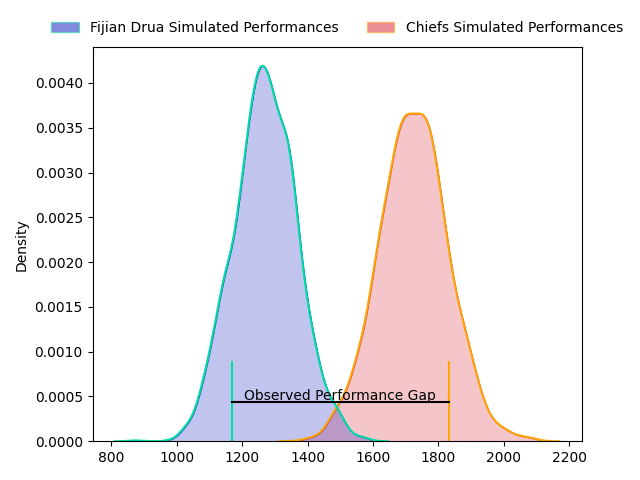
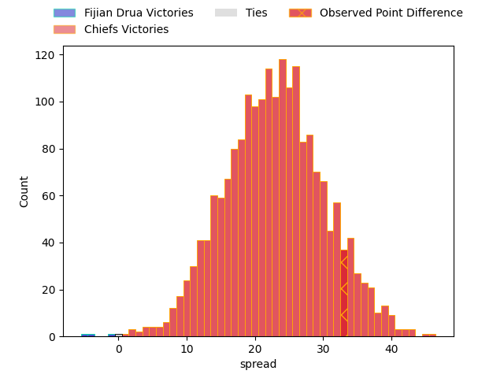

---  
layout: page  
title: Fijian Drua at Chiefs; 17.0-50.0  
date: 2023-04-21 03:05:00 18:00:00 -0500  
categories: match review  
---
# Fijian Drua at Chiefs; 17.0-50.0

# Club Level Predictions

The first set of predictions treats a club as the smallest object, as the club develops its members, organizes a gameplan, and deploys its players as needed for each match. This club model has a prediction of 0.924, which translates to predicting Chiefs to win by 22.6.

Each club has a rating and a rating deviation (simiar to a Glicko system), and expected performances can be generated. This allows for simulated matches and spreads like the ones below.
## Projected Performances

## Projected Spreads

## Projected Results

# Player Level Predictions

Treating teams instead as an entity made up of the currently active players, I have ratings for each player in an altogether different system. These can be combined to form team ratings once teamsheets are announced, weighting starters a bit higher than the reserves. After the match is played, players can be weighted by their minutes on the field, allowing for an accurate measure of the team's composition. With these compiled team ratings, we can make predictions, measure inaccuracy, and update the individual player ratings.
## Prediction with Player Minutes: Chiefs by 8.5

Chiefs by 4.5 on a neutral field

There were 2 large changes in win probability in this match
## Prediction without Player Minutes: Chiefs by 8.2

Chiefs by 4.2 on a neutral pitch

|   Away Minutes | Away Player             |   Away elo |   Away Percentile |   Number |   Home Percentile |   Home elo | Home Player            |   Home Minutes |
|---------------:|:------------------------|-----------:|------------------:|---------:|------------------:|-----------:|:-----------------------|---------------:|
|             64 | Haereiti Hetet          |      98.18 |                88 |        1 |                78 |      90.45 | Ollie Norris           |             48 |
|             72 | Tevita Ikanivere        |     113.61 |                97 |        2 |                96 |     112.65 | Samisoni Taukei'aho    |             63 |
|             55 | Samuela Tawake          |      76.55 |                48 |        3 |                90 |      99.64 | John Ryan              |             51 |
|             72 | Isoa Nasilasila         |     112.05 |                94 |        4 |                97 |     121.64 | Brodie Retallick       |             72 |
|             82 | Ratu Rotuisolia         |      71.51 |                37 |        5 |                52 |      78.6  | Manaaki Selby-Rickit   |             48 |
|             82 | Joseva Tamani           |      74.8  |                46 |        6 |                87 |     101.76 | Samipeni Finau         |             82 |
|             72 | Elia Canakaivata        |      84.07 |                62 |        7 |                57 |      82.41 | Kaylum Boshier         |             82 |
|             71 | Te Ahiwaru Cirikidaveta |     115.38 |                95 |        8 |                86 |      98.66 | Pita Gus Sowakula      |             59 |
|             74 | Peni Matawalu           |      88.61 |                70 |        9 |                83 |      99.55 | Cortez Ratima          |             72 |
|             72 | Teti Tela               |      97.05 |                81 |       10 |                68 |      88.78 | Bryn Gatland           |             82 |
|             82 | Tuidraki Samusamuvodre  |      52.89 |                11 |       11 |                81 |      95.44 | Etene Nanai-Seturo     |             82 |
|             82 | Michael Naitokani       |      86.15 |               nan |       12 |                80 |      96.24 | Rameka Poihipi         |             41 |
|             63 | Apisalome Vota          |     101.98 |                86 |       13 |                52 |      79.27 | Daniel Rona            |             82 |
|             82 | Ilaisa Droasese         |     102.55 |                86 |       14 |                76 |      93.22 | Shaun Stevenson        |             82 |
|             82 | Selestino Ravutaumada   |      85.6  |                67 |       15 |                64 |      85.41 | Damian McKenzie        |             82 |
|             10 | Mesulame Dolokoto       |      83.05 |               nan |       16 |                69 |      84.67 | Tyrone Thompson        |             19 |
|             29 | Livai Natave            |      86.06 |                70 |       17 |                58 |      81.45 | Jared Proffit          |             34 |
|             27 | Jone Tiko               |      85.11 |                68 |       18 |               nan |      87.09 | Solomone Tukuafu       |             31 |
|             10 | Chris Minimbi           |      83.03 |                66 |       19 |               nan |      86.88 | Josh Lord              |             34 |
|             10 | Rusiate Nasove          |     127.47 |                98 |       20 |                36 |      71.14 | Tupou Vaa'i            |             10 |
|              8 | Leone Nawai             |      86.48 |               nan |       21 |               nan |      78.22 | Simon Parker           |             23 |
|             19 | Kalione Nasoko          |      86.28 |               nan |       22 |                78 |      94.24 | Te Toiroa Tahuriorangi |             10 |
|             10 | Kitione Taliga          |      85.91 |                62 |       23 |               nan |      86.68 | Gideon Wrampling       |             41 |

