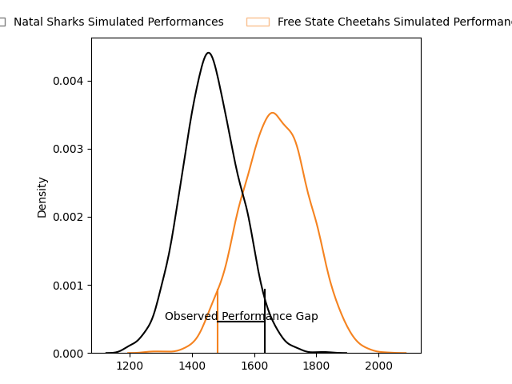
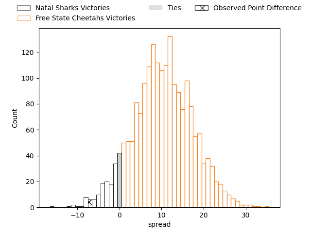
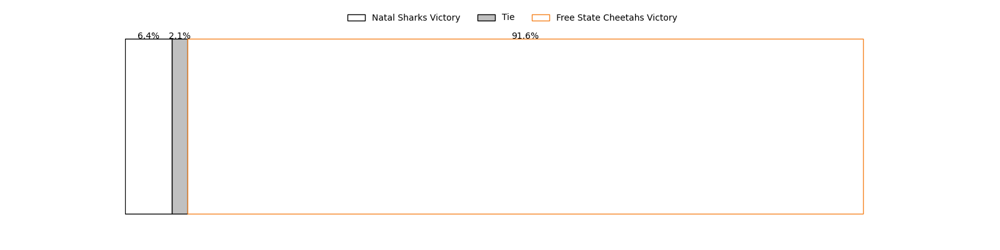

---  
layout: page  
title: Natal Sharks at Free State Cheetahs; 24-17  
date: 2023-04-21 14:30:00 18:00:00 -0500  
categories: match review  
---
# Natal Sharks at Free State Cheetahs; 24-17

# Club Level Predictions

The first set of predictions treats a club as the smallest object, as the club develops its members, organizes a gameplan, and deploys its players as needed for each match. This club model has a prediction of 0.756, which translates to predicting Free State Cheetahs to win by 10.3.

Each club has a rating and a rating deviation (simiar to a Glicko system), and expected performances can be generated. This allows for simulated matches and spreads like the ones below.
## Projected Performances

## Projected Spreads

## Projected Results

# Player Level Predictions

Treating teams instead as an entity made up of the currently active players, I have ratings for each player in an altogether different system. These can be combined to form team ratings once teamsheets are announced, weighting starters a bit higher than the reserves. After the match is played, players can be weighted by their minutes on the field, allowing for an accurate measure of the team's composition. With these compiled team ratings, we can make predictions, measure inaccuracy, and update the individual player ratings.
## Prediction with Player Minutes: Free State Cheetahs by 21.6

Free State Cheetahs by 17.6 on a neutral field

There were 13 large changes in win probability in this match
## Prediction without Player Minutes: Free State Cheetahs by 18.4

Free State Cheetahs by 14.4 on a neutral pitch

|   Away Minutes | Away Player                   |   Away elo |   Away Percentile |   Number |   Home Percentile |   Home elo | Home Player                    |   Home Minutes |
|---------------:|:------------------------------|-----------:|------------------:|---------:|------------------:|-----------:|:-------------------------------|---------------:|
|             67 | Khwezi Jongamazizi Mona       |      57.42 |                17 |        1 |                72 |      86.96 | Schalk Ferreira                |             40 |
|             58 | Fezokuhle Mbatha              |      73.05 |                56 |        2 |                46 |      74.44 | Marko Louis Janse van Rensburg |             40 |
|             58 | Khuthuzani Kingdom Mchunu     |      86.7  |                85 |        3 |                65 |      83.78 | Johannes (Aranos) Coetzee      |             40 |
|             80 | Corne Rahl                    |      83.26 |                63 |        4 |                64 |      84.14 | Rynier Mark Bernardo           |             80 |
|             57 | Ockie Barnard                 |      82.25 |                62 |        5 |                83 |      95.79 | Victor Kutlwano Sekekete       |             80 |
|             67 | Tinotenda Blithe Mavesere     |      64.2  |                23 |        6 |                55 |      78.99 | Gideon van der Merwe           |             80 |
|             80 | James Venter                  |      80.18 |                53 |        7 |                79 |      92.1  | Sibabalo Qoma                  |             80 |
|             80 | Hendrik Petrus (Henco) Venter |      87.7  |                69 |        8 |                65 |      84.95 | Jeandre Rudolph                |             80 |
|             63 | Bradley Davids                |      72.81 |                40 |        9 |                71 |      89.24 | Ruan Pienaar                   |             57 |
|             80 | Lionel Cronje                 |      62.93 |                37 |       10 |               nan |      83.98 | Siya Masuku                    |             80 |
|             80 | Marnus Potgieter              |      86.81 |                66 |       11 |                70 |      88.75 | Cohen Jasper                   |             80 |
|             80 | Alwayno Visagie               |      94.52 |                80 |       12 |                66 |      86.62 | Reinhardt Fortuin              |             80 |
|             75 | Josh Jonas                    |      63.28 |                22 |       13 |                61 |      83.68 | Robert Thompson Ebersohn       |             73 |
|             80 | Yaw Osei Penxe                |      59.49 |                19 |       14 |                86 |     100.87 | Daniel Kasende Kalepula        |             73 |
|             80 | Nevaldo Fleurs                |      77.76 |                48 |       15 |                51 |      78.75 | Tapiwa Lloyd Mafura            |             80 |
|             23 | Marco De Witt                 |      73.33 |               nan |       16 |               nan |      91.74 | Louis van der Westhuizen       |             40 |
|             22 | Daniel Viljoen Jooste         |      84.23 |                66 |       17 |                85 |      94.96 | Alulutho Tshakweni             |             40 |
|             22 | Hanro Jacobs                  |      65.8  |                25 |       18 |                78 |      90.69 | Hencus van Wyk                 |             40 |
|             13 | Dian Bleuler                  |      75.1  |                45 |       19 |                74 |      94.48 | Rewan Kruger                   |             23 |
|             17 | Tiaan Fourie                  |      81.74 |                65 |       20 |                78 |      95.2  | David Benjamin Brits           |              7 |
|             13 | Dylan Richardson              |      66.63 |                23 |       21 |                17 |      58.93 | Andell Loubser                 |              7 |
|              5 | Murray Koster                 |      66.31 |                27 |       22 |               nan |     nan    | nan                            |            nan |

