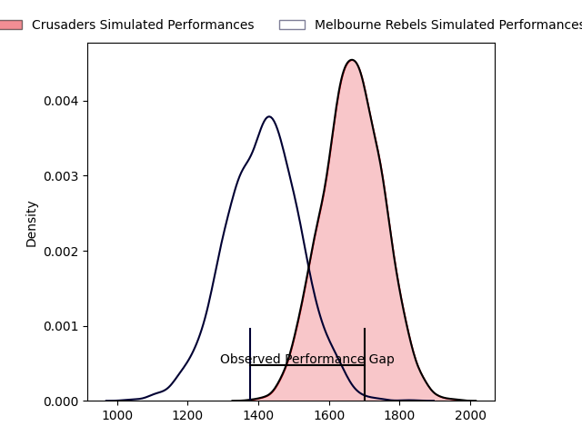
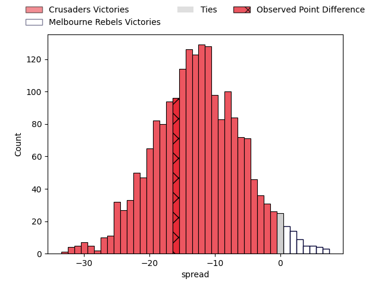
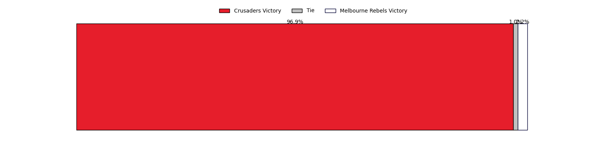

---  
layout: page  
title: Crusaders at Melbourne Rebels; 43.0-27.0  
date: 2023-04-21 05:35:00 18:00:00 -0500  
categories: match review  
---
# Crusaders at Melbourne Rebels; 43.0-27.0

# Club Level Predictions

The first set of predictions treats a club as the smallest object, as the club develops its members, organizes a gameplan, and deploys its players as needed for each match. This club model has a prediction of 0.196, which translates to predicting Crusaders to win by 12.7.

Each club has a rating and a rating deviation (simiar to a Glicko system), and expected performances can be generated. This allows for simulated matches and spreads like the ones below.
## Projected Performances

## Projected Spreads

## Projected Results

# Player Level Predictions

Treating teams instead as an entity made up of the currently active players, I have ratings for each player in an altogether different system. These can be combined to form team ratings once teamsheets are announced, weighting starters a bit higher than the reserves. After the match is played, players can be weighted by their minutes on the field, allowing for an accurate measure of the team's composition. With these compiled team ratings, we can make predictions, measure inaccuracy, and update the individual player ratings.
## Prediction with Player Minutes: Crusaders by 7.9

Crusaders by 11.9 on a neutral field

There were 6 large changes in win probability in this match
## Prediction without Player Minutes: Crusaders by 3.4

Crusaders by 7.4 on a neutral pitch

|   Away Minutes | Away Player          |   Away elo |   Away Percentile |   Number |   Home Percentile |   Home elo | Home Player      |   Home Minutes |
|---------------:|:---------------------|-----------:|------------------:|---------:|------------------:|-----------:|:-----------------|---------------:|
|             56 | Joe Moody            |      88.43 |                24 |        1 |                91 |     113.33 | Matt Gibbon      |             58 |
|             66 | Codie Taylor         |     107.94 |                84 |        2 |                60 |      97.96 | Alex Mafi        |             60 |
|             56 | Tamaiti Williams     |      92.94 |                41 |        3 |                40 |      88.52 | Sam Talakai      |             58 |
|             83 | Scott Barrett        |     124.02 |                95 |        4 |                48 |      95.18 | Josh Canham      |             83 |
|             83 | Sam Whitelock        |     110.03 |                84 |        5 |                42 |      93.16 | Trevor Hosea     |             72 |
|             56 | Dom Gardiner         |      95.47 |                49 |        6 |                21 |      86.6  | Josh Kemeny      |             73 |
|             83 | Tom Christie         |     111.4  |                86 |        7 |                49 |      95.51 | Brad Wilkin      |             83 |
|             56 | Christian Lio-Willie |      85.33 |                19 |        8 |                21 |      86    | Vaiolini Ekuasi  |             83 |
|             46 | Mitchell Drummond    |      90.35 |                32 |        9 |                96 |     126.06 | Ryan Louwrens    |             63 |
|             83 | Richie Mo'unga       |     149.86 |                99 |       10 |                41 |      93.33 | Carter Gordon    |             83 |
|             83 | Macca Springer       |      92.69 |                42 |       11 |                93 |     123.23 | Monty Ioane      |             83 |
|             83 | David Havili         |     126.01 |                96 |       12 |                88 |     115.34 | Stacey Ili       |              7 |
|             83 | Braydon Ennor        |     116.52 |                90 |       13 |                71 |     104.23 | Reece Hodge      |             83 |
|             53 | Pepesana Patafilo    |     103.47 |                70 |       14 |                23 |      86.55 | Lachie Anderson  |             64 |
|             58 | Fergus Burke         |      90.05 |                36 |       15 |                74 |     106.09 | Andrew Kellaway  |             83 |
|             17 | Ioane Moananu        |      89.73 |               nan |       16 |                61 |      97.37 | Jordan Uelese    |             23 |
|             27 | Finlay Brewis        |     103.38 |                81 |       17 |                60 |      98.78 | Cameron Orr      |             25 |
|             27 | Seb Calder           |      96.67 |               nan |       18 |                56 |      96.77 | Pone Fa'amausili |             25 |
|             27 | Quinten Strange      |      89.83 |                31 |       19 |               nan |      88.68 | Angelo Smith     |             11 |
|             27 | Cullen Grace         |     101.16 |                62 |       20 |               nan |      94.06 | Daniel Maiava    |             10 |
|             37 | Willi Heinz          |      94.29 |                43 |       21 |                59 |      97.18 | James Tuttle     |             20 |
|             25 | Jack Goodhue         |     113.22 |                85 |       22 |               nan |      91.52 | Lukas Ripley     |             76 |
|             30 | Dallas McLeod        |     107.32 |                76 |       23 |                39 |      91.13 | Joe Pincus       |             19 |

