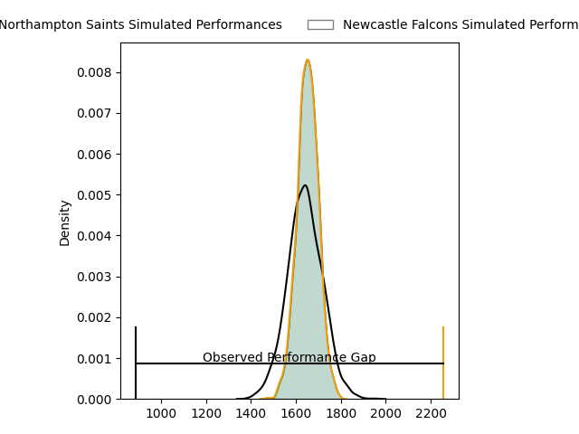
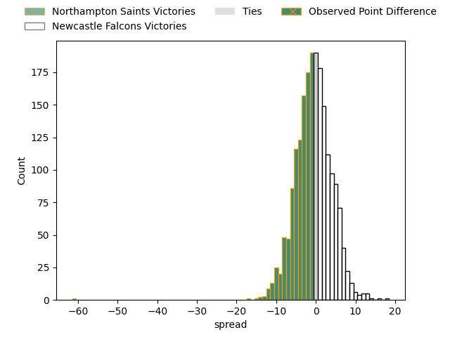

---  
layout: page  
title: Northampton Saints at Newcastle Falcons; 66.0-5.0  
date: 2023-04-21 14:45:00 18:00:00 -0500  
categories: match review  
---
# Northampton Saints at Newcastle Falcons; 66.0-5.0

# Club Level Predictions

The first set of predictions treats a club as the smallest object, as the club develops its members, organizes a gameplan, and deploys its players as needed for each match. This club model has a prediction of 0.48, which translates to predicting Northampton Saints to win by 0.7.

Each club has a rating and a rating deviation (simiar to a Glicko system), and expected performances can be generated. This allows for simulated matches and spreads like the ones below.
## Projected Performances

## Projected Spreads

## Projected Results

# Player Level Predictions

Treating teams instead as an entity made up of the currently active players, I have ratings for each player in an altogether different system. These can be combined to form team ratings once teamsheets are announced, weighting starters a bit higher than the reserves. After the match is played, players can be weighted by their minutes on the field, allowing for an accurate measure of the team's composition. With these compiled team ratings, we can make predictions, measure inaccuracy, and update the individual player ratings.
## Prediction with Player Minutes: Northampton Saints by 14.0

Northampton Saints by 18.0 on a neutral field

There were 4 large changes in win probability in this match
## Prediction without Player Minutes: Northampton Saints by 11.5

Northampton Saints by 15.5 on a neutral pitch

|   Away Minutes | Away Player          |   Away elo |   Away Percentile |   Number |   Home Percentile |   Home elo | Home Player         |   Home Minutes |
|---------------:|:---------------------|-----------:|------------------:|---------:|------------------:|-----------:|:--------------------|---------------:|
|             66 | Alex Waller          |     133.52 |                99 |        1 |                59 |      80.98 | Logovi'i Mulipola   |             47 |
|             66 | Sam Matavesi         |      45.6  |                 6 |        2 |                76 |      89.12 | Jamie Blamire       |             74 |
|             69 | Paul Hill            |     111.24 |                96 |        3 |                64 |      83.02 | Mark Tampin         |             57 |
|             80 | David Ribbans        |      97.32 |                84 |        4 |                47 |      75.95 | Greg Peterson       |             55 |
|             80 | Alex Moon            |     122.56 |                97 |        5 |                 9 |      51.38 | Sebastian de Chaves |             80 |
|             61 | Courtney Lawes       |      85.05 |                68 |        6 |                38 |      71.87 | Pedro Rubiolo       |             57 |
|             62 | Lewis Ludlam         |      76.86 |                50 |        7 |                61 |      81.11 | Freddie Lockwood    |             80 |
|             48 | Juarno Augustus      |      80.21 |                54 |        8 |                29 |      67.44 | Callum Chick        |             80 |
|             71 | Alex Mitchell        |     105.06 |                90 |        9 |                98 |     123.49 | Michael Young       |             57 |
|             80 | Fin Smith            |      83.38 |                59 |       10 |                75 |      92.17 | Brett Connon        |             71 |
|             80 | Tommy Freeman        |     103.67 |                89 |       11 |                35 |      70.02 | Mateo Carreras      |             80 |
|             80 | Rory Hutchinson      |      85.68 |                65 |       12 |                27 |      65.86 | Matias Orlando      |             80 |
|             62 | Fraser Dingwall      |      68.7  |                31 |       13 |                72 |      89.9  | Matias Moroni       |             80 |
|             80 | Tom Collins          |     110.15 |                92 |       14 |                98 |     125.12 | Adam Radwan         |             80 |
|             80 | George Furbank       |     113.58 |                93 |       15 |                80 |      97.49 | Elliott Obatoyinbo  |             63 |
|             14 | Tom Cruse            |      60.43 |                14 |       16 |               nan |      85.88 | Conrad Cade         |              6 |
|             14 | Ethan Waller         |      90.93 |                78 |       17 |                89 |      98.83 | Adam Brocklebank    |             33 |
|             11 | Edward Prowse        |      88.88 |               nan |       18 |               nan |      80.47 | Conor Kenny         |             23 |
|             19 | Lukhan Salakaia-Loto |      69.86 |                34 |       19 |                76 |      90.21 | Philip van der Walt |             25 |
|             18 | Angus Scott-Young    |     105.1  |                91 |       20 |                88 |     101.7  | Carl Fearns         |             23 |
|             32 | Sam Graham           |     116.29 |                96 |       21 |                20 |      58.91 | Sam Stuart          |             23 |
|              9 | Tom James            |      97.48 |                82 |       22 |                21 |      57.51 | Pete Lucock         |              9 |
|             18 | Tom Litchfield       |      95.62 |               nan |       23 |                44 |      76.11 | Alex Tait           |             17 |

