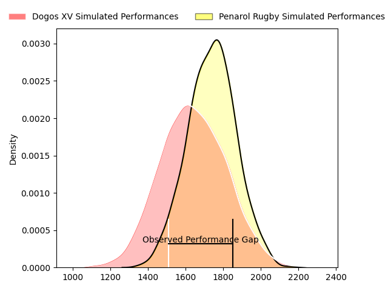
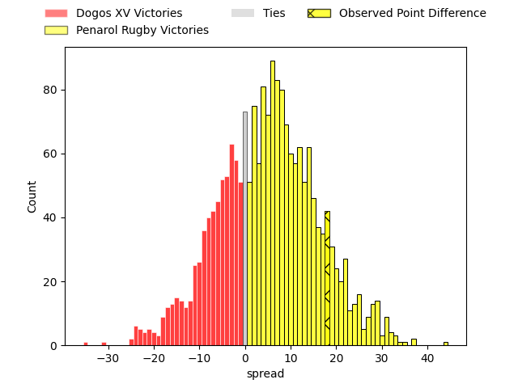
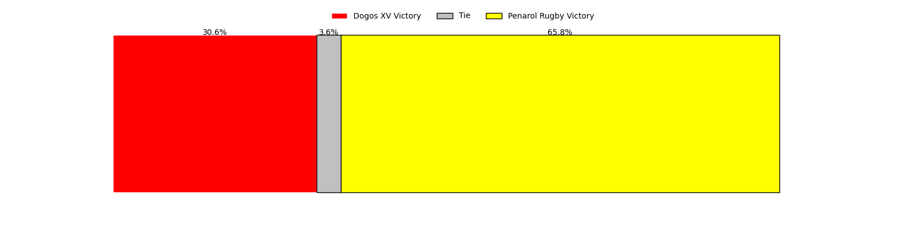

---  
layout: page  
title: Dogos XV at Penarol Rugby; 15-33  
date: 2023-04-21 22:00:00 18:00:00 -0500  
categories: match review  
---
# Dogos XV at Penarol Rugby; 15-33

# Club Level Predictions

The first set of predictions treats a club as the smallest object, as the club develops its members, organizes a gameplan, and deploys its players as needed for each match. This club model has a prediction of 0.62, which translates to predicting Penarol Rugby to win by 4.8.

Each club has a rating and a rating deviation (simiar to a Glicko system), and expected performances can be generated. This allows for simulated matches and spreads like the ones below.
## Projected Performances

## Projected Spreads

## Projected Results

# Player Level Predictions

Treating teams instead as an entity made up of the currently active players, I have ratings for each player in an altogether different system. These can be combined to form team ratings once teamsheets are announced, weighting starters a bit higher than the reserves. After the match is played, players can be weighted by their minutes on the field, allowing for an accurate measure of the team's composition. With these compiled team ratings, we can make predictions, measure inaccuracy, and update the individual player ratings.
## Prediction with Player Minutes: Penarol Rugby by 9.0

Penarol Rugby by 5.0 on a neutral field

There were 4 large changes in win probability in this match
## Prediction without Player Minutes: Penarol Rugby by 8.5

Penarol Rugby by 4.5 on a neutral pitch

|   Away Minutes | Away Player               |   Away elo |   Away Percentile |   Number |   Home Percentile |   Home elo | Home Player                        |   Home Minutes |
|---------------:|:--------------------------|-----------:|------------------:|---------:|------------------:|-----------:|:-----------------------------------|---------------:|
|             27 | Santiago Pulella          |      77.75 |                51 |        1 |                29 |      67.74 | Edgardo Matias Benitez Santin      |             48 |
|             70 | Boris Wenger              |      54.91 |                13 |        2 |                26 |      64.42 | Guillermo Pujadas Leon             |             48 |
|             40 | Octavio Filippa           |      63.72 |                21 |        3 |                25 |      66.04 | Ignacio Alfredo Peculo Rodriguez   |             48 |
|             59 | Lautaro Simes             |      58.61 |                16 |        4 |                35 |      70.76 | Felipe Aliaga                      |             72 |
|             80 | Franco Molina             |      63.74 |                24 |        5 |                29 |      67.31 | Juan Manuel Rodriguez              |             80 |
|             55 | Aitor Bildosola           |      59.35 |                17 |        6 |                22 |      63.15 | Manuel Ardao                       |             48 |
|             80 | Efrain Elias              |      63.73 |                23 |        7 |                13 |      56.15 | Lucas Bianchi                      |             80 |
|             80 | Ignacio Jose Gandini      |      70.1  |                31 |        8 |                30 |      69.18 | Manuel Diana                       |             80 |
|             76 | Agustin Moyano            |      63.51 |                23 |        9 |                50 |      78.13 | Santiago Álvarez Viera Da Cunha    |             57 |
|             57 | Juan Baronio              |      56.21 |                13 |       10 |                22 |      63.07 | Felipe Etcheverry                  |             80 |
|             80 | Lautaro Cipriani          |      55.65 |                14 |       11 |                33 |      68.82 | Juan Manuel Alonso                 |             80 |
|             80 | Leonardo Gea Salim        |      65.16 |                25 |       12 |                26 |      66.13 | Guillermo Storace                  |             72 |
|             76 | Faustino Sánchez Valarolo |      71.73 |                36 |       13 |                27 |      65.84 | Tomas Inciarte Rachetti            |             80 |
|             80 | Mateo Soler               |      54.9  |                13 |       14 |                28 |      65.54 | Gaston Mieres Valente              |             80 |
|             80 | Julian Ignacio Hernandez  |      62.2  |                21 |       15 |                16 |      57.95 | Alfonso Silva                      |             68 |
|             53 | Ramiro Valdes Iribarren   |      57.23 |                 7 |       16 |               nan |      60.27 | Matteo Sanguinetti                 |             32 |
|             25 | Manuel Todaro             |      63.15 |                28 |       17 |                17 |      61.7  | Emiliano Faccennini                |             32 |
|             23 | Agustin Segura            |      46.31 |                 6 |       18 |                24 |      65.24 | Diego Arbelo                       |             32 |
|             21 | Gregorio Hernandez        |      59.98 |                 8 |       19 |                10 |      53.59 | Carlos Manuel Deus Lopes de Amorin |             32 |
|             10 | Roman Pretz               |      54.42 |                 8 |       20 |               nan |      61.64 | Juan Francisco Torres Burwood      |             23 |
|              4 | Franco Giudice            |      80.41 |                53 |       21 |                10 |      55.1  | Agustin Morales                    |              8 |
|              4 | Juan Cruz Strada          |      57.1  |                11 |       22 |                46 |      76.07 | Juan Zuccarino                     |              8 |
|             40 | Octavio Barbatti          |      63.72 |               nan |       23 |               nan |      57.76 | Santiago Manuel Del Cerro Lawlor   |             12 |

