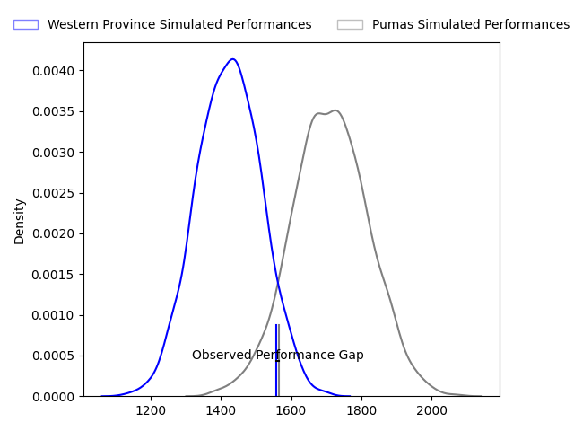
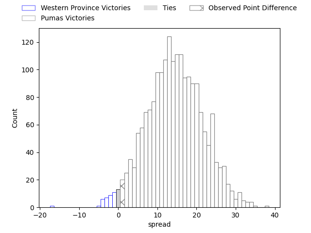
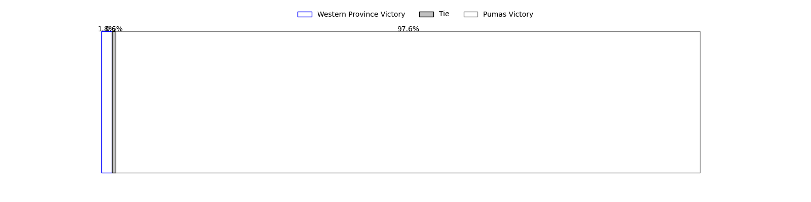

---  
layout: page  
title: Western Province at Pumas; 24-25  
date: 2023-04-21 00:00:00 18:00:00 -0500  
categories: match review  
---
# Western Province at Pumas; 24-25

# Club Level Predictions

The first set of predictions treats a club as the smallest object, as the club develops its members, organizes a gameplan, and deploys its players as needed for each match. This club model has a prediction of 0.83, which translates to predicting Pumas to win by 14.4.

Each club has a rating and a rating deviation (simiar to a Glicko system), and expected performances can be generated. This allows for simulated matches and spreads like the ones below.
## Projected Performances

## Projected Spreads

## Projected Results

# Player Level Predictions

Treating teams instead as an entity made up of the currently active players, I have ratings for each player in an altogether different system. These can be combined to form team ratings once teamsheets are announced, weighting starters a bit higher than the reserves. After the match is played, players can be weighted by their minutes on the field, allowing for an accurate measure of the team's composition. With these compiled team ratings, we can make predictions, measure inaccuracy, and update the individual player ratings.
## Prediction with Player Minutes: Pumas by 21.0

Pumas by 17.0 on a neutral field

There were 8 large changes in win probability in this match
## Prediction without Player Minutes: Pumas by 22.8

Pumas by 18.8 on a neutral pitch

|   Away Minutes | Away Player                       |   Away elo |   Away Percentile |   Number |   Home Percentile |   Home elo | Home Player           |   Home Minutes |
|---------------:|:----------------------------------|-----------:|------------------:|---------:|------------------:|-----------:|:----------------------|---------------:|
|             69 | Kwenzokuhle Ndumiso Blose         |      74.22 |                44 |        1 |                66 |      84.48 | Cameron Dawson        |             59 |
|             61 | Andre-Hugo Venter                 |      74    |                45 |        2 |                62 |      82.37 | Corne Fourie          |             69 |
|             72 | Lee-Marvin Lofty Siyanda Mazibuko |      93.17 |                83 |        3 |                43 |      74.19 | Njabula Juice Gumede  |             69 |
|             80 | Connor Evans                      |      60.95 |                20 |        4 |                58 |      81.21 | Malembe Mpofu         |             80 |
|             66 | Gary Porter                       |      70.62 |                35 |        5 |                95 |     113.28 | Shane Monro Kirkwood  |             80 |
|             80 | Junior Sipato Pokomela            |      60.41 |                19 |        6 |                63 |      83    | Francois Kleinhans    |             80 |
|             60 | Jarrod Taylor                     |      76.89 |                50 |        7 |                34 |      70.12 | Deon Slabbert         |             36 |
|             80 | Keke Morabe                       |      92.88 |                78 |        8 |                74 |      89.76 | Kwanda Dimaza         |             50 |
|             80 | Godlen Herschelle Derrick Masimla |      76.41 |                47 |        9 |                30 |      67.34 | Giovanne Snyman       |             59 |
|             80 | Jean-Luc du Plessis               |      69.62 |                32 |       10 |                95 |     115.6  | Tinus de Beer         |             72 |
|             45 | Suleiman  Hartzenberg             |      78.26 |                53 |       11 |                57 |      79.83 | Jade Kyle Stighling   |             80 |
|             80 | Cornel Smit                       |      82.2  |                61 |       12 |                92 |     108.62 | Ali Mgijima           |             80 |
|             80 | Juan de Jongh                     |      62.34 |                21 |       13 |                54 |      80.03 | Diego Appollis        |             80 |
|             80 | Duncan Rowan Saal                 |      91.11 |                76 |       14 |                70 |      87.78 | Stefan Coetzee        |             80 |
|             80 | Sacha Mngomezulu                  |      70.94 |                34 |       15 |                57 |      82.8  | Devon Frank Williams  |             71 |
|             35 | Luke John Burger                  |      72.91 |               nan |       16 |               nan |      81.03 | Ruwald Van der Merwe  |             44 |
|             20 | Louw Nel                          |      72.74 |               nan |       17 |                24 |      65.75 | Andre Fouché          |             30 |
|             19 | Chad Solomon                      |      70.75 |               nan |       18 |                79 |      92.81 | Chriswill September   |             21 |
|             11 | Leon Lyons                        |      73.96 |                42 |       19 |               nan |      89.99 | PJ Jacobs             |             21 |
|              8 | Corne Wellbach                    |      76.76 |               nan |       20 |               nan |      90.4  | Etienne Janeke        |             11 |
|             14 | Dylan De Leeuw                    |      76.96 |               nan |       21 |               nan |      53.3  | Simon Raw             |             11 |
|            nan | nan                               |     nan    |               nan |       22 |                44 |      75.55 | Lundi Msenge          |              9 |
|            nan | nan                               |     nan    |               nan |       23 |                37 |      75.53 | Brandon Terry Thomson |              8 |

