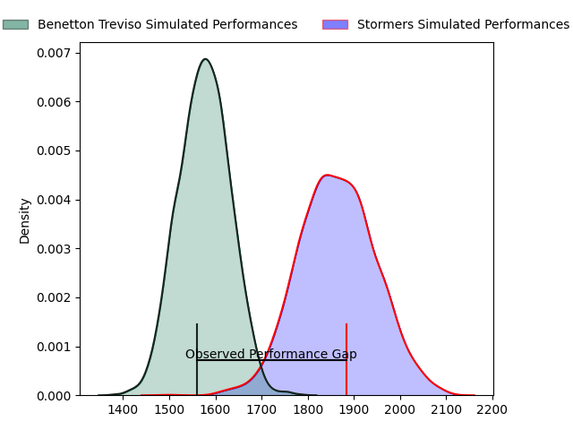
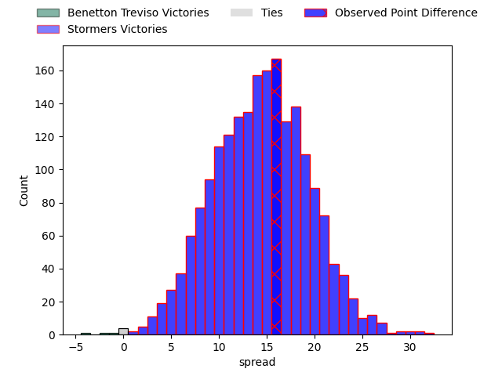
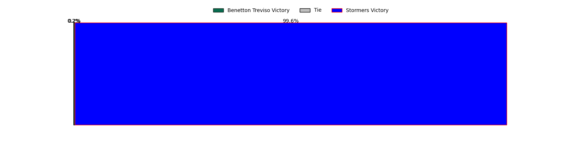

---  
layout: page  
title: Benetton Treviso at Stormers; 22-38  
date: 2023-04-21 18:30:00 18:00:00 -0500  
categories: match review  
---
# Benetton Treviso at Stormers; 22-38

# Club Level Predictions

The first set of predictions treats a club as the smallest object, as the club develops its members, organizes a gameplan, and deploys its players as needed for each match. This club model has a prediction of 0.838, which translates to predicting Stormers to win by 14.5.

Each club has a rating and a rating deviation (simiar to a Glicko system), and expected performances can be generated. This allows for simulated matches and spreads like the ones below.
## Projected Performances

## Projected Spreads

## Projected Results

# Player Level Predictions

Treating teams instead as an entity made up of the currently active players, I have ratings for each player in an altogether different system. These can be combined to form team ratings once teamsheets are announced, weighting starters a bit higher than the reserves. After the match is played, players can be weighted by their minutes on the field, allowing for an accurate measure of the team's composition. With these compiled team ratings, we can make predictions, measure inaccuracy, and update the individual player ratings.
## Prediction with Player Minutes: Stormers by 15.2

Stormers by 11.2 on a neutral field

There were 7 large changes in win probability in this match
## Prediction without Player Minutes: Stormers by 16.3

Stormers by 12.3 on a neutral pitch

|   Away Minutes | Away Player          |   Away elo |   Away Percentile |   Number |   Home Percentile |   Home elo | Home Player                  |   Home Minutes |
|---------------:|:---------------------|-----------:|------------------:|---------:|------------------:|-----------:|:-----------------------------|---------------:|
|             53 | Thomas Gallo         |      73.83 |               nan |        1 |                48 |      76.7  | Steven Kitshoff              |             60 |
|             53 | Siua Maile           |      69.21 |                40 |        2 |               nan |      75.39 | JJ Kotze                     |             60 |
|             80 | Filipo Alongi        |      75.17 |               nan |        3 |                37 |      76.42 | Johan Neethling Fouche       |             60 |
|             59 | Marco Lazzaroni      |      72.86 |                41 |        4 |                50 |      77.41 | Ruben van Heerden            |             26 |
|             80 | Riccardo Favretto    |      66.2  |                28 |        5 |                55 |      79.59 | Marvin Orie                  |             80 |
|             80 | Alessandrio Izekor   |      75.35 |                45 |        6 |                20 |      61.35 | Willem Gerhardus Engelbrecht |             63 |
|             80 | Manuel Zuliani       |      65.78 |                30 |        7 |                56 |      80.85 | Hacjivah Dayimani            |             80 |
|             50 | Henry Stowers        |      69.41 |                30 |        8 |               nan |      74.13 | Evan Roos                    |             80 |
|             45 | Dewald Otto Duvenage |      65.26 |                25 |        9 |                42 |      73.97 | Albertus Paul de Wet         |             56 |
|             66 | Tomas Albornoz       |      60.89 |                18 |       10 |                58 |      82.47 | Immanuel Libbok              |             80 |
|             80 | Marcus Watson        |      72.05 |                39 |       11 |                59 |      81.48 | Seabelo Senatla              |             80 |
|             80 | Marco Zanon          |      66.33 |                27 |       12 |                52 |      79.75 | Damian Willemse              |             80 |
|             59 | Joaquin Riera        |      63.83 |                23 |       13 |                62 |      83.78 | Daniel Michael du Plessis    |             66 |
|             80 | Edoardo Padovani     |     100.45 |                86 |       14 |                83 |      97.64 | Angelo Davids                |             80 |
|             80 | Matteo Minozzi       |      66.44 |                26 |       15 |                56 |      81.75 | Clayton Blommetjies          |             80 |
|             35 | Alessandro Garbisi   |      68.08 |               nan |       16 |                55 |      79    | Ernst van Rhyn               |             14 |
|             30 | Lorenzo Cannone      |      84.65 |                64 |       17 |                87 |      99.29 | Ben-Jason Dixon              |             40 |
|             27 | Federico Zani        |      70.06 |               nan |       18 |                57 |      79.33 | Herschel Jerome Jantjies     |             24 |
|             27 | Bautista Bernasconi  |      80.06 |                59 |       19 |                64 |      83.02 | Joseph Dweba                 |             20 |
|             21 | Niccolo Cannone      |      59.29 |                17 |       20 |                24 |      61.74 | Alistair Fernando Vermaak    |             20 |
|             21 | Tommaso Menoncello   |     100.27 |                84 |       21 |                48 |      76.45 | Jozua Francois Malherbe      |             20 |
|             14 | Jacob Umaga          |      70.25 |                40 |       22 |                35 |      70.97 | Marcel Theunissen            |             17 |
|            nan | nan                  |     nan    |               nan |       23 |                21 |      61.67 | Adriaan Ruhan Nel            |             14 |

