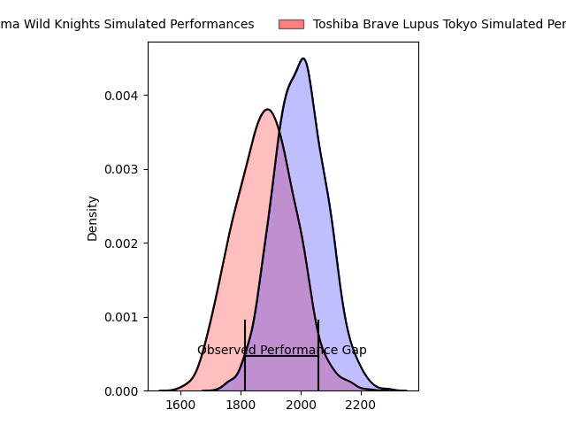
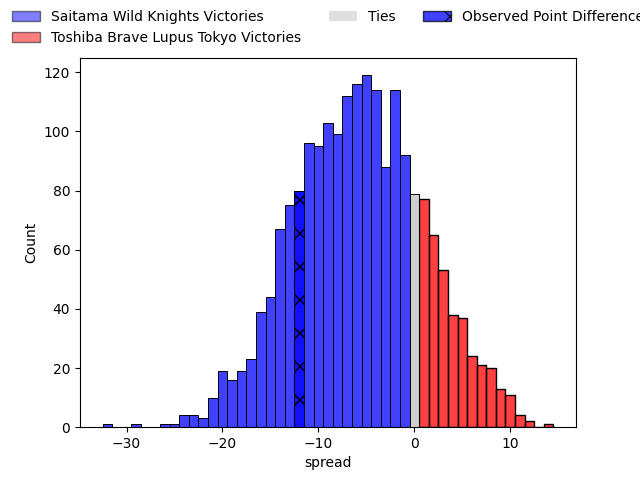
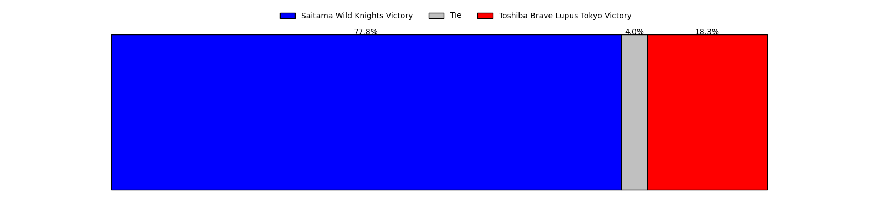

---  
layout: page  
title: Saitama Wild Knights at Toshiba Brave Lupus Tokyo; 34-22  
date: 2023-04-21 12:00:00 18:00:00 -0500  
categories: match review  
---
# Saitama Wild Knights at Toshiba Brave Lupus Tokyo; 34-22

# Club Level Predictions

The first set of predictions treats a club as the smallest object, as the club develops its members, organizes a gameplan, and deploys its players as needed for each match. This club model has a prediction of 0.342, which translates to predicting Saitama Wild Knights to win by 5.9.

Each club has a rating and a rating deviation (simiar to a Glicko system), and expected performances can be generated. This allows for simulated matches and spreads like the ones below.
## Projected Performances

## Projected Spreads

## Projected Results

# Player Level Predictions

Treating teams instead as an entity made up of the currently active players, I have ratings for each player in an altogether different system. These can be combined to form team ratings once teamsheets are announced, weighting starters a bit higher than the reserves. After the match is played, players can be weighted by their minutes on the field, allowing for an accurate measure of the team's composition. With these compiled team ratings, we can make predictions, measure inaccuracy, and update the individual player ratings.
## Prediction with Player Minutes: Toshiba Brave Lupus Tokyo by 9.8

Toshiba Brave Lupus Tokyo by 5.8 on a neutral field

There were 8 large changes in win probability in this match
## Prediction without Player Minutes: Toshiba Brave Lupus Tokyo by 10.6

Toshiba Brave Lupus Tokyo by 6.6 on a neutral pitch

|   Away Minutes | Away Player      |   Away elo |   Away Percentile |   Number |   Home Percentile |   Home elo | Home Player        |   Home Minutes |
|---------------:|:-----------------|-----------:|------------------:|---------:|------------------:|-----------:|:-------------------|---------------:|
|             61 | Craig Millar     |      91.02 |                84 |        1 |                85 |      94.23 | Sena Kimura        |             56 |
|             51 | Atsushi Sakate   |      89.31 |                76 |        2 |                78 |      90.67 | Mamoru Harada      |             56 |
|             51 | Shohei Hirano    |      79.54 |                56 |        3 |                93 |     104.21 | Yuta Kokaji        |             53 |
|             80 | Esei Ha'angana   |      89.3  |                75 |        4 |                72 |      85.62 | Kyosuke Kajikawa   |             58 |
|             61 | Lodewyk de Jager |      81.53 |                59 |        5 |                69 |      86.25 | Jacob Pierce       |             80 |
|             75 | Ryota Hasegawa   |      87.01 |                72 |        6 |                74 |      88.9  | Yoshitaka Tokunaga |             80 |
|             80 | Lachlan Boshier  |      71.48 |                38 |        7 |                60 |      81.36 | Takeshi Sasaki     |             75 |
|             80 | Jack Cornelsen   |      87.83 |                70 |        8 |                69 |      87.44 | Michael Leitch     |             80 |
|             61 | Keisuke Uchida   |      79.27 |                54 |        9 |                75 |      91.79 | Takahiro Ogawa     |             53 |
|             72 | Takuya Yamasawa  |      91.24 |                72 |       10 |                76 |      92.41 | Tom Taylor         |             80 |
|             80 | Marika Koroibete |      80.06 |                61 |       11 |                91 |     106.56 | Masaki Hamada      |             80 |
|             80 | Tomoki Osada     |      81.16 |                56 |       12 |                78 |      94.65 | Nicholas McCurran  |             80 |
|             67 | Dylan Riley      |      90.12 |                72 |       13 |                63 |      84.33 | Seta Tamanivalu    |             54 |
|             80 | Koki Takeyama    |     122.34 |                97 |       14 |                80 |      94.51 | Jone Naikabula     |             74 |
|             80 | Ryuji Noguchi    |      83.45 |                63 |       15 |                89 |     107.05 | Takuro Matsunaga   |             80 |
|             29 | Shota Horie      |      90.39 |                83 |       16 |               nan |      82.14 | Teruo Makabe       |             27 |
|             29 | Taiki Fujii      |      98.52 |                93 |       17 |                56 |      79    | Jack Stratton      |             27 |
|             19 | Mark Abbott      |      80.99 |                58 |       18 |                67 |      86.6  | Taichi Mano        |             26 |
|             19 | Daniel Perez     |      79.29 |                55 |       19 |                71 |      87.2  | Masataka Mikami    |             24 |
|             19 | Taiki Koyama     |     101.77 |                87 |       20 |                15 |      56.93 | Daigo Hashimoto    |             24 |
|             13 | Vince Aso        |      79.52 |                53 |       21 |                83 |      95.22 | Shin Ito           |             22 |
|              8 | Rikiya Matsuda   |      76.46 |                48 |       22 |                85 |      99.47 | Shohei Toyoshima   |              6 |
|              5 | Shota Fukui      |      84.9  |                64 |       23 |               nan |      68.69 | Takahiro Fujita    |              5 |

