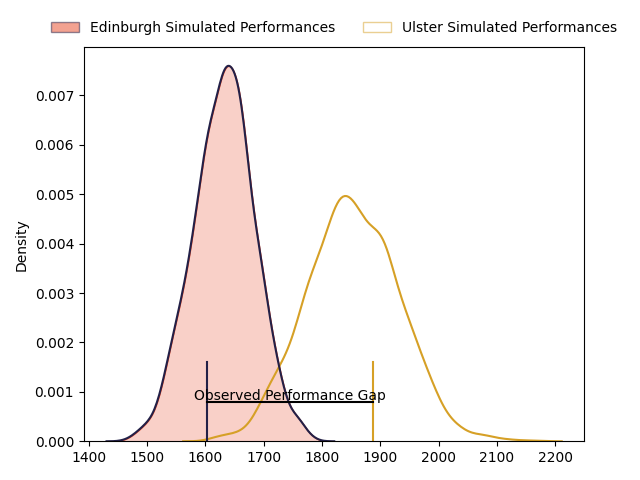
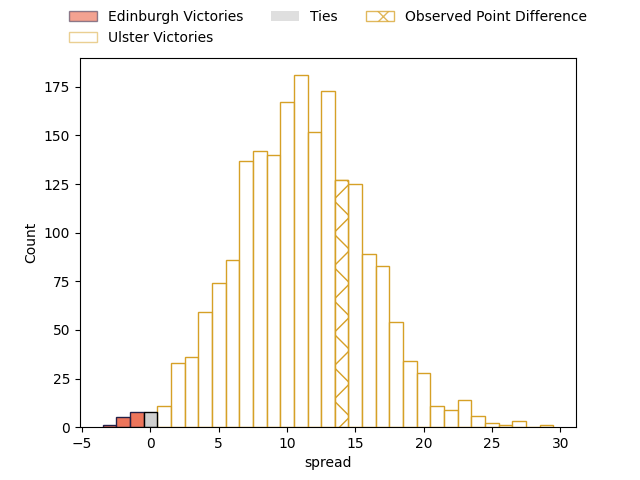

---  
layout: page  
title: Edinburgh at Ulster; 14-28  
date: 2023-04-21 20:35:00 18:00:00 -0500  
categories: match review  
---
# Edinburgh at Ulster; 14-28

# Club Level Predictions

The first set of predictions treats a club as the smallest object, as the club develops its members, organizes a gameplan, and deploys its players as needed for each match. This club model has a prediction of 0.776, which translates to predicting Ulster to win by 10.9.

Each club has a rating and a rating deviation (simiar to a Glicko system), and expected performances can be generated. This allows for simulated matches and spreads like the ones below.
## Projected Performances

## Projected Spreads

## Projected Results

# Player Level Predictions

Treating teams instead as an entity made up of the currently active players, I have ratings for each player in an altogether different system. These can be combined to form team ratings once teamsheets are announced, weighting starters a bit higher than the reserves. After the match is played, players can be weighted by their minutes on the field, allowing for an accurate measure of the team's composition. With these compiled team ratings, we can make predictions, measure inaccuracy, and update the individual player ratings.
## Prediction with Player Minutes: Edinburgh by 8.2

Edinburgh by 12.2 on a neutral field

There were 4 large changes in win probability in this match
## Prediction without Player Minutes: Edinburgh by 7.0

Edinburgh by 11.0 on a neutral pitch

|   Away Minutes | Away Player              |   Away elo |   Away Percentile |   Number |   Home Percentile |   Home elo | Home Player            |   Home Minutes |
|---------------:|:-------------------------|-----------:|------------------:|---------:|------------------:|-----------:|:-----------------------|---------------:|
|             62 | Pierre Schoeman          |      80.2  |                57 |        1 |                58 |      73.5  | Andrew Warwick         |             71 |
|             22 | David Cherry             |      82.04 |                62 |        2 |                52 |      77.11 | Rob Herring            |             26 |
|             40 | Luan de Bruin            |      86.36 |               nan |        3 |                71 |      82.11 | Jeffery To'omaga-Allen |             62 |
|             80 | Glen Young               |      72.63 |                41 |        4 |                85 |      97.96 | Alan O'Connor          |             56 |
|             80 | Sam Skinner              |     108.01 |                92 |        5 |                73 |      86.06 | Kieran Treadwell       |             80 |
|             80 | Jamie Ritchie            |     121.08 |                96 |        6 |                30 |      67.91 | David McCann           |             80 |
|             71 | Hamish Watson            |      92.79 |                80 |        7 |                82 |      91.27 | Nick Timoney           |             80 |
|             66 | Viliame Mata             |      80.1  |                54 |        8 |                33 |      71.43 | Duane Vermeulen        |             80 |
|             71 | Henry Pyrgos             |      81.04 |                52 |        9 |                58 |      82.31 | John Cooney            |             80 |
|             80 | Blair Kinghorn           |     140.42 |                99 |       10 |                54 |      80.44 | Billy Burns            |             80 |
|             80 | Duhan van der Merwe      |      89.88 |                74 |       11 |                57 |      80.14 | Jacob Stockdale        |             80 |
|             13 | Cameron Hamish Hutchison |      82.46 |               nan |       12 |                73 |      91.29 | Stewart Moore          |             80 |
|             62 | Mark Bennett             |      75.89 |                45 |       13 |                52 |      79.28 | James Hume             |             15 |
|             80 | Darcy Graham             |      86.24 |                67 |       14 |                63 |      83.22 | Robert Baloucoune      |             40 |
|             80 | Emiliano Boffelli        |      77.12 |                47 |       15 |                41 |      74.72 | Michael Lowry          |             12 |
|             67 | Charlie Savala           |      63.2  |                22 |       16 |                66 |      86.13 | Luke Marshall          |             57 |
|             58 | Stuart McInally          |      72.28 |                34 |       17 |                52 |      77.65 | Craig Gilroy           |             65 |
|             40 | WP Nel                   |     131.81 |                99 |       18 |                66 |      83.89 | Tom Stewart            |             54 |
|             18 | Abram Adrian Boan Venter |      61.6  |                14 |       19 |                61 |      83.47 | Nathan Doak            |             40 |
|             18 | Nathan Sweeney           |      76.24 |               nan |       20 |                41 |      72.76 | Sam Carter             |             24 |
|             14 | Pierce Phillips          |      82.18 |               nan |       21 |               nan |      71.01 | Gareth Milasinovich    |             18 |
|              9 | Conor Boyle              |      68.45 |                28 |       22 |                93 |     109.39 | Harry Sheridan         |             11 |
|              9 | Charlie Shiel            |      73.25 |                44 |       23 |                69 |      88.13 | Callum Reid            |              9 |

