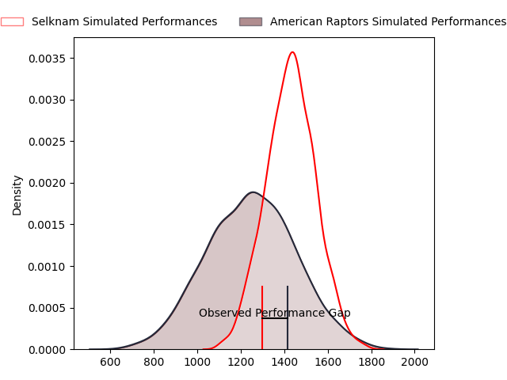
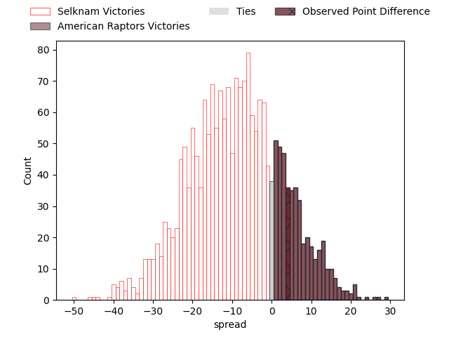
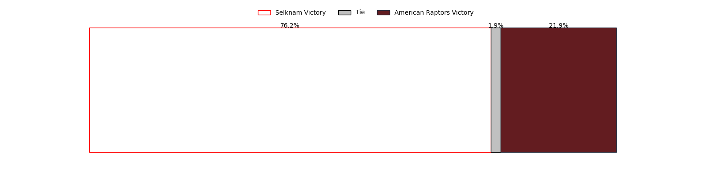

---  
layout: page  
title: Selknam at American Raptors; 22-26  
date: 2023-04-22 22:00:00 18:00:00 -0500  
categories: match review  
---
# Selknam at American Raptors; 22-26

# Club Level Predictions

The first set of predictions treats a club as the smallest object, as the club develops its members, organizes a gameplan, and deploys its players as needed for each match. This club model has a prediction of 0.272, which translates to predicting Selknam to win by 9.0.

Each club has a rating and a rating deviation (simiar to a Glicko system), and expected performances can be generated. This allows for simulated matches and spreads like the ones below.
## Projected Performances

## Projected Spreads

## Projected Results

# Player Level Predictions

Treating teams instead as an entity made up of the currently active players, I have ratings for each player in an altogether different system. These can be combined to form team ratings once teamsheets are announced, weighting starters a bit higher than the reserves. After the match is played, players can be weighted by their minutes on the field, allowing for an accurate measure of the team's composition. With these compiled team ratings, we can make predictions, measure inaccuracy, and update the individual player ratings.
## Prediction with Player Minutes: Selknam by 17.7

Selknam by 21.7 on a neutral field

There were 12 large changes in win probability in this match
## Prediction without Player Minutes: Selknam by 17.5

Selknam by 21.5 on a neutral pitch

|   Away Minutes | Away Player                       |   Away elo |   Away Percentile |   Number |   Home Percentile |   Home elo | Home Player              |   Home Minutes |
|---------------:|:----------------------------------|-----------:|------------------:|---------:|------------------:|-----------:|:-------------------------|---------------:|
|              7 | Javier Carrasco                   |      55.91 |                11 |        1 |                11 |      55.56 | Payton Telea-Ilalio      |             66 |
|             80 | Diego Escobar                     |      53    |                11 |        2 |                14 |      55.43 | Diego Fortuny            |             80 |
|             57 | Inaki Gurruchaga                  |      51.55 |                 7 |        3 |                 1 |      38.34 | Ma'ake Muti              |             66 |
|             80 | Santiago Pedrero                  |      59.7  |                18 |        4 |                 1 |      32.29 | Diego Magno              |             78 |
|             61 | Javier Eissmann                   |      50.54 |                 8 |        5 |                 0 |      16.31 | Will Crawford            |             56 |
|             52 | Clemente Saavedra                 |      62.4  |                19 |        6 |                 1 |      33.03 | Shawn Clark              |             80 |
|             80 | Raimundo Martinez                 |      53.11 |                10 |        7 |                16 |      58.19 | Tommy Clark              |             80 |
|             62 | Alfonso Escobar Alvarez           |      53.78 |               nan |        8 |                 6 |      47.33 | Ronan Murphy             |             80 |
|             65 | Marcelo Torrealba                 |      53.65 |               nan |        9 |               nan |      59.11 | Ethan McVeigh            |             69 |
|             80 | Rodrigo Fernandez                 |      62.05 |                19 |       10 |                 3 |      35.85 | Lucas Gonzalez Amorosino |             74 |
|             80 | Matias Garafulic                  |      56.43 |                15 |       11 |               nan |      40.8  | Daytwon Sheridan         |             80 |
|             80 | Pablo Casas                       |      48.37 |                 7 |       12 |                 4 |      43.77 | Aki Pulu                 |             62 |
|             80 | Domingo Saavedra                  |      73.57 |                40 |       13 |                 0 |      31.26 | Watson Filikitonga       |             80 |
|             55 | Lukas Carvallo                    |      53.38 |                10 |       14 |                 1 |      30.1  | Ryan James               |             80 |
|             80 | Santiago Videla                   |      58.01 |                16 |       15 |                 4 |      40.75 | Line Latu                |             80 |
|             73 | Salvador Lues                     |      53.06 |                 7 |       16 |               nan |      55.38 | Max Dacey                |             24 |
|             28 | Ignacio Silva                     |      59.66 |                21 |       17 |                13 |      51.1  | Cash Maluia              |             18 |
|             25 | Gaspar Moltedo                    |      50.13 |                 9 |       18 |               nan |      51.13 | Sebastian Otero          |             14 |
|             23 | Esteban Inostroza                 |      56.38 |               nan |       19 |                 2 |      43.23 | Juan Echeverria          |             14 |
|             19 | Thomas Hans Orchard Meyer-Rachner |      53.25 |                10 |       20 |                 1 |      35.08 | Martin Landajo           |             11 |
|             18 | Joaquin Milesi                    |      75.26 |                44 |       21 |                 8 |      48.6  | Patrick Madden           |              6 |
|             15 | Nicolas Herreros                  |      46.37 |                 4 |       22 |                 5 |      40.11 | Siaki Lolohea Vikilani   |              2 |

