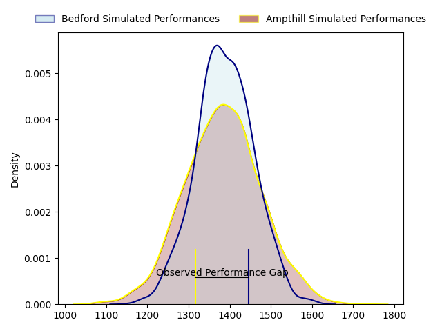
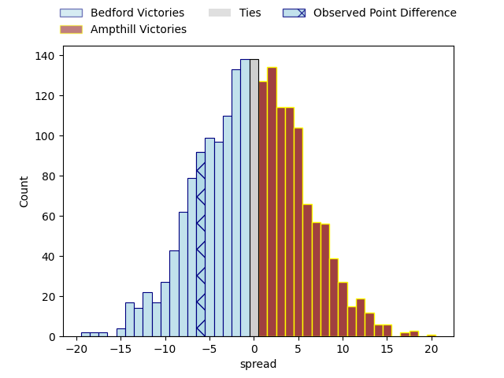

---  
layout: page  
title: Bedford at Ampthill; 33-27  
date: 2023-04-22 16:00:00 18:00:00 -0500  
categories: match review  
---
# Bedford at Ampthill; 33-27

# Club Level Predictions

The first set of predictions treats a club as the smallest object, as the club develops its members, organizes a gameplan, and deploys its players as needed for each match. This club model has a prediction of 0.49, which translates to predicting Bedford to win by 0.4.

Each club has a rating and a rating deviation (simiar to a Glicko system), and expected performances can be generated. This allows for simulated matches and spreads like the ones below.
## Projected Performances

## Projected Spreads

## Projected Results

# Player Level Predictions

Treating teams instead as an entity made up of the currently active players, I have ratings for each player in an altogether different system. These can be combined to form team ratings once teamsheets are announced, weighting starters a bit higher than the reserves. After the match is played, players can be weighted by their minutes on the field, allowing for an accurate measure of the team's composition. With these compiled team ratings, we can make predictions, measure inaccuracy, and update the individual player ratings.
## Prediction with Player Minutes: Bedford by 17.6

Bedford by 21.6 on a neutral field

There were 8 large changes in win probability in this match
## Prediction without Player Minutes: Bedford by 18.6

Bedford by 22.6 on a neutral pitch

|   Away Minutes | Away Player          |   Away elo |   Away Percentile |   Number |   Home Percentile |   Home elo | Home Player       |   Home Minutes |
|---------------:|:---------------------|-----------:|------------------:|---------:|------------------:|-----------:|:------------------|---------------:|
|             80 | Joey Conway          |      76.86 |                48 |        1 |                38 |      72.5  | Dominic Hardman   |             77 |
|             64 | James Fish           |      69.54 |                32 |        2 |                49 |      74.79 | Matt Gallagher    |             53 |
|             47 | Corrie Barrett       |      63.45 |                21 |        3 |                30 |      68.14 | Joe Sproston      |             48 |
|             47 | Robin Williams       |      81.41 |                59 |        4 |                41 |      72.82 | Charlie Beckett   |             80 |
|             80 | Tom Lockett          |      79.33 |                54 |        5 |                 7 |      49.42 | Harry Wilson      |             55 |
|             64 | Emeka Atuanya        |      71.49 |                38 |        6 |                20 |      61.11 | Fyn Brown         |             80 |
|             80 | Luke Frost           |      79.28 |                56 |        7 |                25 |      64.99 | Josh Smart        |             80 |
|             80 | Tui Uru              |      72.24 |                36 |        8 |                18 |      62.39 | Morgan Strong     |             63 |
|             65 | Alex Day             |     109.94 |                94 |        9 |                 6 |      49.3  | Lewis Finlay      |             80 |
|             65 | William Maisey       |     129.7  |                98 |       10 |                32 |      66.48 | Tom Hardwick      |             80 |
|             80 | Dean Adamson         |      49.62 |                 8 |       11 |                19 |      62.56 | Alexandrer Harmes |             80 |
|             80 | Michael Le Bourgeois |      83.29 |                60 |       12 |                23 |      63.99 | Gwyn Parks        |             80 |
|             50 | Ethan Grayson        |      72.95 |                38 |       13 |                 8 |      50.69 | Charlie Hudson    |             55 |
|             80 | Sean French          |      70.39 |                36 |       14 |                21 |      60.82 | Josh Skelcey      |             53 |
|             80 | Richard Lane         |      94.73 |                78 |       15 |                27 |      66.96 | Tomas Bacon       |             80 |
|             33 | Alex Woolford        |      56.14 |                11 |       16 |                41 |      71.34 | Aleki Lutui       |             32 |
|             33 | Osman Dimen          |      71.68 |                29 |       17 |                36 |      70.47 | Sid Blackmore     |             27 |
|             30 | George Hendy         |      66.83 |                26 |       18 |                29 |      68.53 | Conor Rankin      |             27 |
|             16 | Jack Hughes          |      75.99 |                58 |       19 |                36 |      70.49 | Joshua Bragman    |             25 |
|             16 | Jordan Onojaife      |      57.11 |                14 |       20 |                19 |      60.42 | Cai Devine        |             25 |
|             15 | Jake Garside         |      70.31 |                41 |       21 |                20 |      61.2  | Rob Nixon         |             17 |
|             15 | Louis Grimoldby      |      69.49 |                32 |       22 |                31 |      61.16 | Jake Ellwood      |              3 |

