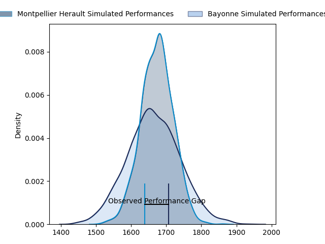
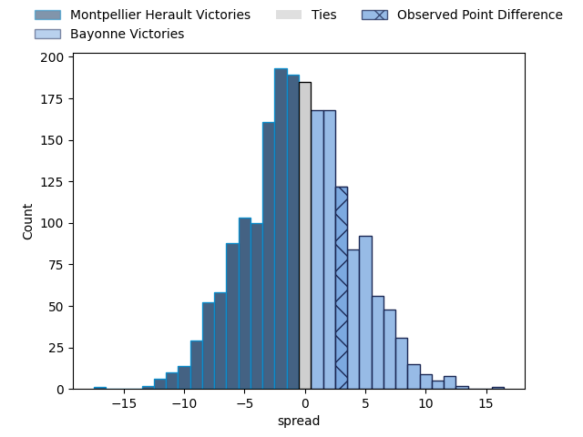

---  
layout: page  
title: Montpellier Herault at Bayonne; 30-33  
date: 2023-04-22 17:00:00 18:00:00 -0500  
categories: match review  
---
# Montpellier Herault at Bayonne; 30-33

# Club Level Predictions

The first set of predictions treats a club as the smallest object, as the club develops its members, organizes a gameplan, and deploys its players as needed for each match. This club model has a prediction of 0.49, which translates to predicting Montpellier Herault to win by 0.3.

Each club has a rating and a rating deviation (simiar to a Glicko system), and expected performances can be generated. This allows for simulated matches and spreads like the ones below.
## Projected Performances

## Projected Spreads

## Projected Results

# Player Level Predictions

Treating teams instead as an entity made up of the currently active players, I have ratings for each player in an altogether different system. These can be combined to form team ratings once teamsheets are announced, weighting starters a bit higher than the reserves. After the match is played, players can be weighted by their minutes on the field, allowing for an accurate measure of the team's composition. With these compiled team ratings, we can make predictions, measure inaccuracy, and update the individual player ratings.
## Prediction with Player Minutes: Montpellier Herault by 7.1

Montpellier Herault by 11.1 on a neutral field

There were 14 large changes in win probability in this match
## Prediction without Player Minutes: Montpellier Herault by 4.5

Montpellier Herault by 8.5 on a neutral pitch

|   Away Minutes | Away Player                         |   Away elo |   Away Percentile |   Number |   Home Percentile |   Home elo | Home Player           |   Home Minutes |
|---------------:|:------------------------------------|-----------:|------------------:|---------:|------------------:|-----------:|:----------------------|---------------:|
|             52 | Enzo Forletta                       |      78.14 |                52 |        1 |                48 |      76.55 | Swan Cormenier        |             53 |
|             52 | Vincent Giudicelli                  |      69.33 |                32 |        2 |                41 |      72.98 | Facundo Bosch         |             66 |
|             40 | Mohamed Haouas                      |      70.31 |                34 |        3 |                57 |      76.73 | Pieter Ernst Scholtz  |             53 |
|             80 | Nicolaas Jacobus Janse van Rensburg |      82.7  |                62 |        4 |                93 |     110.57 | Thomas Ceyte          |             80 |
|             62 | Paul Willemse                       |     126.69 |                98 |        5 |                71 |      87.12 | Konstantin Mikautadze |             48 |
|             80 | Lenni Nouchi                        |      88.52 |                69 |        6 |                55 |      78.85 | Pierre Huguet         |             56 |
|             66 | Alexandre Bécognée                  |      71.08 |                36 |        7 |                31 |      68.84 | Baptiste Heguy        |             80 |
|             80 | Zach Mercer                         |      72.27 |                36 |        8 |                44 |      75.66 | Uzair Cassiem         |             80 |
|             57 | Jacobus Meyer Reinach               |      93.21 |                80 |        9 |                59 |      82.29 | Maxime Machenaud      |             80 |
|             80 | Paolo Garbisi                       |      97.97 |                81 |       10 |                33 |      69.24 | Camille Lopez         |             80 |
|             80 | George Bridge                       |     104.21 |                88 |       11 |                43 |      73.63 | Rémy Baget            |             57 |
|             66 | Jan Lodewyk Serfontein              |      89.4  |                71 |       12 |                41 |      73.96 | Guillaume Martocq     |             53 |
|             80 | Thomas Darmon                       |      88.61 |                69 |       13 |                64 |      85.11 | Peyo Muscarditz       |             80 |
|             80 | Julien Tisseron                     |      91.36 |                76 |       14 |                54 |      78.55 | Bastien Pourailly     |             80 |
|             80 | Anthony Bouthier                    |      92.27 |                75 |       15 |                40 |      74.29 | Tom Spring            |             74 |
|             40 | Titi Lamositele                     |      82.51 |                63 |       16 |               nan |      81.69 | Manuel Leindekar      |             32 |
|             28 | Grégory Fichten                     |      77.84 |                51 |       17 |                27 |      67.65 | Eneriko Buliruarua    |             27 |
|             28 | Curtis Langdon                      |      66.5  |               nan |       18 |                62 |      82.41 | Quentin Béthune       |             27 |
|             23 | Léo Coly                            |      55.67 |                12 |       19 |                85 |      94.72 | Tevita Tatafu         |             27 |
|             18 | Tyler Evan Duguid                   |      86.07 |                68 |       20 |               nan |      75.26 | Olajuwon Noah         |             24 |
|             14 | Clément Doumenc                     |      74.18 |                40 |       21 |                27 |      64.95 | Marland Yarde         |             23 |
|             14 | Pierre Lucas                        |      63.58 |               nan |       22 |               nan |      78.23 | Torsten van Jaarsveld |             14 |
|            nan | nan                                 |     nan    |               nan |       23 |                72 |      88.91 | Thomas Dolhagaray     |              6 |

