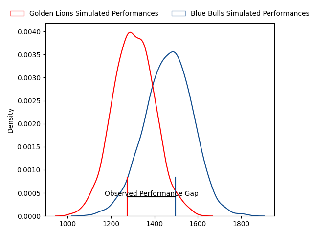
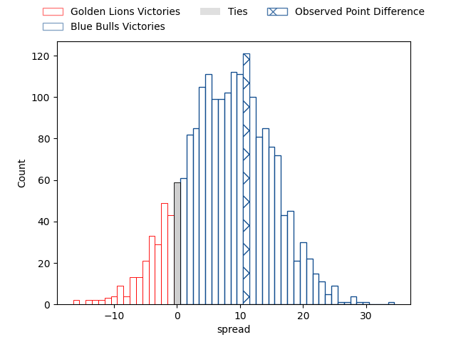
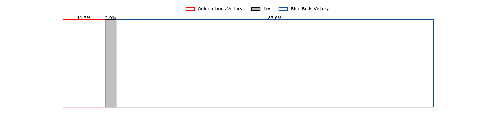

---  
layout: page  
title: Golden Lions at Blue Bulls; 19-30  
date: 2023-04-22 18:00:00 18:00:00 -0500  
categories: match review  
---
# Golden Lions at Blue Bulls; 19-30

# Club Level Predictions

The first set of predictions treats a club as the smallest object, as the club develops its members, organizes a gameplan, and deploys its players as needed for each match. This club model has a prediction of 0.703, which translates to predicting Blue Bulls to win by 7.8.

Each club has a rating and a rating deviation (simiar to a Glicko system), and expected performances can be generated. This allows for simulated matches and spreads like the ones below.
## Projected Performances

## Projected Spreads

## Projected Results

# Player Level Predictions

Treating teams instead as an entity made up of the currently active players, I have ratings for each player in an altogether different system. These can be combined to form team ratings once teamsheets are announced, weighting starters a bit higher than the reserves. After the match is played, players can be weighted by their minutes on the field, allowing for an accurate measure of the team's composition. With these compiled team ratings, we can make predictions, measure inaccuracy, and update the individual player ratings.
## Prediction with Player Minutes: Blue Bulls by 11.9

Blue Bulls by 7.9 on a neutral field

There were 6 large changes in win probability in this match
## Prediction without Player Minutes: Blue Bulls by 7.8

Blue Bulls by 3.8 on a neutral pitch

|   Away Minutes | Away Player               |   Away elo |   Away Percentile |   Number |   Home Percentile |   Home elo | Home Player                       |   Home Minutes |
|---------------:|:--------------------------|-----------:|------------------:|---------:|------------------:|-----------:|:----------------------------------|---------------:|
|             58 | Sithembiso Sithole        |      67.21 |                33 |        1 |               nan |      73.23 | Jacques van Rooyen                |             55 |
|             62 | Gerrit Jacobus Visagie    |      73.1  |                41 |        2 |                46 |      74.66 | Jan Hendrik Wessels               |             80 |
|             62 | Ruan-Henry Smith          |      77.96 |                52 |        3 |                84 |      93.72 | Sebastian Lombard                 |             58 |
|             80 | Raynard Roets             |      93.85 |                81 |        4 |                54 |      79.15 | Willem Hendrik Jacques du Plessis |             80 |
|             80 | Darrien-Lane Landsberg    |      87.79 |                72 |        5 |               nan |      76.18 | Charlie Ewels                     |             80 |
|             58 | Renzo du Plessis          |      64.92 |                24 |        6 |                74 |      88.99 | Cameron Hanekom                   |             67 |
|             58 | Jarod Cairns              |      75.39 |                47 |        7 |                45 |      74.66 | Reinhardt Ludwig                  |             68 |
|             68 | Travis Gordon             |      59.24 |                15 |        8 |                51 |      86.09 | WJ Steenkamp                      |             80 |
|             71 | Nico Steyn                |      71.84 |                38 |        9 |                73 |      90.47 | Izak Jacobus Burger               |             80 |
|             80 | Tiaan Henk Swanepoel      |      62.37 |                22 |       10 |                19 |      62.18 | Morne Steyn                       |             80 |
|             80 | Boldwin Hansen            |      82.86 |                62 |       11 |                44 |      74.38 | Wandisile Simelane                |             80 |
|             58 | Tyler Bocks               |      74.51 |                43 |       12 |                71 |      89.59 | Chris Smit                        |             80 |
|             80 | Stean Pienaar             |      77.42 |                51 |       13 |                44 |      75.17 | Lionel Granton Mapoe              |             80 |
|             80 | Prince Nkabinde           |      76.69 |               nan |       14 |                69 |      86.52 | Sibongile Vukile Novuka           |             67 |
|             80 | Vaughen Isaacs            |      87.05 |                67 |       15 |                73 |      91.19 | Juan Mostert                      |             80 |
|             22 | Rynardt Jonker            |      84.43 |                63 |       16 |                33 |      69.98 | Lizo Pumzile Gqoboka              |             25 |
|             22 | Johannes JC Pretorius     |      83.28 |               nan |       17 |                30 |      73.37 | Robert Hunt                       |             22 |
|             22 | PJ Steenkamp              |      73.95 |                43 |       18 |                57 |      88.13 | Cornal Hendricks                  |             13 |
|             22 | Kayden Kiewit             |      63.64 |               nan |       19 |               nan |      76.38 | Merwe Olivier                     |             13 |
|             18 | Kabous Bezuidenhout       |      54.78 |               nan |       20 |                48 |      75.67 | Mihlali Langa Mosi                |             12 |
|             12 | Cal Smid                  |      41.28 |                 4 |       21 |               nan |     nan    | nan                               |            nan |
|              9 | Andre Warner              |      62.93 |                29 |       22 |               nan |     nan    | nan                               |            nan |
|             18 | Michael Thomas van Vuuren |      69.38 |               nan |       23 |               nan |     nan    | nan                               |            nan |

