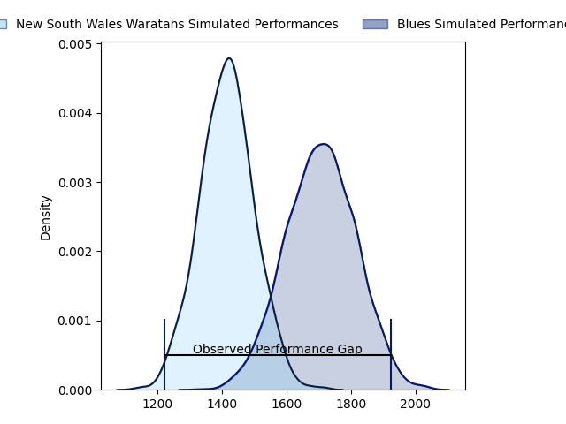
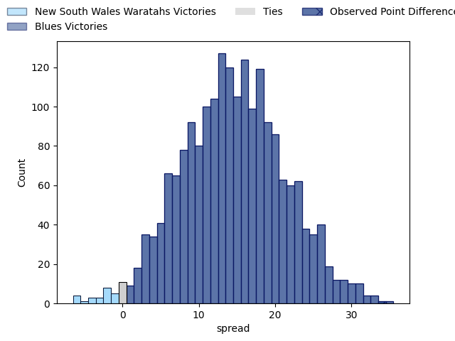

---  
layout: page  
title: New South Wales Waratahs at Blues; 21.0-55.0  
date: 2023-04-22 03:05:00 18:00:00 -0500  
categories: match review  
---
# New South Wales Waratahs at Blues; 21.0-55.0

# Club Level Predictions

The first set of predictions treats a club as the smallest object, as the club develops its members, organizes a gameplan, and deploys its players as needed for each match. This club model has a prediction of 0.835, which translates to predicting Blues to win by 14.6.

Each club has a rating and a rating deviation (simiar to a Glicko system), and expected performances can be generated. This allows for simulated matches and spreads like the ones below.
## Projected Performances

## Projected Spreads

## Projected Results

# Player Level Predictions

Treating teams instead as an entity made up of the currently active players, I have ratings for each player in an altogether different system. These can be combined to form team ratings once teamsheets are announced, weighting starters a bit higher than the reserves. After the match is played, players can be weighted by their minutes on the field, allowing for an accurate measure of the team's composition. With these compiled team ratings, we can make predictions, measure inaccuracy, and update the individual player ratings.
## Prediction with Player Minutes: Blues by 19.9

Blues by 15.9 on a neutral field

There were 5 large changes in win probability in this match
## Prediction without Player Minutes: Blues by 20.6

Blues by 16.6 on a neutral pitch

|   Away Minutes | Away Player          |   Away elo |   Away Percentile |   Number |   Home Percentile |   Home elo | Home Player       |   Home Minutes |
|---------------:|:---------------------|-----------:|------------------:|---------:|------------------:|-----------:|:------------------|---------------:|
|             46 | Tom Lambert          |      98.78 |                89 |        1 |                91 |     101.62 | Ofa Tu'ungafasi   |             52 |
|             65 | Mahe Vailanu         |      48.19 |                 6 |        2 |                68 |      84.79 | Ricky Riccitelli  |             59 |
|             45 | Harry Johnson-Holmes |      85.76 |                69 |        3 |                87 |      96.23 | Nepo Laulala      |             37 |
|             74 | Jed Holloway         |      79.63 |                55 |        4 |                98 |     129.1  | Patrick Tuipulotu |             59 |
|             71 | Zac Von Appen        |      90.83 |               nan |        5 |                85 |      98.48 | Sam Darry         |             80 |
|             59 | Taleni Seu           |      84.08 |                62 |        6 |                39 |      73.72 | Anton Segner      |             57 |
|             80 | Hunter Ward          |      89.51 |               nan |        7 |                58 |      80.36 | Adrian Choat      |             80 |
|             80 | Will Harris          |      95.78 |                80 |        8 |                97 |     118.03 | Hoskins Sotutu    |             80 |
|             57 | Jake Gordon          |     115.71 |                96 |        9 |                83 |      98.26 | Finlay Christie   |             59 |
|             66 | Ben Donaldson        |      90.09 |                71 |       10 |                99 |     137.19 | Beauden Barrett   |             80 |
|             80 | Dylan Pietsch        |     106.77 |                91 |       11 |                88 |     102.71 | Caleb Clarke      |             80 |
|             80 | Joey Walton          |      82.68 |                57 |       12 |                90 |     105.7  | Harry Plummer     |             75 |
|             80 | Izaia Perese         |      75.43 |                45 |       13 |                45 |      75.82 | Rieko Ioane       |             80 |
|             80 | Max Jorgensen        |     109.64 |                91 |       14 |                94 |     112.55 | Mark Telea        |             80 |
|             52 | Harry Wilson         |      89.99 |               nan |       15 |                88 |     105.83 | Stephen Perofeta  |             29 |
|             24 | Tolu Latu            |     111.03 |               nan |       16 |                70 |      86.65 | Soane Vikena      |             21 |
|             34 | Nephi Leatigaga      |      73.53 |               nan |       17 |                34 |      70.7  | Jordan Lay        |             28 |
|             35 | Daniel Botha         |      89.3  |               nan |       18 |                66 |      84.74 | James Lay         |             43 |
|             21 | Michael Icely        |      84.28 |               nan |       19 |                88 |     101.73 | Cameron Suafoa    |             21 |
|              6 | Charlie Gamble       |      85.3  |                68 |       20 |                96 |     115.56 | Akira Ioane       |             23 |
|             23 | Teddy Wilson         |      82.33 |               nan |       21 |                74 |      91.49 | Sam Nock          |             21 |
|             14 | Jack Bowen           |      84.47 |               nan |       22 |                86 |     102.55 | Bryce Heem        |              5 |
|             28 | Ben Dowling          |      82.82 |                57 |       23 |                63 |      86.43 | Zarn Sullivan     |             51 |

