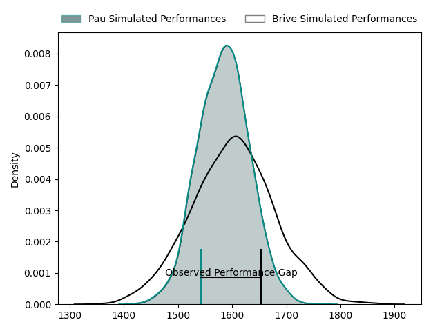
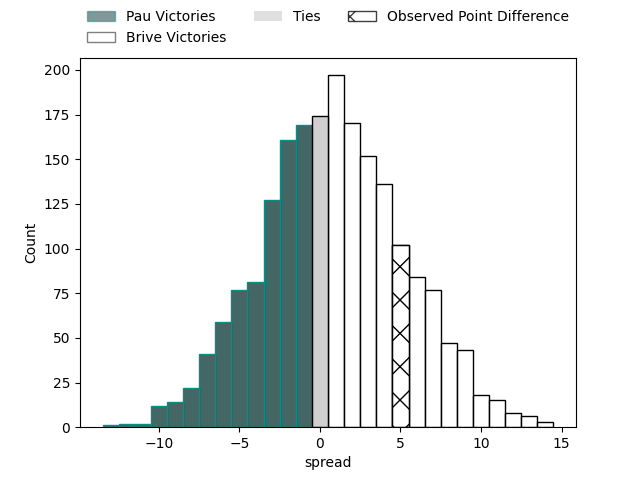

---  
layout: page  
title: Pau at Brive; 17-22  
date: 2023-04-22 17:00:00 18:00:00 -0500  
categories: match review  
---
# Pau at Brive; 17-22

# Club Level Predictions

The first set of predictions treats a club as the smallest object, as the club develops its members, organizes a gameplan, and deploys its players as needed for each match. This club model has a prediction of 0.528, which translates to predicting Brive to win by 1.0.

Each club has a rating and a rating deviation (simiar to a Glicko system), and expected performances can be generated. This allows for simulated matches and spreads like the ones below.
## Projected Performances

## Projected Spreads

## Projected Results

# Player Level Predictions

Treating teams instead as an entity made up of the currently active players, I have ratings for each player in an altogether different system. These can be combined to form team ratings once teamsheets are announced, weighting starters a bit higher than the reserves. After the match is played, players can be weighted by their minutes on the field, allowing for an accurate measure of the team's composition. With these compiled team ratings, we can make predictions, measure inaccuracy, and update the individual player ratings.
## Prediction with Player Minutes: Pau by 16.2

Pau by 20.2 on a neutral field

There were 7 large changes in win probability in this match
## Prediction without Player Minutes: Pau by 15.9

Pau by 19.9 on a neutral pitch

|   Away Minutes | Away Player                 |   Away elo |   Away Percentile |   Number |   Home Percentile |   Home elo | Home Player               |   Home Minutes |
|---------------:|:----------------------------|-----------:|------------------:|---------:|------------------:|-----------:|:--------------------------|---------------:|
|             68 | Ignacio David Calles        |      87.86 |                74 |        1 |                23 |      64.14 | Wesley Tapueluelu         |             49 |
|             60 | Lucas Rey                   |      82.98 |                64 |        2 |                20 |      60.67 | Motu Farao Matu'u         |             41 |
|             60 | Guram Papidze               |      72.69 |                39 |        3 |                26 |      66.63 | Marcel van der Merwe      |             49 |
|             80 | Guillaume Ducat             |      89.19 |                74 |        4 |                20 |      64.56 | Retief Marais             |             80 |
|             49 | Lekima Vuda Tagitagivalu    |      67.67 |                29 |        5 |                16 |      58.16 | Lucas Martin Paulos Adler |             51 |
|             80 | Luke Whitelock              |      76.66 |                50 |        6 |                19 |      60.65 | Esteban Abadie            |             72 |
|             49 | Reece Hewat                 |      83.36 |                64 |        7 |                21 |      58.75 | Ross Moriarty             |             76 |
|             80 | Sacha Zegueur               |      44.28 |                 4 |        8 |                24 |      65.89 | Rodrigo Bruni             |             80 |
|             60 | Dan Robson                  |      70.28 |                28 |        9 |                61 |      76.31 | Mathis Ferté              |             72 |
|             80 | Zack Henry                  |      82.54 |                57 |       10 |                17 |      60.71 | Nicolas Sanchez           |             80 |
|             80 | Aminiasi Tuimaba            |      78.2  |                53 |       11 |                35 |      65.39 | Axel Muller               |             80 |
|             49 | Jale Vatubua                |      74.21 |                45 |       12 |                23 |      63.35 | Stuart Olding             |             80 |
|             80 | Tumua Manu                  |      84.34 |                63 |       13 |                25 |      65.15 | Setariki Tuicuvu          |             80 |
|             80 | Clément Laporte             |      89.16 |                73 |       14 |                43 |      73.62 | Arthur Bonneval           |             80 |
|             80 | Jack Maddocks               |      94.65 |                78 |       15 |                16 |      58.45 | Thomas Laranjeira         |             80 |
|             31 | Émilien Gailleton           |      95.77 |                79 |       16 |               nan |      64.95 | Vano Karkadze             |             39 |
|             31 | Santiago Grondona           |      69.04 |               nan |       17 |                37 |      72.05 | Daniel Brennan            |             31 |
|             31 | Martin Puech                |      64.8  |                26 |       18 |               nan |      74.05 | Pietro Ceccarelli         |             31 |
|             20 | Youri Delhommel             |      65.72 |               nan |       19 |                40 |      72.48 | Mesulame Kunavula         |             29 |
|             20 | Siate Tokolahi              |      79.61 |                53 |       20 |                35 |      70.51 | Saïd Hireche              |              8 |
|             20 | Thibault Daubagna           |      83.01 |                60 |       21 |                 9 |      52.89 | Leo Carbonneau            |              8 |
|             12 | Siegfried (Ziggy) Fisi'ihoi |      66.16 |                25 |       22 |                27 |      70.96 | Sasha Gue                 |              4 |

