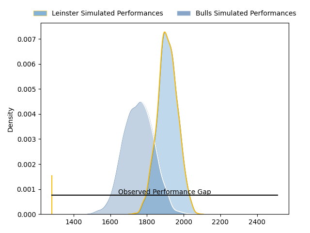
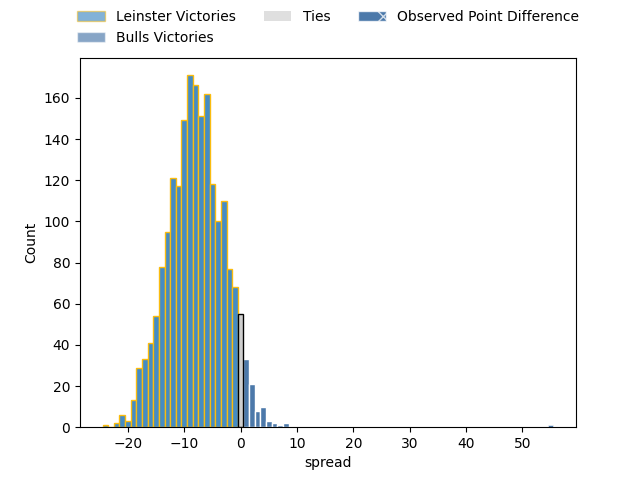

---  
layout: page  
title: Leinster at Bulls; 7-62  
date: 2023-04-22 16:00:00 18:00:00 -0500  
categories: match review  
---
# Leinster at Bulls; 7-62

# Club Level Predictions

The first set of predictions treats a club as the smallest object, as the club develops its members, organizes a gameplan, and deploys its players as needed for each match. This club model has a prediction of 0.286, which translates to predicting Leinster to win by 8.1.

Each club has a rating and a rating deviation (simiar to a Glicko system), and expected performances can be generated. This allows for simulated matches and spreads like the ones below.
## Projected Performances

## Projected Spreads

## Projected Results

# Player Level Predictions

Treating teams instead as an entity made up of the currently active players, I have ratings for each player in an altogether different system. These can be combined to form team ratings once teamsheets are announced, weighting starters a bit higher than the reserves. After the match is played, players can be weighted by their minutes on the field, allowing for an accurate measure of the team's composition. With these compiled team ratings, we can make predictions, measure inaccuracy, and update the individual player ratings.
## Prediction with Player Minutes: Bulls by 7.4

Bulls by 3.4 on a neutral field

There were 4 large changes in win probability in this match
## Prediction without Player Minutes: Bulls by 1.6

Leinster by 2.4 on a neutral pitch

|   Away Minutes | Away Player          |   Away elo |   Away Percentile |   Number |   Home Percentile |   Home elo | Home Player                  |   Home Minutes |
|---------------:|:---------------------|-----------:|------------------:|---------:|------------------:|-----------:|:-----------------------------|---------------:|
|             48 | Edward Byrne         |      85.08 |               nan |        1 |                78 |      89.36 | Gerhardus Cornelis Steenkamp |             54 |
|             54 | Tadgh McElroy        |      89.7  |               nan |        2 |                80 |      91.14 | Cornelis Johannes Grobbelaar |             54 |
|             71 | Tom Clarkson         |      88.51 |               nan |        3 |                58 |      80.48 | Mornay Jan Jakobus Smith     |             54 |
|             80 | Alex Soroka          |      81.55 |               nan |        4 |                63 |      83.09 | Ruan Stefan Vermaak          |             80 |
|             65 | Brian Deeny          |      97.69 |                85 |        5 |                80 |      93.51 | Ruan Nortje                  |             59 |
|             80 | James Culhane        |      81.91 |               nan |        6 |                84 |      97.23 | Marco Gerhardt van Staden    |             80 |
|             65 | Will Connors         |      86.06 |                70 |        7 |                72 |      87    | Cyle Justin Brink            |             80 |
|             80 | Max Deegan           |      86.65 |                67 |        8 |                77 |      92.23 | Elrigh Louw                  |             80 |
|             80 | Nick McCarthy        |      87.41 |                68 |        9 |                40 |      72.71 | Embrose Cheldon Papier       |             49 |
|             80 | Sam Prendergast      |      84.37 |                60 |       10 |                39 |      71.67 | Johannes Lodewikus Goosen    |             62 |
|             80 | Dave Kearney         |      85.64 |                67 |       11 |                76 |      90.82 | David Kriel                  |             80 |
|             42 | Ben Brownlee         |     102.47 |                86 |       12 |                80 |      97.08 | Harold William Vorster       |             80 |
|             80 | Liam Turner          |      85.87 |                65 |       13 |                79 |      95.66 | Stedman-Gee Rivett Gans      |             80 |
|             40 | Tommy O'Brien        |      81.75 |               nan |       14 |                80 |      94.47 | Canan Moodie                 |             80 |
|             42 | Chris Cosgrave       |      85.66 |                62 |       15 |                76 |      93.02 | Kurt-Lee Arendse             |             80 |
|             40 | Rob Russell          |      73.8  |                42 |       16 |                78 |      97.76 | Keagan Johannes              |             31 |
|             38 | Ben Murphy           |      81.37 |               nan |       17 |                29 |      79.27 | Francois Klopper             |             26 |
|             38 | Charlie Tector       |      93.89 |               nan |       18 |               nan |      69.49 | Bismarck du Plessis          |             26 |
|             32 | Michael Milne        |      84.65 |                67 |       19 |                37 |      72.12 | Simphiwe Matanzima           |             26 |
|             26 | Lee Barron           |      82.46 |                63 |       20 |                57 |      81.3  | Janko Swanepoel              |             21 |
|             15 | Conor O'Tighearnaigh |      82.13 |               nan |       21 |                74 |      92.47 | Chris Smith                  |             18 |
|             15 | Ross Molony          |      84.34 |                65 |       22 |               nan |     nan    | nan                          |            nan |
|              9 | Temi Lasisi          |      81.94 |               nan |       23 |               nan |     nan    | nan                          |            nan |

