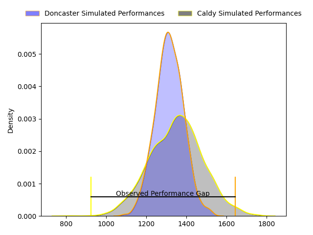
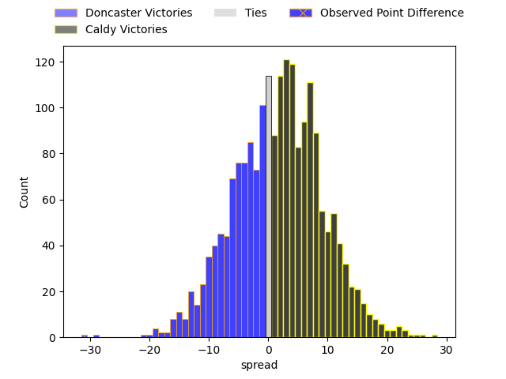

---  
layout: page  
title: Doncaster at Caldy; 38-7  
date: 2023-04-22 16:00:00 18:00:00 -0500  
categories: match review  
---
# Doncaster at Caldy; 38-7

# Club Level Predictions

The first set of predictions treats a club as the smallest object, as the club develops its members, organizes a gameplan, and deploys its players as needed for each match. This club model has a prediction of 0.55, which translates to predicting Caldy to win by 1.8.

Each club has a rating and a rating deviation (simiar to a Glicko system), and expected performances can be generated. This allows for simulated matches and spreads like the ones below.
## Projected Performances

## Projected Spreads

## Projected Results

# Player Level Predictions

Treating teams instead as an entity made up of the currently active players, I have ratings for each player in an altogether different system. These can be combined to form team ratings once teamsheets are announced, weighting starters a bit higher than the reserves. After the match is played, players can be weighted by their minutes on the field, allowing for an accurate measure of the team's composition. With these compiled team ratings, we can make predictions, measure inaccuracy, and update the individual player ratings.
## Prediction with Player Minutes: Caldy by 2.3

Doncaster by 1.7 on a neutral field

There were 5 large changes in win probability in this match
## Prediction without Player Minutes: Caldy by 2.9

Doncaster by 1.1 on a neutral pitch

|   Away Minutes | Away Player          |   Away elo |   Away Percentile |   Number |   Home Percentile |   Home elo | Home Player         |   Home Minutes |
|---------------:|:---------------------|-----------:|------------------:|---------:|------------------:|-----------:|:--------------------|---------------:|
|             63 | Conor Davidson       |      36.48 |                 0 |        1 |                28 |      66.74 | Adam Aigbokhae      |             61 |
|             65 | George Roberts       |      63.96 |                25 |        2 |                38 |      69.75 | Oliver Hearn        |             72 |
|             61 | Andrew Foster        |      65.13 |                23 |        3 |                21 |      63.48 | Nathan Rushton      |             50 |
|             80 | Evan Mintern         |     111.17 |                94 |        4 |                25 |      64.82 | Sam Dickinson       |             66 |
|             80 | Ehize Ehizode        |      50.06 |                 7 |        5 |                19 |      60.45 | Thomas Sanders      |             80 |
|             80 | Martin Sigren Molina |      53.59 |                10 |        6 |                59 |      80.94 | Rouben Birch        |             80 |
|             73 | Thom Smith           |      64.59 |                24 |        7 |                24 |      64.96 | Nyle Davidson       |             56 |
|             73 | John Kelly           |      70.07 |                31 |        8 |                20 |      63.87 | Callum Ridgway      |             80 |
|             77 | Alex Dolly           |      83.15 |                60 |        9 |                23 |      61.47 | Chris Pilgrim       |             48 |
|             56 | Sam Olver            |      57.9  |                14 |       10 |                16 |      58.96 | Rhys Hayes          |             56 |
|             80 | Maliq Holden         |      68.69 |                33 |       11 |                30 |      67.61 | Louis Beer          |             61 |
|             80 | Connor Edwards       |      59.81 |                17 |       12 |                22 |      63.43 | Lewis Barker        |             80 |
|             63 | Joe Margetts         |      62.3  |                21 |       13 |                15 |      57.44 | Dan Bibby           |             80 |
|             80 | George Simpson       |      72.1  |                39 |       14 |                31 |      67.72 | Nick Royle          |             80 |
|             80 | Billy McBryde        |      65.11 |                25 |       15 |                22 |      63.15 | Elliott Gourlay     |             80 |
|             24 | Jack Metcalf         |      64.06 |                24 |       16 |                25 |      65.37 | Anerin (Nye) Thomas |             32 |
|             19 | Karl Garside         |      54.9  |                10 |       17 |                16 |      60.18 | Joe Jones           |             30 |
|             17 | Kai Owen             |      71.72 |                36 |       18 |                15 |      55.96 | Harrison Crowe      |             24 |
|             17 | Robbie Smith         |      64.06 |                23 |       19 |                38 |      72.82 | Michael Barlow      |             24 |
|             15 | Will Holling         |      68.65 |                32 |       20 |                30 |      67.33 | Ryan Higginson      |             19 |
|              7 | Jared Cardew         |      43.18 |                 4 |       21 |                20 |      60.57 | Michael Cartmill    |             19 |
|              7 | Sam Daly             |      69.8  |                34 |       22 |                18 |      59.78 | Sam Olyott          |             14 |
|              3 | Will Yarnell         |      77.85 |               nan |       23 |               nan |      58.11 | Thomas Clarke       |              8 |

