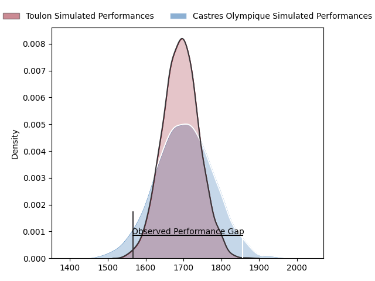
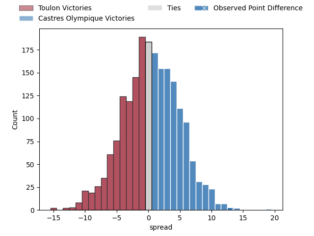

---  
layout: page  
title: Toulon at Castres Olympique; 18-31  
date: 2023-04-22 17:00:00 18:00:00 -0500  
categories: match review  
---
# Toulon at Castres Olympique; 18-31

# Club Level Predictions

The first set of predictions treats a club as the smallest object, as the club develops its members, organizes a gameplan, and deploys its players as needed for each match. This club model has a prediction of 0.513, which translates to predicting Castres Olympique to win by 0.5.

Each club has a rating and a rating deviation (simiar to a Glicko system), and expected performances can be generated. This allows for simulated matches and spreads like the ones below.
## Projected Performances

## Projected Spreads

## Projected Results

# Player Level Predictions

Treating teams instead as an entity made up of the currently active players, I have ratings for each player in an altogether different system. These can be combined to form team ratings once teamsheets are announced, weighting starters a bit higher than the reserves. After the match is played, players can be weighted by their minutes on the field, allowing for an accurate measure of the team's composition. With these compiled team ratings, we can make predictions, measure inaccuracy, and update the individual player ratings.
## Prediction with Player Minutes: Toulon by 3.6

Toulon by 7.6 on a neutral field

There were 11 large changes in win probability in this match
## Prediction without Player Minutes: Toulon by 3.0

Toulon by 7.0 on a neutral pitch

|   Away Minutes | Away Player         |   Away elo |   Away Percentile |   Number |   Home Percentile |   Home elo | Home Player            |   Home Minutes |
|---------------:|:--------------------|-----------:|------------------:|---------:|------------------:|-----------:|:-----------------------|---------------:|
|             57 | Dany Priso          |      86.33 |                77 |        1 |                57 |      80.11 | Quentin Walcker        |             57 |
|             57 | Teddy Baubigny      |      88.86 |                80 |        2 |                75 |      88.14 | Gaëtan Barlot          |              2 |
|             57 | Beka Gigashvili     |      87.24 |                72 |        3 |                61 |      82.13 | Wilfried Hounkpatin    |              8 |
|             80 | Swan Rebbadj        |      89.54 |                75 |        4 |                52 |      78.27 | Leone Nakarawa         |             57 |
|             50 | Brian Alainu'uese   |      80.6  |                57 |        5 |                55 |      79.8  | Thomas Staniforth      |             80 |
|             62 | Cornell du Preez    |      86.99 |                72 |        6 |                64 |      83.3  | Baptiste Delaporte     |             80 |
|             80 | Jules Coulon        |      81.89 |                61 |        7 |                67 |      84.61 | Tyler Ardron           |             80 |
|             51 | Facundo Isa         |      90.55 |                78 |        8 |                52 |      79.55 | Teariki Ben-Nicholas   |             57 |
|             72 | Baptiste Serin      |      85.38 |                69 |        9 |                51 |      78.28 | Santiago Arata Perrone |             63 |
|             80 | Dan Biggar          |     130.52 |                98 |       10 |                69 |      88.84 | Benjamin Urdapilleta   |             80 |
|             80 | Aymeric Luc         |      90.57 |                75 |       11 |                62 |      82.91 | Filipo Nakosi          |             80 |
|             80 | Duncan Paia'aua     |      83.9  |                62 |       12 |                48 |      77.15 | Vilimoni Botitu        |             58 |
|             57 | Waisea Nayacavelu   |      84.38 |                69 |       13 |                73 |      90.87 | Adrien Seguret         |             80 |
|             80 | Jiuta Wainiqolo     |      96.9  |                82 |       14 |                69 |      87.97 | Geoffrey Palis         |             80 |
|             80 | Thomas Salles       |      74.44 |                41 |       15 |                44 |      75.65 | Julien Dumora          |             62 |
|             30 | Mathieu Tanguy      |      79.12 |                54 |       16 |                61 |      82.74 | Brice Humbert          |             78 |
|             29 | Mathieu Bastareaud  |      63.39 |                22 |       17 |                42 |      73.92 | Aurélien Azar          |             72 |
|             23 | Jérémy Sinzelle     |      74.66 |                43 |       18 |                35 |      80.89 | Antoine Tichit         |             23 |
|             23 | Bruce Devaux        |      74.79 |                44 |       19 |                49 |      76.89 | Ryno Pieterse          |             23 |
|             23 | Christopher Tolofua |      75.67 |                48 |       20 |                80 |      93.05 | Baptiste Cope          |             23 |
|             23 | Kieran Brookes      |      75.39 |                48 |       21 |                54 |      80.74 | Adrea Cocagi           |             22 |
|             18 | Matthias Halagahu   |      67.35 |                29 |       22 |                67 |      85.13 | Josaia Raisuqe         |             18 |
|              8 | Jules Danglot       |      66.27 |                27 |       23 |                57 |      81.45 | Jeremy Fernandez       |             17 |

