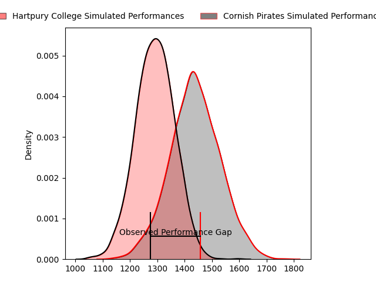
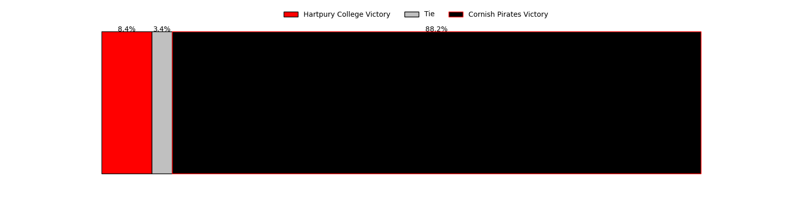

---  
layout: page  
title: Hartpury College at Cornish Pirates; 12-21  
date: 2023-04-22 16:00:00 18:00:00 -0500  
categories: match review  
---
# Hartpury College at Cornish Pirates; 12-21

# Club Level Predictions

The first set of predictions treats a club as the smallest object, as the club develops its members, organizes a gameplan, and deploys its players as needed for each match. This club model has a prediction of 0.691, which translates to predicting Cornish Pirates to win by 7.2.

Each club has a rating and a rating deviation (simiar to a Glicko system), and expected performances can be generated. This allows for simulated matches and spreads like the ones below.
## Projected Performances

## Projected Spreads

## Projected Results

# Player Level Predictions

Treating teams instead as an entity made up of the currently active players, I have ratings for each player in an altogether different system. These can be combined to form team ratings once teamsheets are announced, weighting starters a bit higher than the reserves. After the match is played, players can be weighted by their minutes on the field, allowing for an accurate measure of the team's composition. With these compiled team ratings, we can make predictions, measure inaccuracy, and update the individual player ratings.
## Prediction with Player Minutes: Cornish Pirates by 20.2

Cornish Pirates by 16.2 on a neutral field

There were 1 large changes in win probability in this match
## Prediction without Player Minutes: Cornish Pirates by 20.4

Cornish Pirates by 16.4 on a neutral pitch

|   Away Minutes | Away Player       |   Away elo |   Away Percentile |   Number |   Home Percentile |   Home elo | Home Player       |   Home Minutes |
|---------------:|:------------------|-----------:|------------------:|---------:|------------------:|-----------:|:------------------|---------------:|
|             69 | Joe Wrafter       |      58.74 |                14 |        1 |                93 |     103.32 | Jack Andrew       |             71 |
|             40 | Luke Stratford    |      69.66 |                33 |        2 |                21 |      61.29 | William Crane     |             45 |
|             50 | Sam Rodman        |      80.57 |                58 |        3 |                58 |      80.6  | Matt Johnson      |             60 |
|             80 | Jack Davies       |      48.71 |                 6 |        4 |                 3 |      42.07 | Cory Teague       |             50 |
|             13 | Ben Glynn         |      70.43 |                41 |        5 |                47 |      76.07 | Will Britton      |             80 |
|             80 | Sam Lewis         |      48.69 |                 6 |        6 |                20 |      61.94 | Alex Everett      |             80 |
|             80 | Harry Short       |      86.78 |                72 |        7 |                18 |      59.59 | Will Gibson       |             80 |
|             54 | Jake Holcombe     |      63.59 |                20 |        8 |                92 |     106.71 | John Stevens      |             64 |
|             80 | Oscar Lennon      |      59.99 |               nan |        9 |                38 |      71.91 | Ruaridh Dawson    |             60 |
|             80 | George Barton     |      60.3  |               nan |       10 |                43 |      74.33 | Arwel Robson      |             26 |
|             31 | Bradley Denty     |      76.67 |                50 |       11 |                24 |      63.37 | Will Trewin       |             80 |
|             80 | Harry Tarling     |      70.1  |                40 |       12 |                38 |      74.98 | Joe Elderkin      |             80 |
|             80 | Jack Bates        |      53.64 |                10 |       13 |               nan |      67.05 | Shae Tucker       |             80 |
|             80 | Matthew McNab     |      41.44 |                 4 |       14 |                17 |      58.15 | Robin Wedlake     |             80 |
|             80 | Alex Morgan       |      78.76 |                51 |       15 |                77 |      94.12 | Alexander AJ Cant |             64 |
|             67 | Dale Lemon        |      64.01 |                24 |       16 |                60 |      84.78 | Harry Bazalgette  |             54 |
|             49 | Harry Ascherl     |      53.55 |                10 |       17 |               nan |      68.59 | Max Norey         |             35 |
|             40 | Ethan Hunt        |      60.14 |               nan |       18 |                12 |      56.19 | Steele Barker     |             30 |
|             30 | Mikey Summerfield |      66.48 |                28 |       19 |                67 |      85.12 | Hayden King       |             20 |
|             26 | Freddie Clarke    |      52.28 |                10 |       20 |               nan |      68.45 | Tom Kessell       |             20 |
|             11 | Alex Gibson       |      58.38 |                17 |       21 |                57 |      80.32 | Carwyn Penny      |             16 |
|            nan | nan               |     nan    |               nan |       22 |                18 |      64.87 | Jarrad Hayler     |             16 |
|            nan | nan               |     nan    |               nan |       23 |               nan |      69.26 | Jacob Morris      |              9 |

