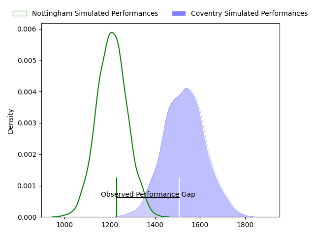
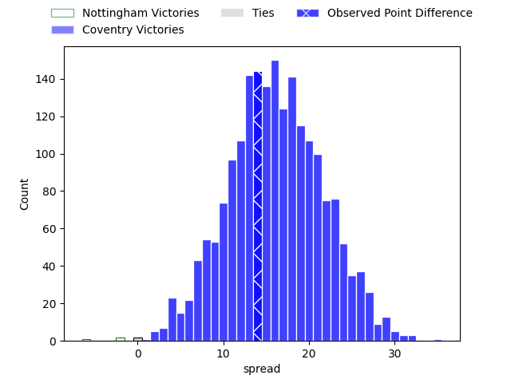
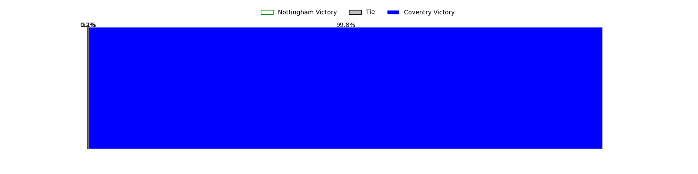

---  
layout: page  
title: Nottingham at Coventry; 24-38  
date: 2023-04-22 16:00:00 18:00:00 -0500  
categories: match review  
---
# Nottingham at Coventry; 24-38

# Club Level Predictions

The first set of predictions treats a club as the smallest object, as the club develops its members, organizes a gameplan, and deploys its players as needed for each match. This club model has a prediction of 0.857, which translates to predicting Coventry to win by 15.9.

Each club has a rating and a rating deviation (simiar to a Glicko system), and expected performances can be generated. This allows for simulated matches and spreads like the ones below.
## Projected Performances

## Projected Spreads

## Projected Results

# Player Level Predictions

Treating teams instead as an entity made up of the currently active players, I have ratings for each player in an altogether different system. These can be combined to form team ratings once teamsheets are announced, weighting starters a bit higher than the reserves. After the match is played, players can be weighted by their minutes on the field, allowing for an accurate measure of the team's composition. With these compiled team ratings, we can make predictions, measure inaccuracy, and update the individual player ratings.
## Prediction with Player Minutes: Coventry by 22.4

Coventry by 18.4 on a neutral field

There were 5 large changes in win probability in this match
## Prediction without Player Minutes: Coventry by 21.0

Coventry by 17.0 on a neutral pitch

|   Away Minutes | Away Player              |   Away elo |   Away Percentile |   Number |   Home Percentile |   Home elo | Home Player        |   Home Minutes |
|---------------:|:-------------------------|-----------:|------------------:|---------:|------------------:|-----------:|:-------------------|---------------:|
|             68 | Toby Williams            |      74.13 |                42 |        1 |                72 |      86.95 | Toby Trinder       |             58 |
|             51 | Jack Dickinson           |      83.7  |                62 |        2 |                72 |      86.09 | Suva Ma'asi        |             61 |
|             51 | Xavier Valentine         |      72.48 |                38 |        3 |                47 |      75.89 | Ollie Andrews      |             58 |
|             59 | Jack Shine               |      64.46 |                25 |        4 |                65 |      84.12 | James Tyas         |             80 |
|             80 | Scott Hall               |      45.22 |                 5 |        5 |                52 |      78.33 | Adam Peters        |             80 |
|             80 | George Cox               |      76.12 |                46 |        6 |                60 |      81.67 | Tom Ball           |             42 |
|             80 | Carl Kirwan              |      83.8  |                65 |        7 |                77 |      90.5  | Josh Bainbridge    |             80 |
|             43 | Josh Poullet             |      68.14 |                30 |        8 |                91 |     108.09 | Senitiki Nayalo    |             80 |
|             51 | Liam Slatem              |      56.83 |                13 |        9 |                66 |      83.3  | Will Chudley       |             80 |
|             61 | Morgan Bunting           |      48.73 |                 7 |       10 |               nan |      75.23 | Theodore Mannion   |             53 |
|             80 | Harry Graham             |      72.19 |                48 |       11 |                41 |      69.99 | James Martin       |             80 |
|             80 | John Joseph Neville      |      52.35 |                10 |       12 |                61 |      79.48 | Will Rigg          |             80 |
|             20 | Charlie Thacker          |      83.31 |                60 |       13 |                33 |      70.44 | Will Wand          |             58 |
|             80 | David Williams           |      76.39 |                48 |       14 |                49 |      76.42 | Will Talbot-Davies |             56 |
|             80 | Jordan Kehinde Olowofela |      74.74 |                41 |       15 |                45 |      76.36 | Louis Brown        |             53 |
|             60 | Michael Green            |      55.62 |                11 |       16 |                33 |      69.37 | James Kenny        |             38 |
|             37 | Jay Ecclesfield          |      67.37 |               nan |       17 |                10 |      51.68 | Evan Mitchell      |             27 |
|             29 | Harry Clayton            |      76.15 |                49 |       18 |               nan |      73.96 | Tobi Wilson        |             27 |
|             29 | Dan Richardson           |      68.55 |                27 |       19 |                50 |      77.74 | Will Lane          |             24 |
|             29 | Josh Goodwin             |      67.93 |               nan |       20 |                13 |      61.33 | Jake Bridges       |             22 |
|             21 | Ross Bundy               |      53.91 |                11 |       21 |                58 |      80.59 | Rhys Thomas        |             22 |
|             19 | Sam Hollingsworth        |      89.39 |                69 |       22 |                44 |      74.99 | George Smith       |             22 |
|             12 | Archie Van der Flier     |      69.13 |               nan |       23 |                47 |      74.24 | Will Biggs         |             19 |

