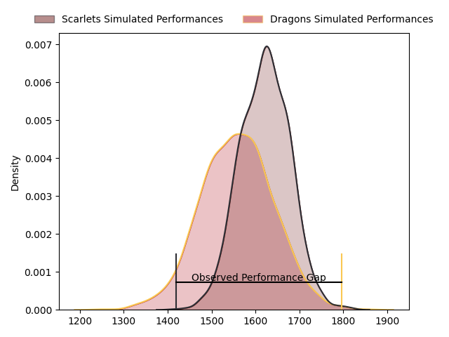
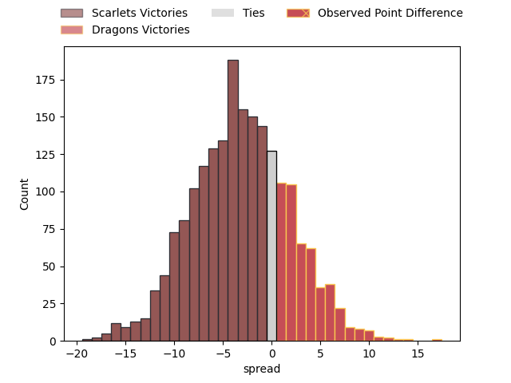

---  
layout: page  
title: Scarlets at Dragons; 14-31  
date: 2023-04-22 16:00:00 18:00:00 -0500  
categories: match review  
---
# Scarlets at Dragons; 14-31

# Club Level Predictions

The first set of predictions treats a club as the smallest object, as the club develops its members, organizes a gameplan, and deploys its players as needed for each match. This club model has a prediction of 0.41, which translates to predicting Scarlets to win by 3.2.

Each club has a rating and a rating deviation (simiar to a Glicko system), and expected performances can be generated. This allows for simulated matches and spreads like the ones below.
## Projected Performances

## Projected Spreads

## Projected Results

# Player Level Predictions

Treating teams instead as an entity made up of the currently active players, I have ratings for each player in an altogether different system. These can be combined to form team ratings once teamsheets are announced, weighting starters a bit higher than the reserves. After the match is played, players can be weighted by their minutes on the field, allowing for an accurate measure of the team's composition. With these compiled team ratings, we can make predictions, measure inaccuracy, and update the individual player ratings.
## Prediction with Player Minutes: Scarlets by 17.4

Scarlets by 21.4 on a neutral field

There were 15 large changes in win probability in this match
## Prediction without Player Minutes: Scarlets by 16.3

Scarlets by 20.3 on a neutral pitch

|   Away Minutes | Away Player      |   Away elo |   Away Percentile |   Number |   Home Percentile |   Home elo | Home Player                 |   Home Minutes |
|---------------:|:-----------------|-----------:|------------------:|---------:|------------------:|-----------:|:----------------------------|---------------:|
|             45 | Kemsley Mathias  |      88.11 |                75 |        1 |                62 |      82.15 | Rhodri Jones                |             63 |
|             45 | Ken Owens        |      94.63 |                83 |        2 |                30 |      67.89 | Elliott Dee                 |             50 |
|             45 | Javan Sebastian  |      83.87 |                59 |        3 |                28 |      73.62 | Lloyd Fairbrother           |             60 |
|             50 | Vaea Fifita      |      87.33 |                71 |        4 |                50 |      77.67 | Ben Carter                  |             80 |
|             80 | Morgan Jones     |      95.87 |                83 |        5 |                60 |      81.85 | Matthew Screech             |             43 |
|             56 | Iwan Shenton     |      84.7  |                67 |        6 |                37 |      71.22 | George Nott                 |             80 |
|             80 | Joshua McLeod    |      83.76 |                65 |        7 |                50 |      76.65 | Taine Basham                |             77 |
|             80 | Carwyn Tuipulotu |      87.36 |                68 |        8 |                57 |      81.69 | Aaron Wainwright            |             80 |
|             56 | Kieran Hardy     |      92.4  |                76 |        9 |                48 |      76.87 | Rhodri Williams             |             77 |
|             74 | Sam Costelow     |      85.62 |                64 |       10 |                41 |      73.38 | Angus O'Brien               |             80 |
|             45 | Ryan Conbeer     |      81.54 |                60 |       11 |                43 |      74.27 | Ashton Hewitt               |             71 |
|             80 | Johnny Williams  |      76.86 |                47 |       12 |                49 |      77.7  | Steffan Hughes              |             80 |
|             80 | Joe Roberts      |      93.46 |                74 |       13 |                28 |      66.95 | Patelesio Fatuloa Tomkinson |             80 |
|             80 | Steffan Evans    |      87.9  |                71 |       14 |                46 |      75.12 | Rio Dyer                    |             80 |
|             80 | Tom Rogers       |      78.46 |                50 |       15 |                25 |      65.09 | Jordan Williams             |             71 |
|             35 | Johnny McNicholl |      91.97 |                74 |       16 |                25 |      65.86 | Sean Lonsdale               |             37 |
|             35 | Sam Wainwright   |     103.74 |                93 |       17 |                26 |      65.16 | Bradley Roberts             |             30 |
|             35 | Dafydd Hughes    |      83.38 |               nan |       18 |                26 |      66.66 | Christian Coleman           |             20 |
|             35 | Wyn Jones        |     129.64 |                99 |       19 |               nan |      68.89 | Robert Evans                |             17 |
|             30 | Iestyn Rees      |      84.41 |               nan |       20 |               nan |      67.73 | Aneurin Owen                |              9 |
|             24 | Gareth Davies    |      74.65 |                44 |       21 |                18 |      63.96 | Will Reed                   |              9 |
|             24 | Griff Evans      |      84.6  |               nan |       22 |               nan |      72.28 | Huw Taylor                  |              3 |
|              6 | Dan Jones        |      84.8  |                62 |       23 |               nan |      71.63 | Lewis Jones                 |              3 |

